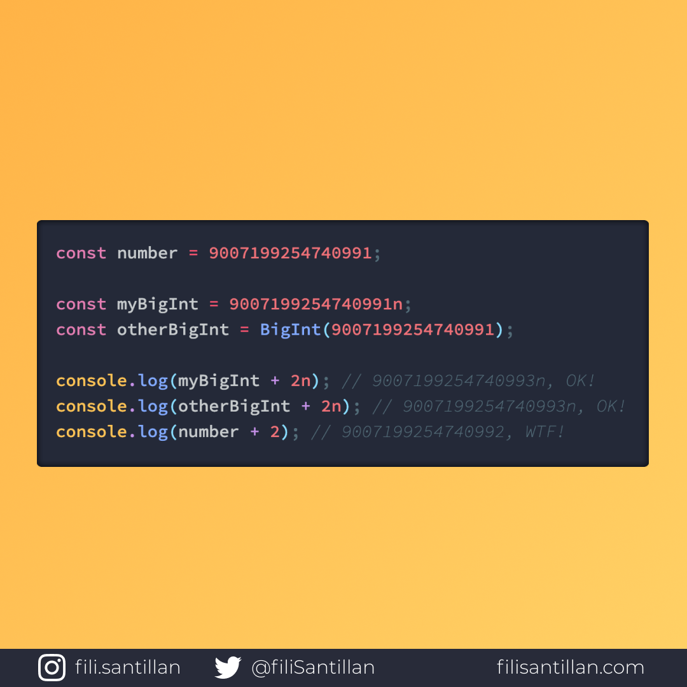

# BigInt

BigInt es un objeto incorporado que nos da JavaScript para representar un número entero más grande, mayor a <code>253 - 1</code> (el número más grande que puede representar el objeto tipo Number de manera confiable).

> Código utilizado en los ejemplos: [BigInt.js](./BigInt.js)

Bit completo en:[filisantillan.com](https://filisantillan.com/bits/bigint/)

## 🤓 Aprende algo nuevo hoy

> Comparto los **bits** al menos una vez por semana.

Instagram: [@fili.santillan](https://www.instagram.com/fili.santillan/)  
Twitter: [@FiliSantillan](https://twitter.com/FiliSantillan)  
Facebook: [Fili Santillán](https://www.facebook.com/FiliSantillan96/)  
Sitio web: http://filisantillan.com  

## 📚 Recursos

- [TC39 BigInt proposal](https://github.com/tc39/proposal-bigint)