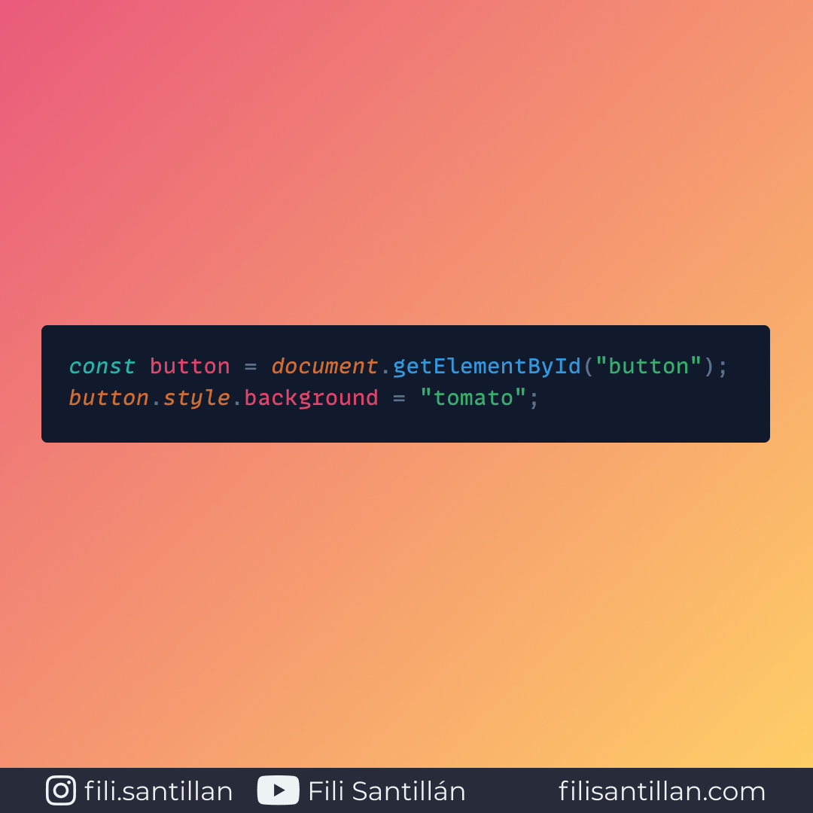

# CSSOM

CSS Object Mode

El modelo de objetos CSS (CSSOM) es un conjunto de API's que nos permiten la manipulación de CSS mediante JavaScript.

Bit completo en: [filisantillan.com](https://filisantillan.com/bits/cssom/)

> Código utilizado en los ejemplos: [CSSOM.js](./CSSOM.js)

## 🤓 Aprende algo nuevo hoy

Comparto los **bits** al menos una vez por semana.

Instagram: [@fili.santillan](https://www.instagram.com/fili.santillan/)  
Twitter: [@FiliSantillan](https://twitter.com/FiliSantillan)  
Facebook: [Fili Santillán](https://www.facebook.com/FiliSantillan96/)  
Sitio web: http://filisantillan.com

## 📚 Recursos

- [CSS Object Model (CSSOM)](https://developer.mozilla.org/en-US/docs/Web/API/CSS_Object_Model)
- [An Introduction and Guide to the CSS Object Model (CSSOM)](https://css-tricks.com/an-introduction-and-guide-to-the-css-object-model-cssom/)
- [Constructing the Object Model](https://developers.google.com/web/fundamentals/performance/critical-rendering-path/constructing-the-object-model)
- [CSSOM](https://varvy.com/performance/cssom.html)
