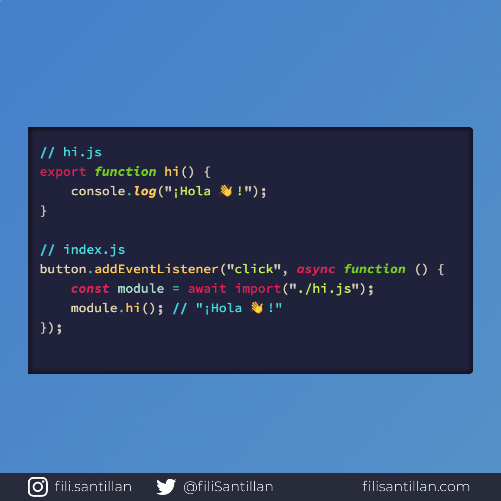

# Dynamic import

Dynamic import o importación dinámica se realiza a partir del método import() que devuelve una promesa del módulo solicitado. Eso significa que podemos solicitar código en caso de que sea necesario. Lo cual mejora increíblemente el rendimiento de una aplicación.

> Código utilizado en los ejemplos: [dynamic-import.js](dynamic-import.js)

Bit completo en: [filisantillan.com](https://filisantillan.com/bits/dynamic-import/)

## 🤓 Aprende algo nuevo hoy

> Comparto los **bits** al menos una vez por semana.

Instagram: [@fili.santillan](https://www.instagram.com/fili.santillan/)  
Twitter: [@FiliSantillan](https://twitter.com/FiliSantillan)  
Facebook: [Fili Santillán](https://www.facebook.com/FiliSantillan96/)  
Sitio web: http://filisantillan.com

## 📚 Recursos

-   [TC39 Dynamic import](https://github.com/tc39/proposal-dynamic-import)
-   [Dynamic import - V8](https://v8.dev/features/dynamic-import)
-   [Code Splitting en React](https://reactjs.org/docs/code-splitting.html)
