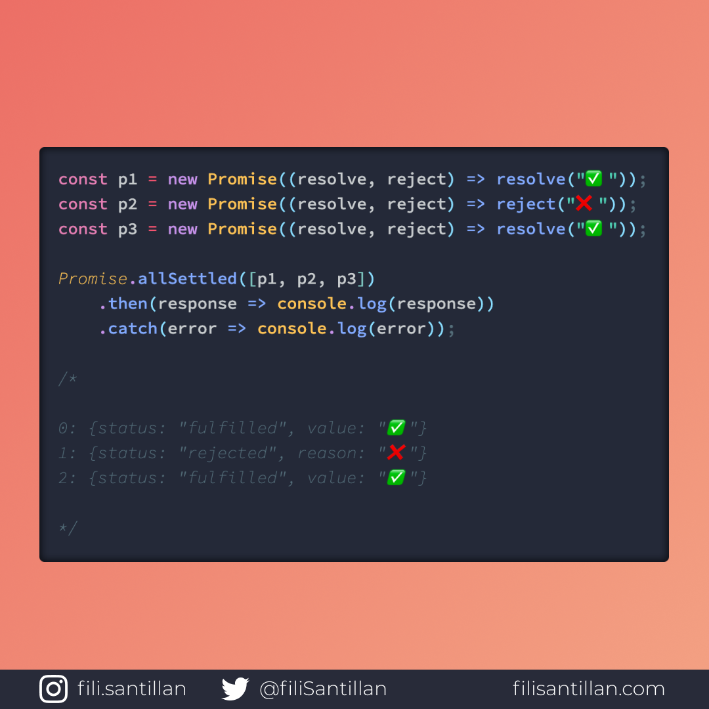

# `Promise.allSettled`

El método `Promise.allSettled()` devuelve una promesa que es resuelta después de que todas las promesas dadas hayan sido concluidas, sin importar si fueron resueltas o rechazadas. El resultado va a ser una serie de objetos describiendo el resultado de cada promesa.

> Código utilizado en los ejemplos: [Promise.allSettled()](./../Promise.allSettled/Promise.allSettled.js)

Bit completo en:[filisantillan.com](https://filisantillan.com/bits/promise-allsettled/)

## 🤓 Aprende algo nuevo hoy

> Comparto los **bits** al menos una vez por semana.

Instagram: [@fili.santillan](https://www.instagram.com/fili.santillan/)  
Twitter: [@FiliSantillan](https://twitter.com/FiliSantillan)  
Facebook: [Fili Santillán](https://www.facebook.com/FiliSantillan96/)  
Sitio web: http://filisantillan.com

## 📚 Recursos

-   [MDN Promise.allSettled()](https://developer.mozilla.org/en-US/docs/Web/JavaScript/Reference/Global_Objects/Promise/allSettled)
-   [TC39 Promise.allSettled() Proposal](https://github.com/tc39/proposal-promise-allSettled)
