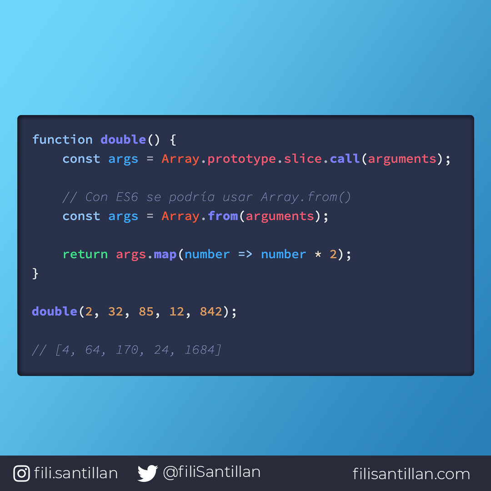
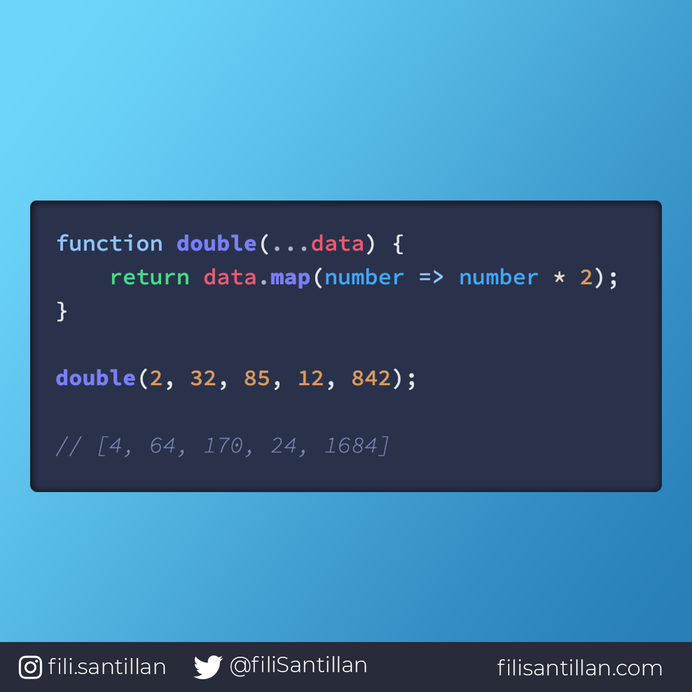

# Rest VS Arguments

Cuando se usa el objeto `arguments` éste no tiene acceso a métodos que comúnmente tenemos en un array (`map`, `filter`, `pop`). Por lo cual, tiene que pasar por un proceso de conversión.

Para evitar este proceso está el operador `rest` que representa un número indefinido de argumentos como un array.

> Código utilizado en los ejemplos: [RestVSArguments.js](/BitCode/RestVSArguments/RestVSArguments.js).

## 🤓 Aprende algo nuevo hoy

> Comparto **bits** al menos una vez por semana.

Instagram: [@fili.santillan](https://www.instagram.com/fili.santillan/)  
Twitter: [@FiliSantillan](https://twitter.com/FiliSantillan)  
Facebook: [Fili Santillán](https://www.facebook.com/FiliSantillan96/)  
Sitio web: http://filisantillan.com  

## 📚 Recursos

- [MDN The arguments object](https://developer.mozilla.org/en-US/docs/Web/JavaScript/Reference/Functions/arguments)
