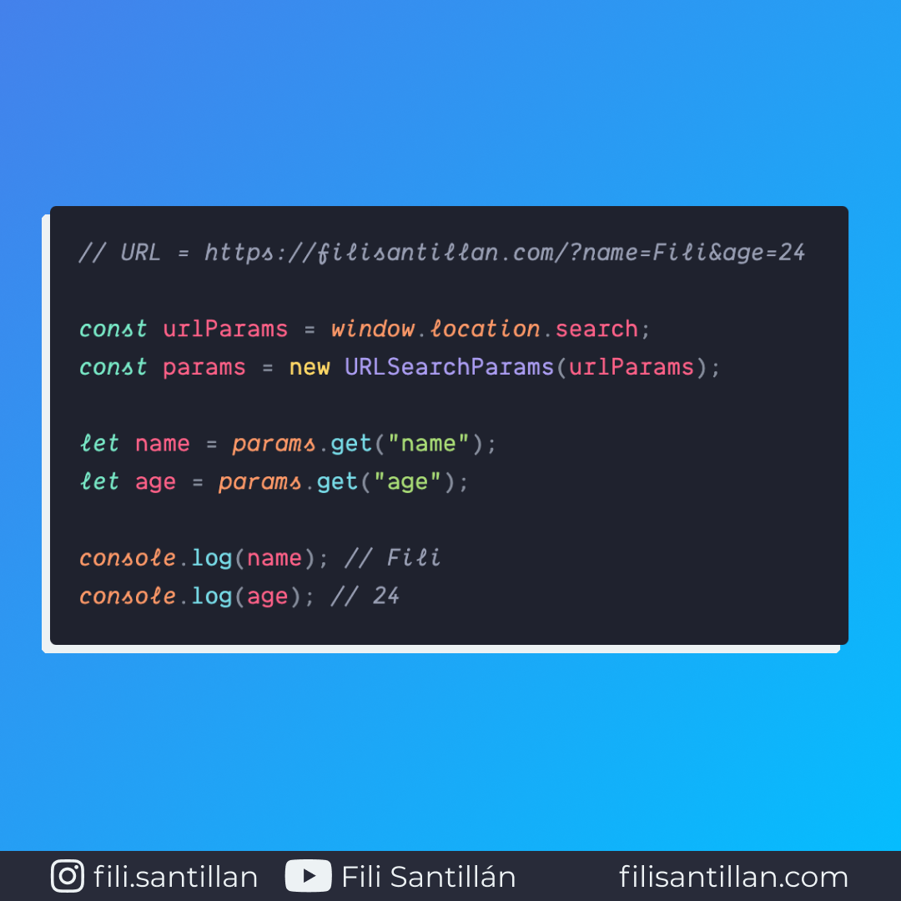

# URLSearchParams

La API `URLSearchParams` proporciona una forma de obtener datos en los parámetros de una URL. Consta de un constructor y varios métodos para trabajar.

Bit completo en: [filisantillan.com](https://filisantillan.com/bits/urlsearchparams/)

> Código utilizado en el ejemplo: [URLSearchParams.js](./URLSearchParams.js)

## 🤓 Aprende algo nuevo hoy

> Comparto los **bits** al menos una vez por semana.

Instagram: [@fili.santillan](https://www.instagram.com/fili.santillan/)  
Twitter: [@FiliSantillan](https://twitter.com/FiliSantillan)  
Facebook: [Fili Santillán](https://www.facebook.com/FiliSantillan96/)  
Sitio web: http://filisantillan.com

## 📚 Recursos

- [URLSearchParams MDN](https://developer.mozilla.org/en-US/docs/Web/API/URLSearchParams)
- [URLSearchParams in JavaScript](https://medium.com/swlh/urlsearchparams-in-javascript-df524f705317)
