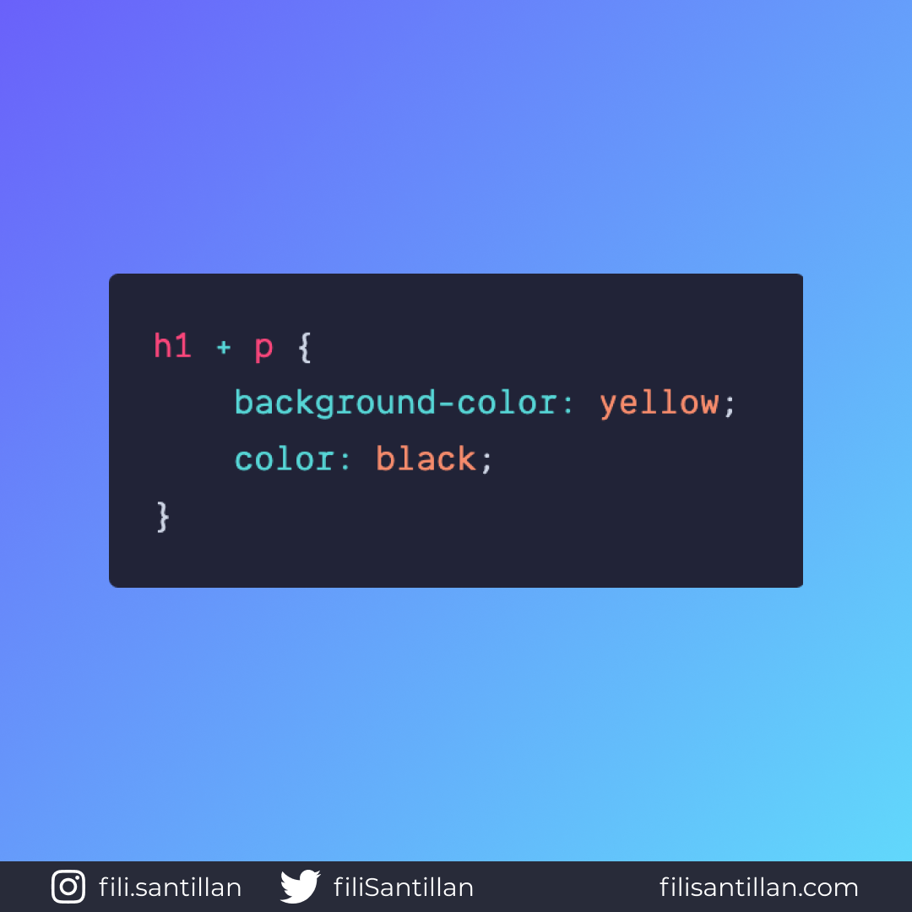

# Selector de hermanos adyacentes

> Código utilizado en los ejemplos: [adjacent-sibling-selector.css](./adjacent-sibling-selector.css)

El selector de hermanos adyacente da estilos al elemento hermano del primer selector definido, solo si este sigue inmediatamente después de dicho selector y que ambos sean hijos del mismo padre.

Bit completo en:
[filisantillan.com](https://filisantillan.com/bits/selector-de-hermanos-adyacentes)

## 🤓 Aprende algo nuevo hoy

> Comparto los **bits** al menos una vez por semana.

Instagram: [@fili.santillan](https://www.instagram.com/fili.santillan/)  
Twitter: [@FiliSantillan](https://twitter.com/FiliSantillan)  
Facebook: [Fili Santillán](https://www.facebook.com/FiliSantillan96/)  
Sitio web: http://filisantillan.com

## 📚 Recursos

-   [MDN Adjacent sibling combinator](https://developer.mozilla.org/en-US/docs/Web/CSS/Adjacent_sibling_combinator)
-   [Icono utilizado en el post](https://www.flaticon.com/authors/adib-sulthon)
