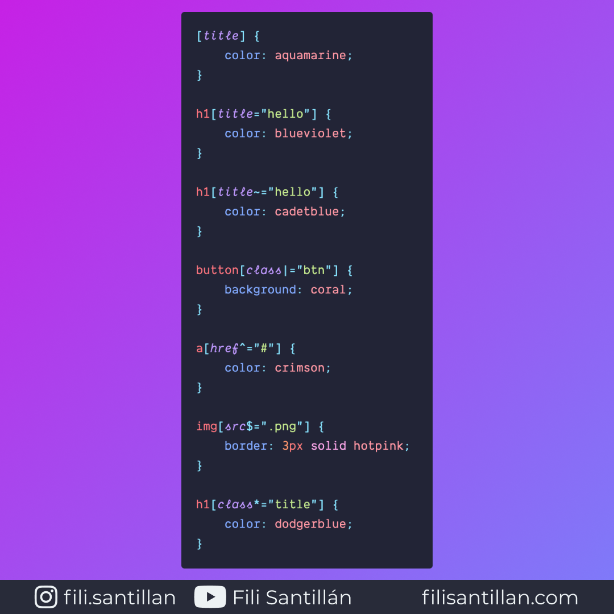

# Selectores de atributo

Los selectores de atributo hacen referencia a elementos en función del nombre del
atributo o el valor.

Bit completo en:
[filisantillan.com](https://filisantillan.com/bits/selectores-de-atributo/)

> Código utilizado en los ejemplos:
> [attribute-selectors.css](./attribute-selectors.css)

## 🤓 Aprende algo nuevo hoy

Comparto los **bits** al menos una vez por semana.

Instagram: [@fili.santillan](https://www.instagram.com/fili.santillan/)  
Twitter: [@FiliSantillan](https://twitter.com/FiliSantillan)  
Facebook: [Fili Santillán](https://www.facebook.com/FiliSantillan96/)  
Sitio web: http://filisantillan.com

## 📚 Recursos

-   [Attribute selectors - MDN](https://developer.mozilla.org/en-US/docs/Web/CSS/Attribute_selectors)
