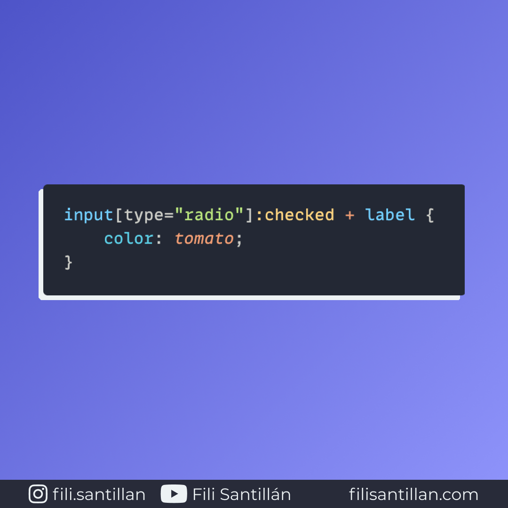

# `:checked`

`:checked` es una pseudo-clase que representa cuando un input tipo `radio` o `checkbox` está marcado o seleccionado por el usuario, es decir cuando entra en el estado activo (`checked`).

Bit completo en: [filisantillan.com](https://filisantillan.com/bits/checked/)

> Código utilizado en el ejemplo: [checked.css](./checked.css)

## 🤓 Aprende algo nuevo hoy

> Comparto los **bits** al menos una vez por semana.

Instagram: [@fili.santillan](https://www.instagram.com/fili.santillan/)  
Twitter: [@FiliSantillan](https://twitter.com/FiliSantillan)  
Facebook: [Fili Santillán](https://www.facebook.com/FiliSantillan96/)  
Sitio web: http://filisantillan.com

## 📚 Recursos

- [:checked MDN](https://developer.mozilla.org/en-US/docs/Web/CSS/:checked)
- [:checked CSS-Tricks](https://css-tricks.com/almanac/selectors/c/checked/)
- [The “Checkbox Hack” (and things you can do with it)](https://css-tricks.com/the-checkbox-hack/)
