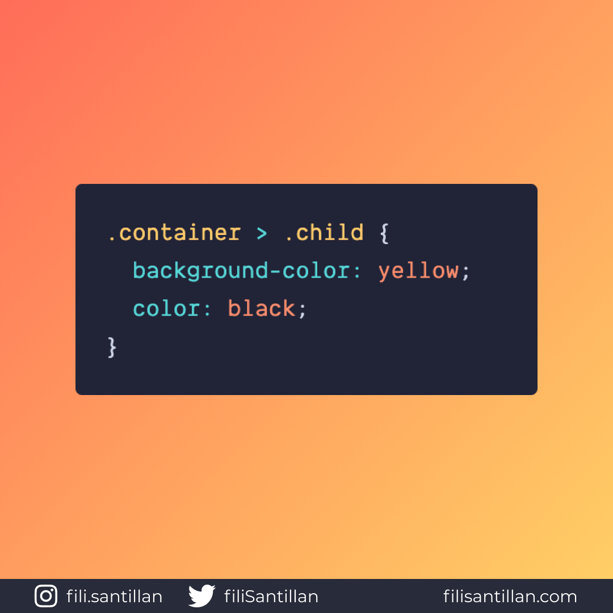

# child selector

> Código utilizado en los ejemplos: [child-selector.css](./child-selector.css)

El child selector o selector de hijo permite dar estilos a los hijos directos
del primer selector que se defina. Es decir, que no va más profundo al selector
definido.

Bit completo en:
[filisantillan.com](https://filisantillan.com/bits/child-selector)

## 🤓 Aprende algo nuevo hoy

> Comparto los **bits** al menos una vez por semana.

Instagram: [@fili.santillan](https://www.instagram.com/fili.santillan/)  
Twitter: [@FiliSantillan](https://twitter.com/FiliSantillan)  
Facebook: [Fili Santillán](https://www.facebook.com/FiliSantillan96/)  
Sitio web: http://filisantillan.com

## 📚 Recursos

-   [MDN Child combinator](https://developer.mozilla.org/en-US/docs/Web/CSS/Child_combinator)
