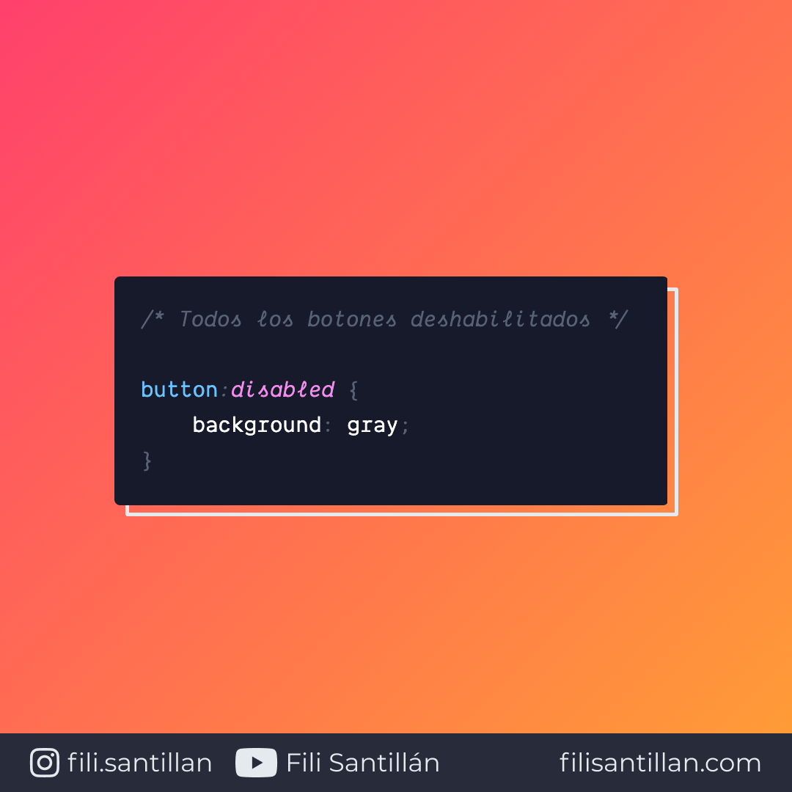

# `:disabled`

`:disabled` es una pseudo-clase que representa cualquier elemento deshabilitado. Funciona como una condicional en la que aplica los estilos, siempre y cuando los elementos cumplan. Es decir, cuando los elementos tienen el atributo `disabled`.

Bit completo en: [filisantillan.com](https://filisantillan.com/bits/disabled/)

> Código utilizado en el ejemplo: [disabled.css](./disabled.css)

## 🤓 Aprende algo nuevo hoy

> Comparto los **bits** al menos una vez por semana.

Instagram: [@fili.santillan](https://www.instagram.com/fili.santillan/)  
Twitter: [@FiliSantillan](https://twitter.com/FiliSantillan)  
Facebook: [Fili Santillán](https://www.facebook.com/FiliSantillan96/)  
Sitio web: http://filisantillan.com

## 📚 Recursos

- [MDN :disabled](https://developer.mozilla.org/en-US/docs/Web/CSS/:disabled)
- [CSS-Tricks :disabled](https://css-tricks.com/almanac/selectors/d/disabled/)
