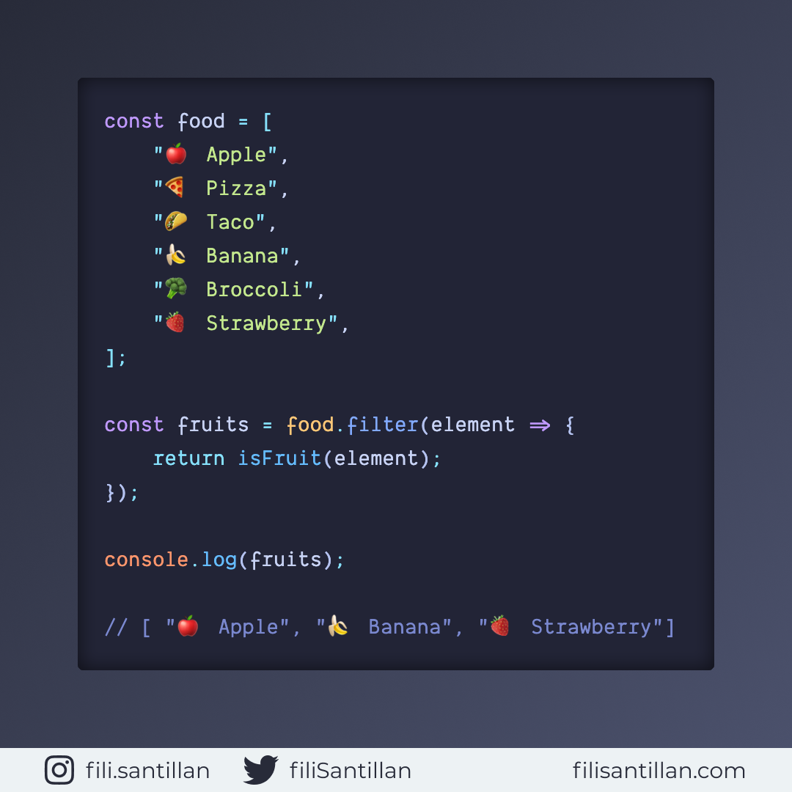

# filter

El método filter() crea un nuevo array a partir de uno ya existente. El nuevo
array se construirá a partir de la condición implementada por la función
definida (callback).

Bit completo en: [filisantillan.com](https://filisantillan.com/bits/filter/)

> Código utilizado en los ejemplos: [filter.js](./filter.js)

## 🤓 Aprende algo nuevo hoy

Comparto los **bits** al menos una vez por semana.

Instagram: [@fili.santillan](https://www.instagram.com/fili.santillan/)  
Twitter: [@FiliSantillan](https://twitter.com/FiliSantillan)  
Facebook: [Fili Santillán](https://www.facebook.com/FiliSantillan96/)  
Sitio web: http://filisantillan.com

## 📚 Recursos

-   [Array.prototype.filter()](https://developer.mozilla.org/en-US/docs/Web/JavaScript/Reference/Global_Objects/Array/filter)
