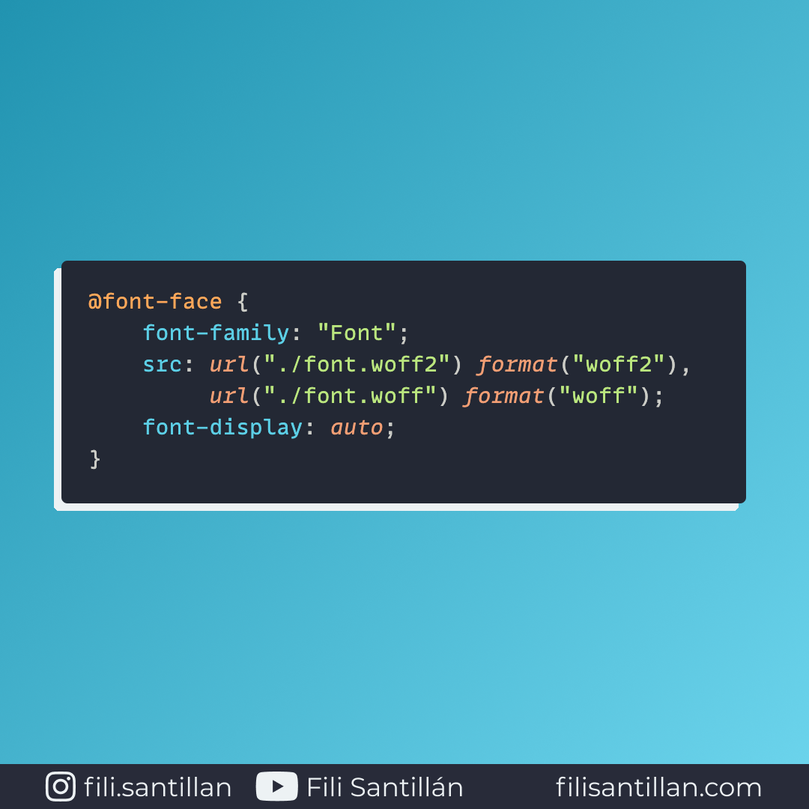

# font-display

La propiedad `font-display` determina como se van a cargar y mostrar las fuentes de un sitio web. Esta se especifica dentro del `@font-face` en conjunto con el resto de propiedades.

Bit completo en: [filisantillan.com](https://filisantillan.com/bits/font-display/)

> Código utilizado en los ejemplos: [font-display.css](./font-display.css)

## 🤓 Aprende algo nuevo hoy

Comparto los **bits** al menos una vez por semana.

Instagram: [@fili.santillan](https://www.instagram.com/fili.santillan/)  
Twitter: [@FiliSantillan](https://twitter.com/FiliSantillan)  
Facebook: [Fili Santillán](https://www.facebook.com/FiliSantillan96/)  
Sitio web: http://filisantillan.com

## 📚 Recursos

- [font-display MDN](https://developer.mozilla.org/en-US/docs/Web/CSS/@font-face/font-display)
- [font-display CSS-Tricks](https://css-tricks.com/almanac/properties/f/font-display/)
- [font-display for the Masses](https://css-tricks.com/font-display-masses/)
