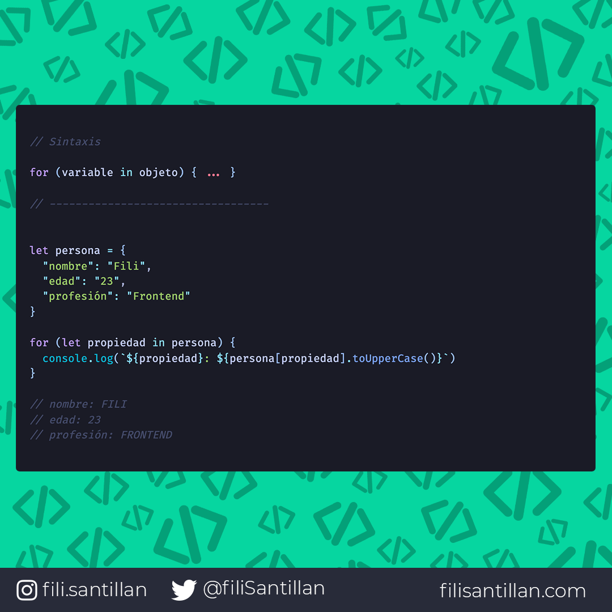

# for...in

`for...in` itera sobre todas las propiedades de un objeto. Es decir, que por cada elemento se aplicará la sentencia especificada.

> Código utilizado en los ejemplos: [for...in.js](/BitCode/for...in/for...in.js)

## 🤓 Aprende algo nuevo hoy

> Comparto los **bits** al menos una vez por semana.

Instagram: [@fili.santillan](https://www.instagram.com/fili.santillan/)  
Twitter: [@FiliSantillan](https://twitter.com/FiliSantillan)  
Facebook: [Fili Santillán](https://www.facebook.com/FiliSantillan96/)  
Sitio web: http://filisantillan.com  

## 📚 Recursos

- [MDN for...in](https://developer.mozilla.org/en-US/docs/Web/JavaScript/Reference/Statements/for...in)
