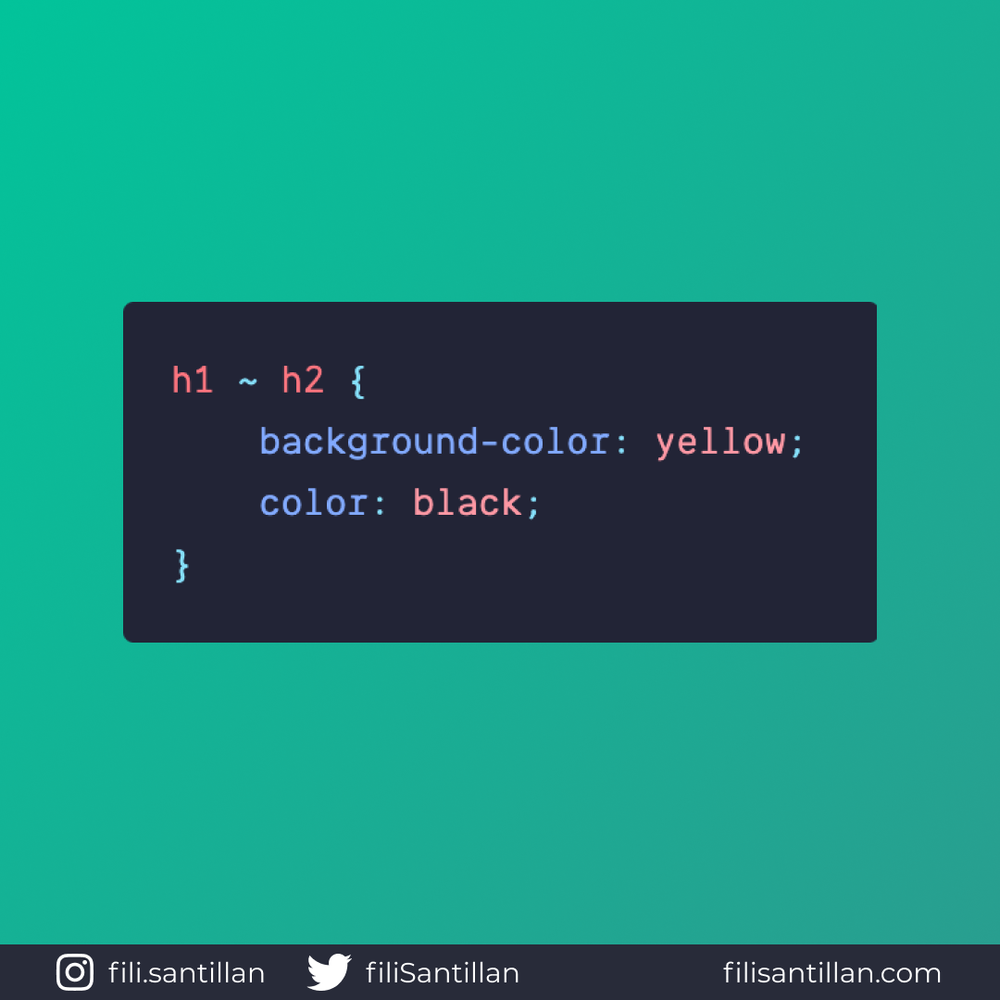

# Selector de hermanos generales

> Código utilizado en los ejemplos:
> [general-sibling-selector.css](./general-sibling-selector.css)

El selector general de hermanos da estilos a los elementos hermanos del primer
selector definido, incluso si no es su hermano inmediato y son hijos del mismo
elemento padre.

Bit completo en:
[filisantillan.com](https://filisantillan.com/bits/selector-de-hermanos-generales)

## 🤓 Aprende algo nuevo hoy

> Comparto los **bits** al menos una vez por semana.

Instagram: [@fili.santillan](https://www.instagram.com/fili.santillan/)  
Twitter: [@FiliSantillan](https://twitter.com/FiliSantillan)  
Facebook: [Fili Santillán](https://www.facebook.com/FiliSantillan96/)  
Sitio web: http://filisantillan.com

## 📚 Recursos

-   [MDN General sibling combinator](https://developer.mozilla.org/en-US/docs/Web/CSS/General_sibling_combinator)
