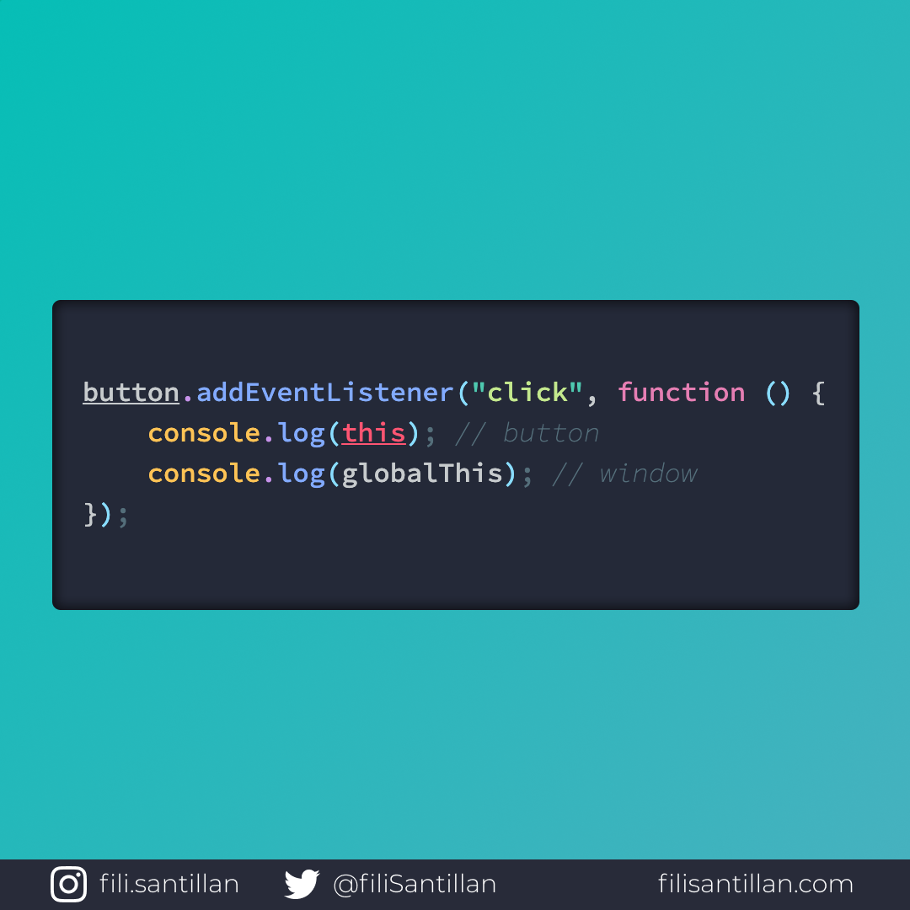

# `globalThis`

`globalThis` hace referencia al objeto global, sin importar el contexto en el que se encuentre tu código.

> Código utilizado en los ejemplos: [globalThis.js](./globalThis.js)

Bit completo en:[filisantillan.com](https://filisantillan.com/bits/globalthis/)

## 🤓 Aprende algo nuevo hoy

> Comparto los **bits** al menos una vez por semana.

Instagram: [@fili.santillan](https://www.instagram.com/fili.santillan/)  
Twitter: [@FiliSantillan](https://twitter.com/FiliSantillan)  
Facebook: [Fili Santillán](https://www.facebook.com/FiliSantillan96/)  
Sitio web: http://filisantillan.com

## 📚 Recursos

-   [MDN GlobalThis](https://developer.mozilla.org/en-US/docs/Web/JavaScript/Reference/Global_Objects/globalThis)
-   [TC39 GlobalThis proposal](https://github.com/tc39/proposal-global)
