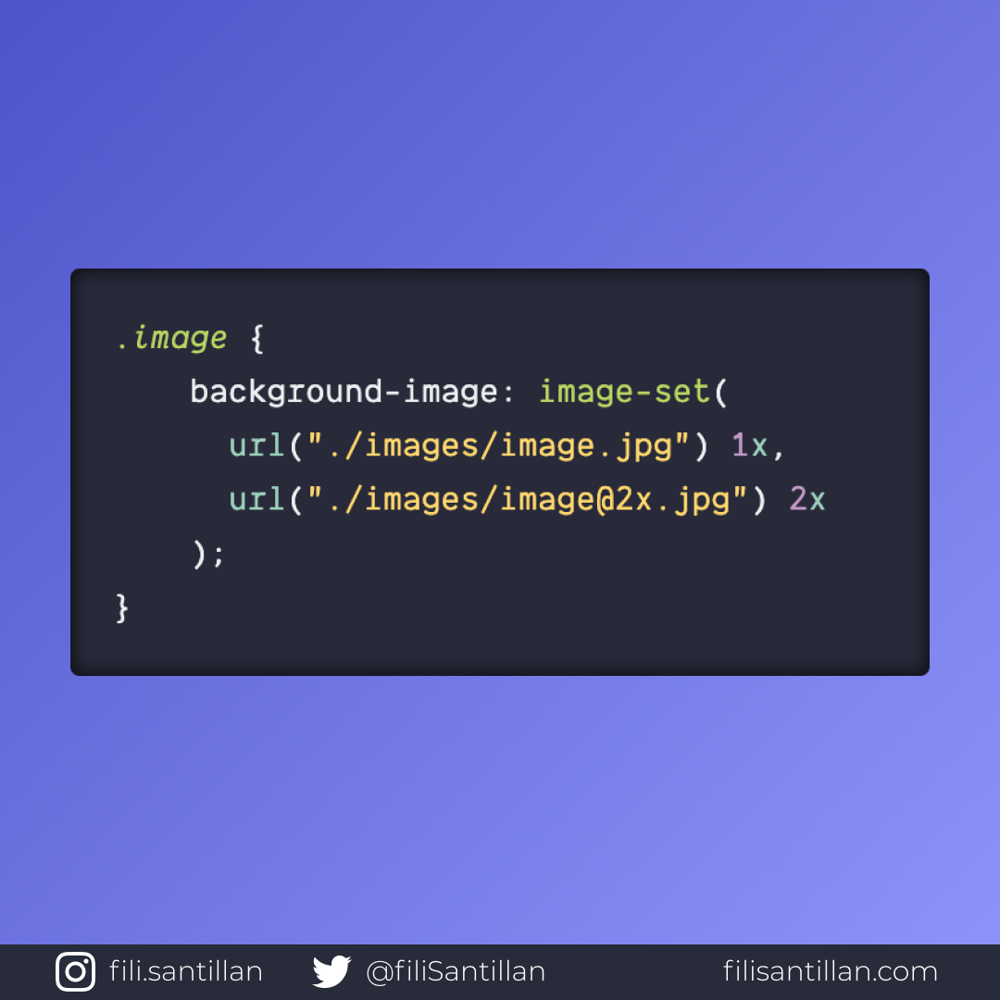

# `image-set`

`image-set` es un método que sirve para servir la imagen correcta dependiendo la resolución del dispositivo del usuario.

> Código utilizado en los ejemplos: [image-set.css](./image-set.css)

Bit completo en: [filisantillan.com](https://filisantillan.com/bits/image-set/)

## 🤓 Aprende algo nuevo hoy

> Comparto los **bits** al menos una vez por semana.

Instagram: [@fili.santillan](https://www.instagram.com/fili.santillan/)  
Twitter: [@FiliSantillan](https://twitter.com/FiliSantillan)  
Facebook: [Fili Santillán](https://www.facebook.com/FiliSantillan96/)  
Sitio web: http://filisantillan.com

## 📚 Recursos

-   [MDN image-set](https://developer.mozilla.org/en-US/docs/Web/CSS/image-set)
-   [Mejorando la carga de un sitio web: Imágenes vs. velocidad](https://filisantillan.com/blog/mejorando-la-carga-de-un-sitio-web-imagenes-vs-velocidad/)