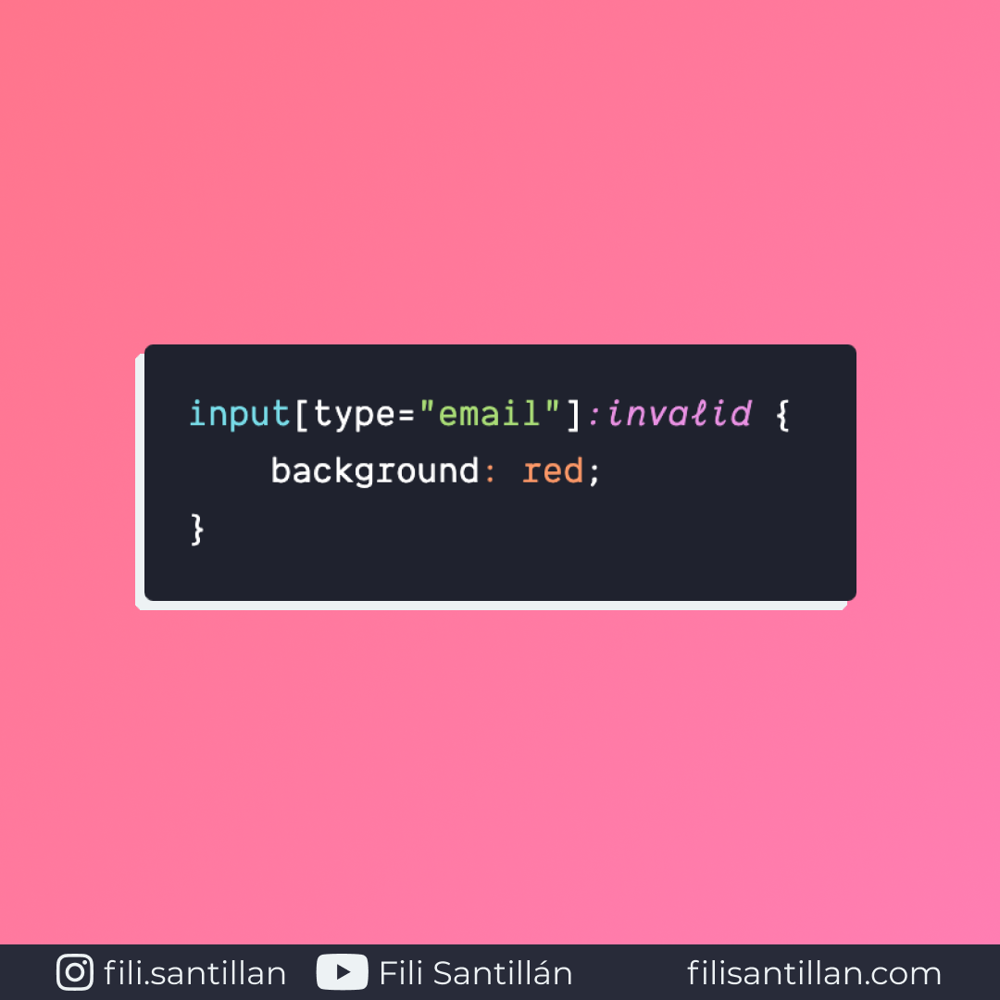

# `:invalid`

`:invalid` es una pseudo-clase que representa cuando un elemento `<input>` es inválido, basado en la información de sus atributos. Es decir que aplica estilos cuando la información es incorrecta.

Bit completo en: [filisantillan.com](https://filisantillan.com/bits/invalid/)

> Código utilizado en el ejemplo: [invalid.css](./invalid.css)

## 🤓 Aprende algo nuevo hoy

> Comparto los **bits** al menos una vez por semana.

Instagram: [@fili.santillan](https://www.instagram.com/fili.santillan/)  
Twitter: [@FiliSantillan](https://twitter.com/FiliSantillan)  
Facebook: [Fili Santillán](https://www.facebook.com/FiliSantillan96/)  
Sitio web: http://filisantillan.com

## 📚 Recursos

- [:invalid MDN](https://developer.mozilla.org/en-US/docs/Web/CSS/:invalid)
- [:invalid CSS-Tricks](https://css-tricks.com/almanac/selectors/i/invalid/)
