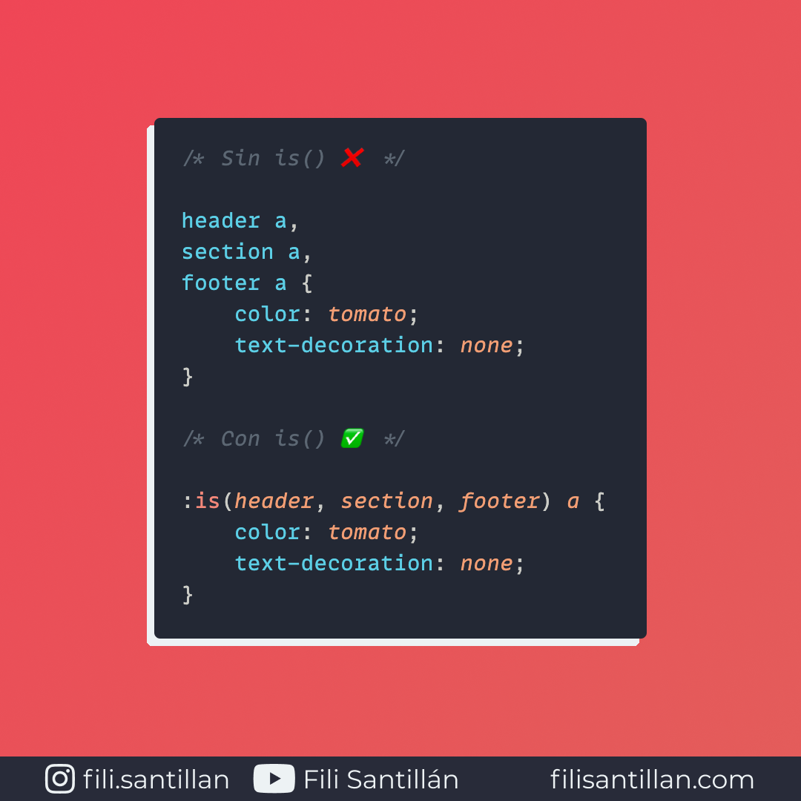

# `is()`

`is()` es una pseudo-clase de CSS que recibe una lista de selectores para así poder crear reglas de coincidencia de una manera mucho más sencilla. Facilitando el escribir agrupaciones de selectores complejas.

Bit completo en: [filisantillan.com](https://filisantillan.com/bits/is/)

> Código utilizado en el ejemplo: [is.css](./is.css)

## 🤓 Aprende algo nuevo hoy

> Comparto los **bits** al menos una vez por semana.

Instagram: [@fili.santillan](https://www.instagram.com/fili.santillan/)  
Twitter: [@FiliSantillan](https://twitter.com/FiliSantillan)  
Facebook: [Fili Santillán](https://www.facebook.com/FiliSantillan96/)  
Sitio web: http://filisantillan.com

## 📚 Recursos

- [:is() (:matches(), :any())](https://developer.mozilla.org/en-US/docs/Web/CSS/:is)
- [:is() CSS-Tricks](https://css-tricks.com/almanac/selectors/i/is/)
- [How to Use New CSS “:is()” for Easy Element Targeting](https://webdesign.tutsplus.com/articles/new-css-is-for-easy-element-targeting--cms-34223)
