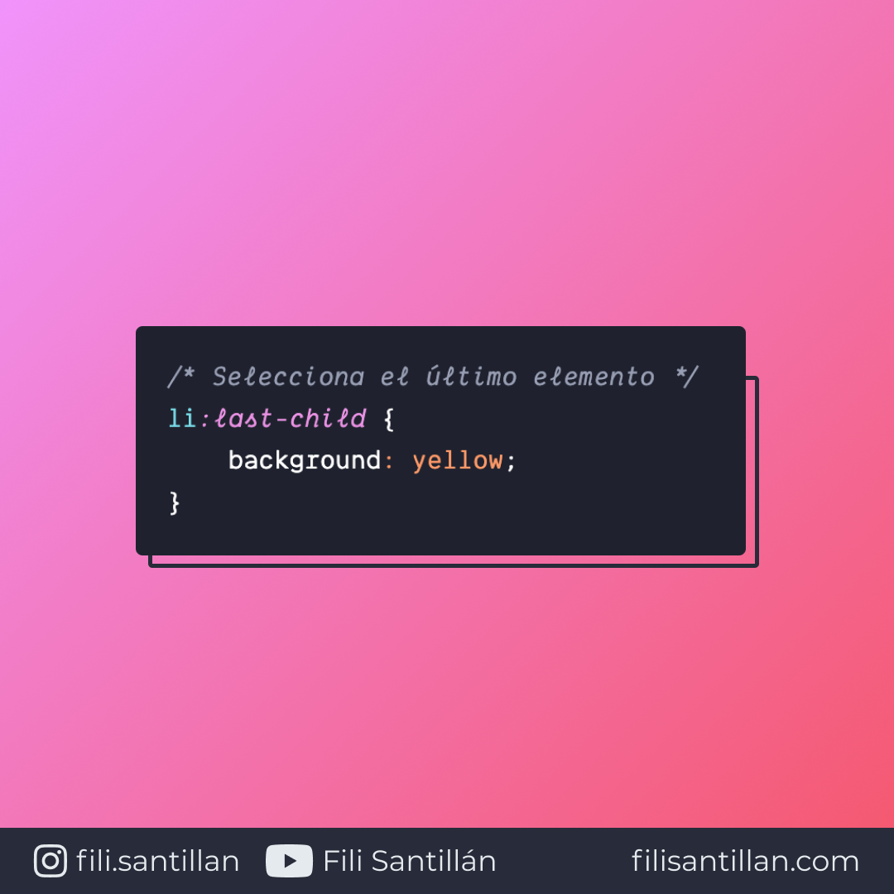

# last-child

`last-child` es una pseudo-clase que selecciona al último elemento en un grupo de hermanos.

Bit completo en: [filisantillan.com](https://filisantillan.com/bits/last-child/)

> Código utilizado en el ejemplo: [last-child.css](./last-child.css)

## 🤓 Aprende algo nuevo hoy

> Comparto los **bits** al menos una vez por semana.

Instagram: [@fili.santillan](https://www.instagram.com/fili.santillan/)  
Twitter: [@FiliSantillan](https://twitter.com/FiliSantillan)  
Facebook: [Fili Santillán](https://www.facebook.com/FiliSantillan96/)  
Sitio web: http://filisantillan.com

## 📚 Recursos

- [MDN :last-child](https://developer.mozilla.org/es/docs/Web/CSS/:last-child)
- [CSS-Tricks :last-child](https://css-tricks.com/almanac/selectors/l/last-child/)
