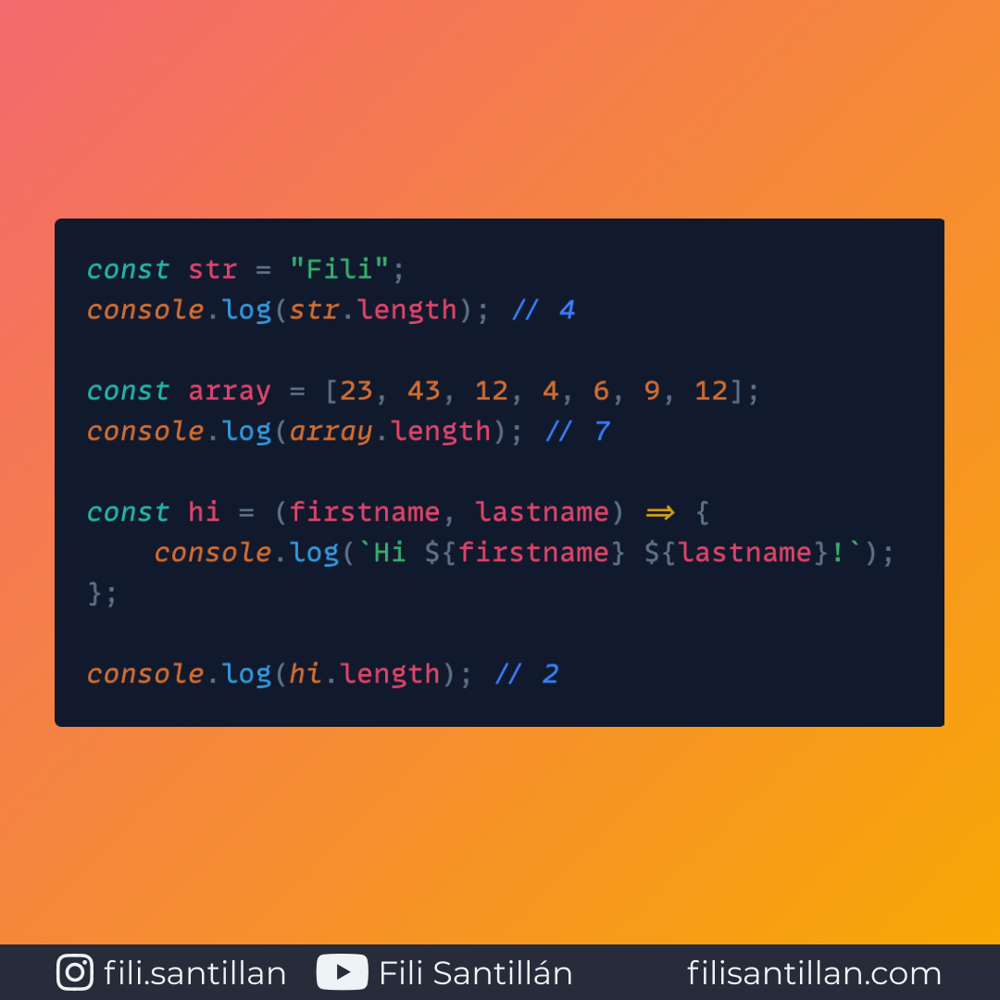

# length

La propiedad length en JavaScript puede cumplir con tres diferentes funciones. Todo dependiendo el contexto en el que se ejecute.

Bit completo en: [filisantillan.com](https://filisantillan.com/bits/length/)

> Código utilizado en los ejemplos: [length.js](./length.js)

## 🤓 Aprende algo nuevo hoy

Comparto los **bits** al menos una vez por semana.

Instagram: [@fili.santillan](https://www.instagram.com/fili.santillan/)  
Twitter: [@FiliSantillan](https://twitter.com/FiliSantillan)  
Facebook: [Fili Santillán](https://www.facebook.com/FiliSantillan96/)  
Sitio web: http://filisantillan.com

## 📚 Recursos

-   [Array.prototype.length](https://developer.mozilla.org/en-US/docs/Web/JavaScript/Reference/Global_Objects/Array/length)
-   [String length](https://developer.mozilla.org/en-US/docs/Web/JavaScript/Reference/Global_Objects/String/length)
