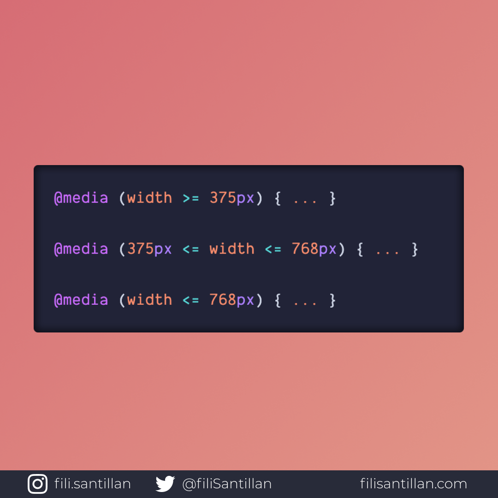

# Media Query Ranges

En la especificación de nivel 4 para los media queries se incluye una mejora para las consultas de rango, utilizando operadores de comparación matemáticos.

> Código utilizado en los ejemplos: [media-query-ranges.css](./media-query-ranges.css)

Bit completo en: [filisantillan.com](https://filisantillan.com/bits/media-query-ranges/)

## 🤓 Aprende algo nuevo hoy

> Comparto los **bits** al menos una vez por semana.

Instagram: [@fili.santillan](https://www.instagram.com/fili.santillan/)  
Twitter: [@FiliSantillan](https://twitter.com/FiliSantillan)  
Facebook: [Fili Santillán](https://www.facebook.com/FiliSantillan96/)  
Sitio web: http://filisantillan.com

## 📚 Recursos

-   [W3C Media Queries Level 4](https://www.w3.org/TR/mediaqueries-4/#range-context)
-   [MDN Using media queries](https://developer.mozilla.org/en-US/docs/Web/CSS/Media_Queries/Using_media_queries)