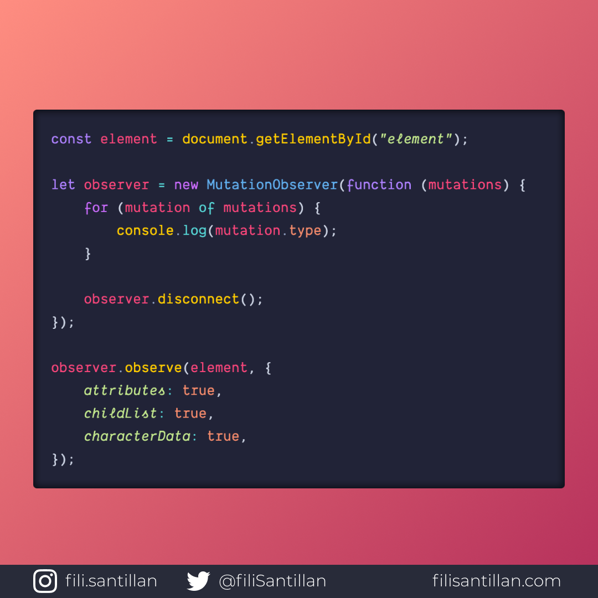

# mutationObserver

`MutationObserver` te da la capacidad de observar los cambios que puede sufrir un elemento del DOM (HTML). Esos cambios incluyen el contenido del elemento, cambios en sus atributos, incluso si ha sido eliminado, entre otros.

> Código utilizado en los ejemplos: [mutationObserver.js](./mutationObserver.js)

Bit completo en:[filisantillan.com](https://filisantillan.com/bits/mutationobserver/)

## 🤓 Aprende algo nuevo hoy

> Comparto los **bits** al menos una vez por semana.

Instagram: [@fili.santillan](https://www.instagram.com/fili.santillan/)  
Twitter: [@FiliSantillan](https://twitter.com/FiliSantillan)  
Facebook: [Fili Santillán](https://www.facebook.com/FiliSantillan96/)  
Sitio web: http://filisantillan.com

## 📚 Recursos

-   [MDN MutationObserver](https://developer.mozilla.org/en-US/docs/Web/API/MutationObserver)
-   [MDN MutationObserver Constructor](https://developer.mozilla.org/en-US/docs/Web/API/MutationObserver/MutationObserver)
-   [Getting To Know The MutationObserver API](https://www.smashingmagazine.com/2019/04/mutationobserver-api-guide/)
