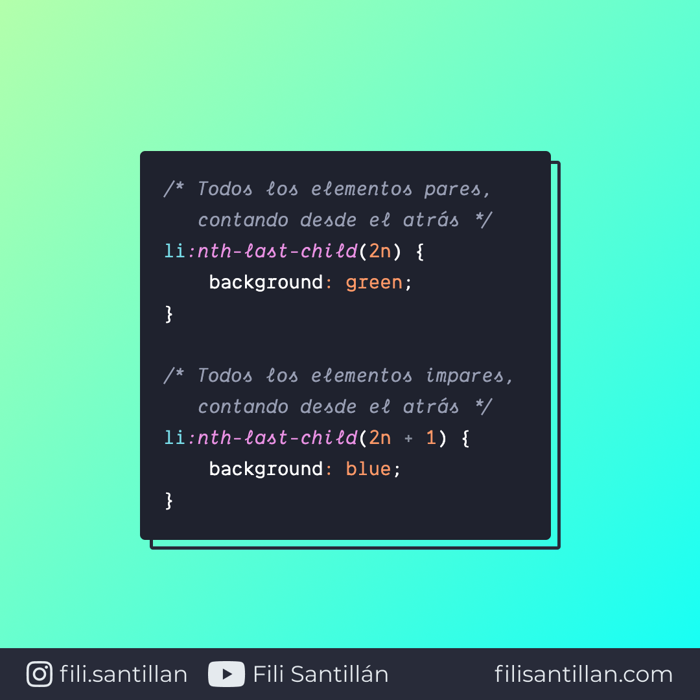

# :nth-last-child

`nth-last-child()` es una pseudo-clase que selecciona a los elementos en un grupo de hermanos que coinciden con el patrón especificado, empezando desde atrás (último).

Bit completo en: [filisantillan.com](https://filisantillan.com/bits/nth-last-child/)

> Código utilizado en el ejemplo: [nth-last-child.css](./nth-last-child.css)

## 🤓 Aprende algo nuevo hoy

> Comparto los **bits** al menos una vez por semana.

Instagram: [@fili.santillan](https://www.instagram.com/fili.santillan/)  
Twitter: [@FiliSantillan](https://twitter.com/FiliSantillan)  
Facebook: [Fili Santillán](https://www.facebook.com/FiliSantillan96/)  
Sitio web: http://filisantillan.com

## 📚 Recursos

- [MDN :last-child](https://developer.mozilla.org/en-US/docs/Web/CSS/:last-child)
- [CSS-Tricks :last-child](https://css-tricks.com/almanac/selectors/l/last-child/)
