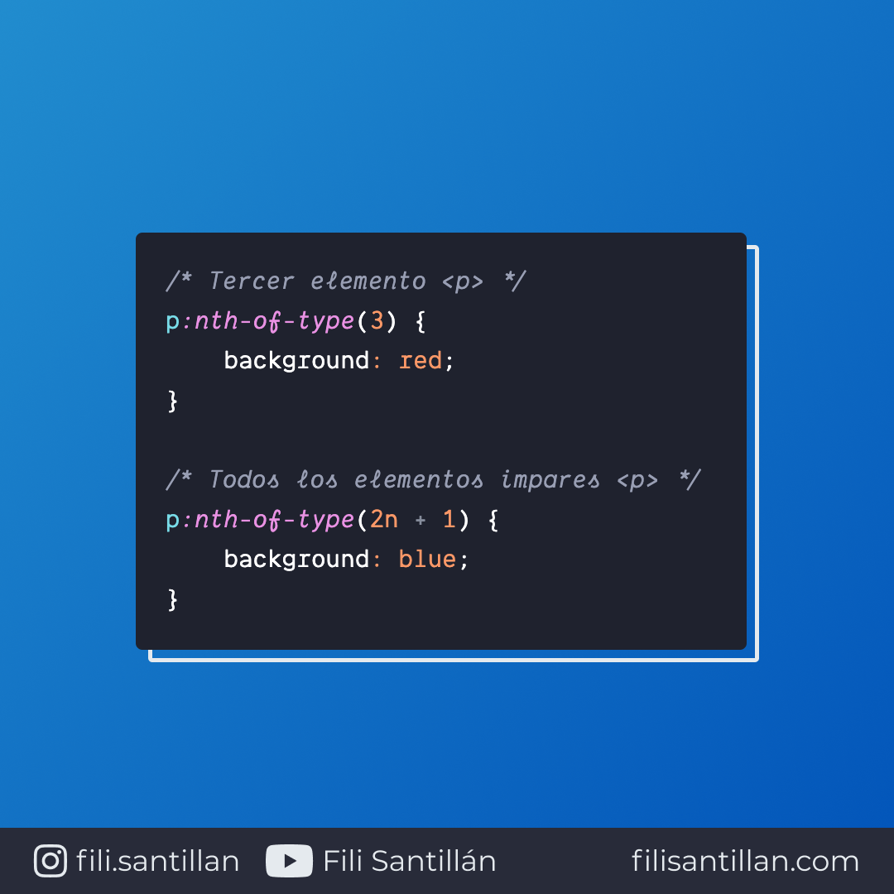

# `nth-of-type`

`nth-of-type` es una pseudo-clase que selecciona a los elementos en un grupo de hermanos que coinciden con el patrón especificado y su ordenamiento de origen.

Bit completo en: [filisantillan.com](https://filisantillan.com/bits/nth-of-type/)

> Código utilizado en el ejemplo: [nth-of-type.css](./nth-of-type.css)

## 🤓 Aprende algo nuevo hoy

> Comparto los **bits** al menos una vez por semana.

Instagram: [@fili.santillan](https://www.instagram.com/fili.santillan/)  
Twitter: [@FiliSantillan](https://twitter.com/FiliSantillan)  
Facebook: [Fili Santillán](https://www.facebook.com/FiliSantillan96/)  
Sitio web: http://filisantillan.com

## 📚 Recursos

- [MDN :nth-of-type()](https://developer.mozilla.org/en-US/docs/Web/CSS/:nth-of-type)
- [CSS-Tricks :nth-of-type](https://css-tricks.com/almanac/selectors/n/nth-of-type/)
- [The Difference Between :nth-child and :nth-of-type](https://css-tricks.com/the-difference-between-nth-child-and-nth-of-type/)
