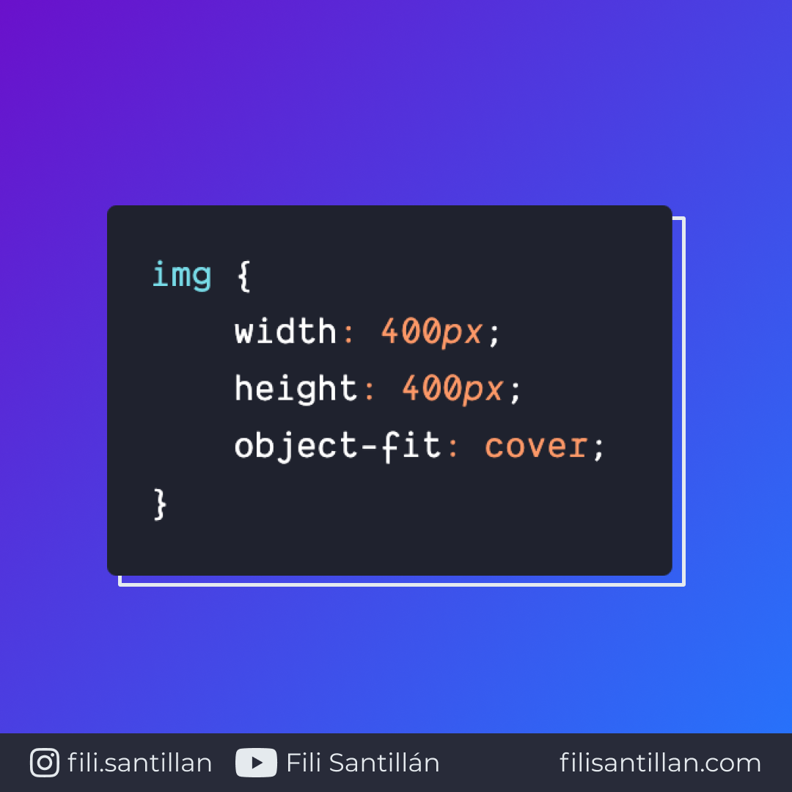

# object-fit

La propiedad `object-fit` especifica cómo se debe comportar un elemento respecto a su contenedor. Diseñado para imágenes, videos y otros formatos de multimedia.

Bit completo en: [filisantillan.com](https://filisantillan.com/bits/object-fit/)

> Código utilizado en el ejemplo: [object-fit.css](./object-fit.css)

## 🤓 Aprende algo nuevo hoy

> Comparto los **bits** al menos una vez por semana.

Instagram: [@fili.santillan](https://www.instagram.com/fili.santillan/)  
Twitter: [@FiliSantillan](https://twitter.com/FiliSantillan)  
Facebook: [Fili Santillán](https://www.facebook.com/FiliSantillan96/)  
Sitio web: http://filisantillan.com

## 📚 Recursos

- [object-fit MDN](https://developer.mozilla.org/en-US/docs/Web/CSS/object-fit)
- [object-fit CSS-Tricks](https://css-tricks.com/almanac/properties/o/object-fit/)
- [Imagen utilizada en los ejemplos](https://images.unsplash.com/photo-1612593782980-3a9d3e40ee98?ixid=MXwxMjA3fDB8MHxwaG90by1wYWdlfHx8fGVufDB8fHw%3D&ixlib=rb-1.2.1&auto=format&fit=crop&w=634&q=80)
