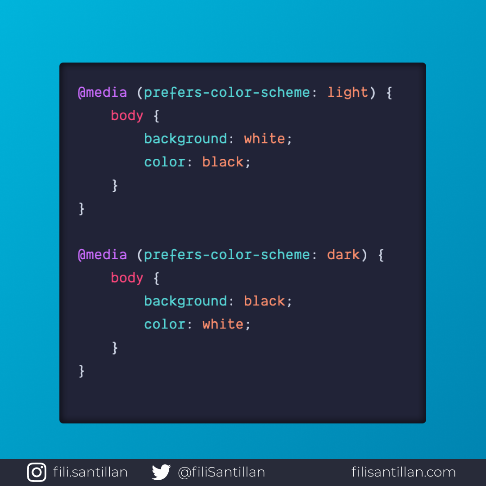

# `prefers-color-scheme`

La función prefers-color-scheme consulta la solicitud de colores que el usuario prefiere en su sistema.

- `light`: Cuando el usuario ha indicado que prefiere tener colores claros.
- `dark`: Cuando el usuario ha indicado que prefiere tener colores oscuros.

> Código utilizado en los ejemplos: [prefers-color-scheme.css](./prefers-color-scheme.css)

Bit completo en: [filisantillan.com](https://filisantillan.com/bits/prefers-color-scheme/)

## 🤓 Aprende algo nuevo hoy

> Comparto los **bits** al menos una vez por semana.

Instagram: [@fili.santillan](https://www.instagram.com/fili.santillan/)  
Twitter: [@FiliSantillan](https://twitter.com/FiliSantillan)  
Facebook: [Fili Santillán](https://www.facebook.com/FiliSantillan96/)  
Sitio web: http://filisantillan.com

## 📚 Recursos

-   [MDN prefer-color-scheme](https://developer.mozilla.org/en-US/docs/Web/CSS/@media/prefers-color-scheme)
-   [web.dev prefer-color-scheme](https://web.dev/prefers-color-scheme/)
