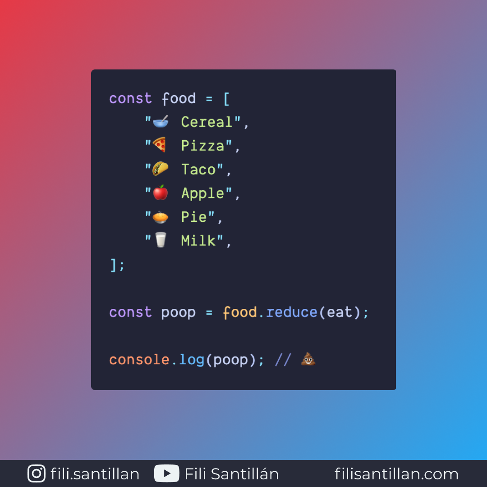

# reduce

El método `reduce()` devuelve un valor de salida único a través de una función
reductora (callback) que se ejecuta por cada elemento en un array.

Bit completo en: [filisantillan.com](https://filisantillan.com/bits/reduce/)

> Código utilizado en los ejemplos: [reduce.js](./reduce.js)

## 🤓 Aprende algo nuevo hoy

Comparto los **bits** al menos una vez por semana.

Instagram: [@fili.santillan](https://www.instagram.com/fili.santillan/)  
Twitter: [@FiliSantillan](https://twitter.com/FiliSantillan)  
Facebook: [Fili Santillán](https://www.facebook.com/FiliSantillan96/)  
Sitio web: http://filisantillan.com

## 📚 Recursos

-   [MDN Array.prototype.reduce()](https://developer.mozilla.org/en-US/docs/Web/JavaScript/Reference/Global_Objects/Array/reduce)
