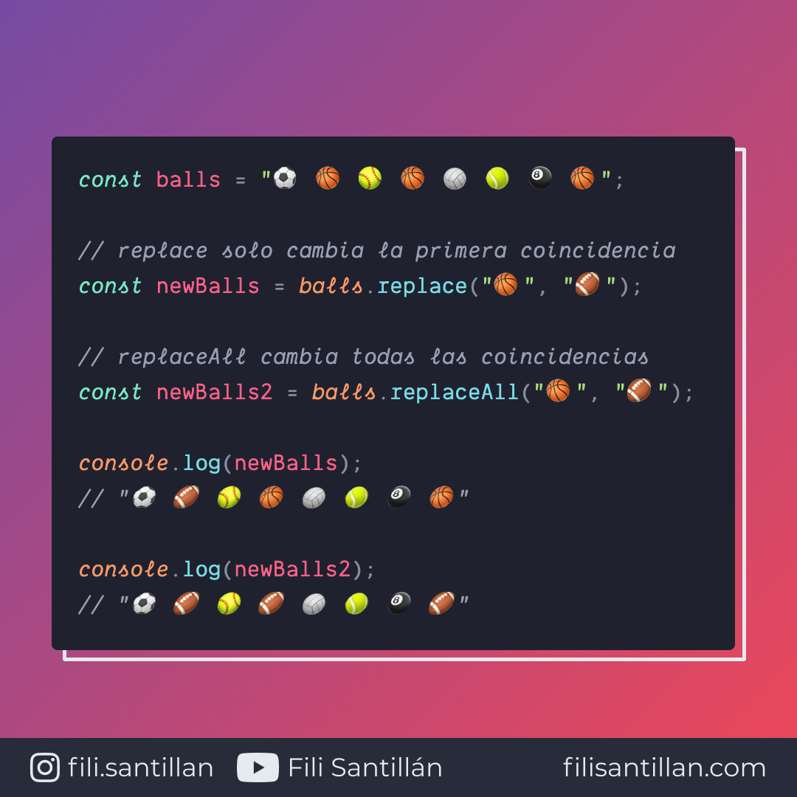

# replaceAll

El método `replaceAll` devuelve un `string` creado a partir de otro, reemplazando todas las coincidencias especificadas en un patrón.

Bit completo en: [filisantillan.com](https://filisantillan.com/bits/replaceall/)

> Código utilizado en el ejemplo: [replaceAll.js](./replaceAll.js)

## 🤓 Aprende algo nuevo hoy

> Comparto los **bits** al menos una vez por semana.

Instagram: [@fili.santillan](https://www.instagram.com/fili.santillan/)  
Twitter: [@FiliSantillan](https://twitter.com/FiliSantillan)  
Facebook: [Fili Santillán](https://www.facebook.com/FiliSantillan96/)  
Sitio web: http://filisantillan.com

## 📚 Recursos

- [MDN String.prototype.replaceAll()](https://developer.mozilla.org/en-US/docs/Web/JavaScript/Reference/Global_Objects/String/replaceAll)
