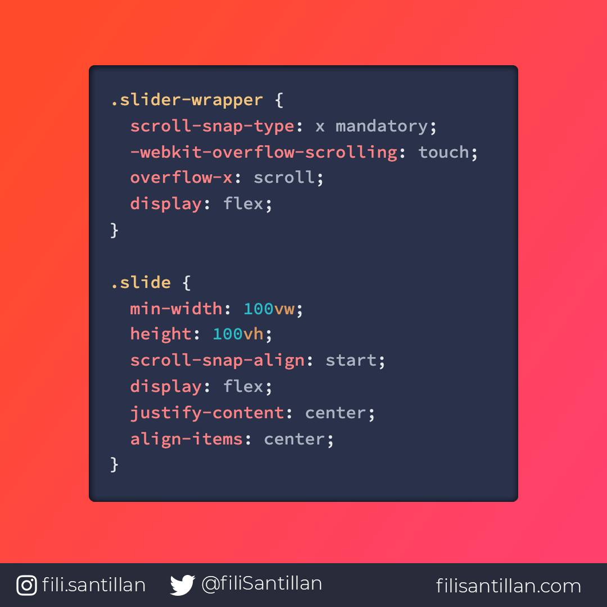

# Scroll Snap

**CSS Scroll Snap** permite crear experiencias de desplazamiento mucho más amigables y bien controladas. Permitiendo declarar las posiciones en nuestro scroll.

> Código utilizado en los ejemplos: [scroll-snap.css](/BitCode/scroll-snap/scroll-snap.css).

Demo: https://codepen.io/filisantillan/pen/GRpKrdw

## 🤓 Aprende algo nuevo hoy

> Comparto **bits** al menos una vez por semana.

Instagram: [@fili.santillan](https://www.instagram.com/fili.santillan/)  
Twitter: [@FiliSantillan](https://twitter.com/FiliSantillan)  
Facebook: [Fili Santillán](https://www.facebook.com/FiliSantillan96/)  
Sitio web: http://filisantillan.com  

## 📚 Recursos

- [Practical CSS Scroll Snapping](https://css-tricks.com/practical-css-scroll-snapping/)
- [Well-Controlled Scrolling with CSS Scroll Snap](https://developers.google.com/web/updates/2018/07/css-scroll-snap)