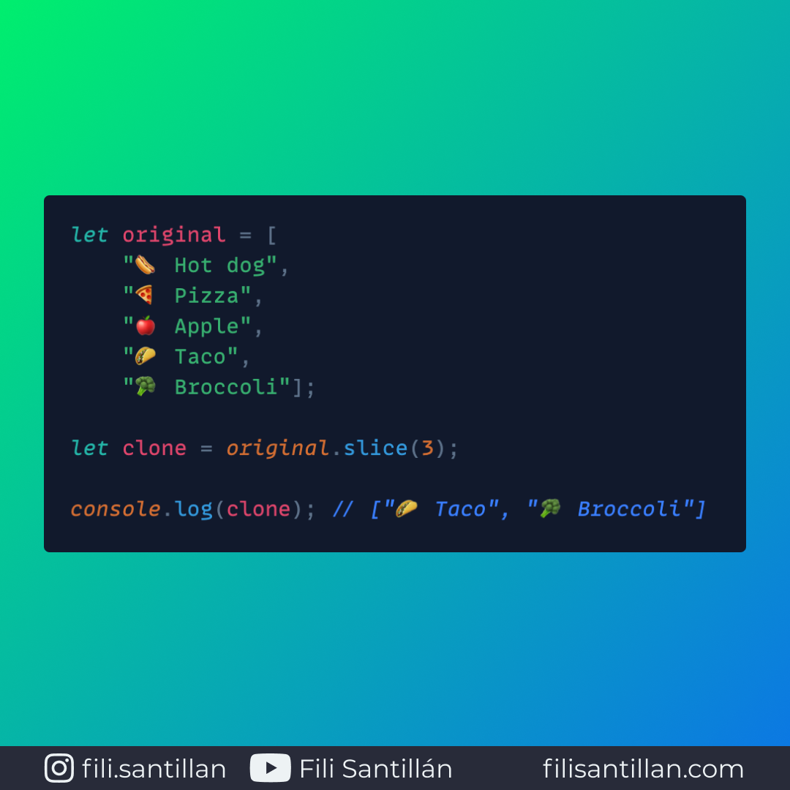

# Slice

El método `slice` devuelve la copia de un array con la posibilidad de especificar el inicio y el final de la copia. Sin que el array original se vea afectado.

En el caso de `strings`, extrae una sección del mismo y devuelve uno completamente nuevo. Sin que el primer `string` se vea afectado.

Bit completo en: [filisantillan.com](https://filisantillan.com/bits/slice/)

> Código utilizado en los ejemplos: [slice.js](./slice.js)

## 🤓 Aprende algo nuevo hoy

Comparto los **bits** al menos una vez por semana.

Instagram: [@fili.santillan](https://www.instagram.com/fili.santillan/)  
Twitter: [@FiliSantillan](https://twitter.com/FiliSantillan)  
Facebook: [Fili Santillán](https://www.facebook.com/FiliSantillan96/)  
Sitio web: http://filisantillan.com

## 📚 Recursos

-   [Array.prototype.slice()](https://developer.mozilla.org/en-US/docs/Web/JavaScript/Reference/Global_Objects/Array/slice)
-   [String.prototype.slice()](https://developer.mozilla.org/en-US/docs/Web/JavaScript/Reference/Global_Objects/String/slice)
