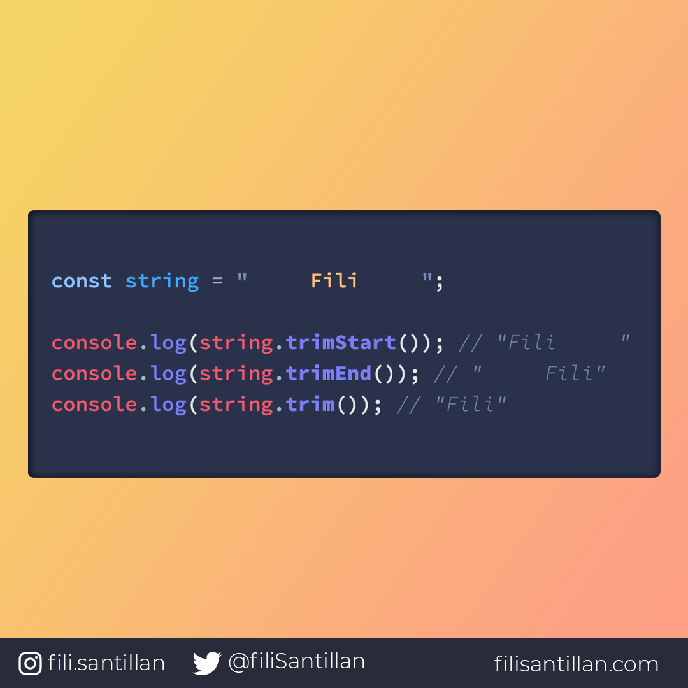

# `trim()`

Los métodos `trimStart()`, `trimEnd()` y `trim()` eliminan los espacios en blanco al principio, final o de ambos lados.

> Código utilizado en los ejemplos: [trim.js](/BitCode/trim/trim.js).

## 🤓 Aprende algo nuevo hoy

> Comparto **bits** al menos una vez por semana.

Instagram: [@fili.santillan](https://www.instagram.com/fili.santillan/)  
Twitter: [@FiliSantillan](https://twitter.com/FiliSantillan)  
Facebook: [Fili Santillán](https://www.facebook.com/FiliSantillan96/)  
Sitio web: http://filisantillan.com  