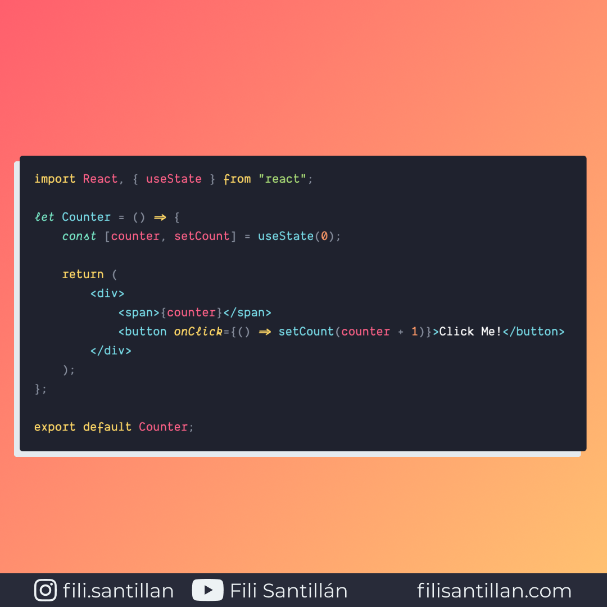

# useState

El Hook useState te permite añadir un estado local en un componente, sin tener que definir una clase de JavaScript.

Bit completo en: [filisantillan.com](https://filisantillan.com/bits/usestate/)

> Código utilizado en el ejemplo: [useState.js](./useState.js)

## 🤓 Aprende algo nuevo hoy

> Comparto los **bits** al menos una vez por semana.

Instagram: [@fili.santillan](https://www.instagram.com/fili.santillan/)  
Twitter: [@FiliSantillan](https://twitter.com/FiliSantillan)  
Facebook: [Fili Santillán](https://www.facebook.com/FiliSantillan96/)  
Sitio web: http://filisantillan.com

## 📚 Recursos

- [Introducción a los React Hooks](https://filisantillan.com/blog/introduccion-a-los-react-hooks/)
