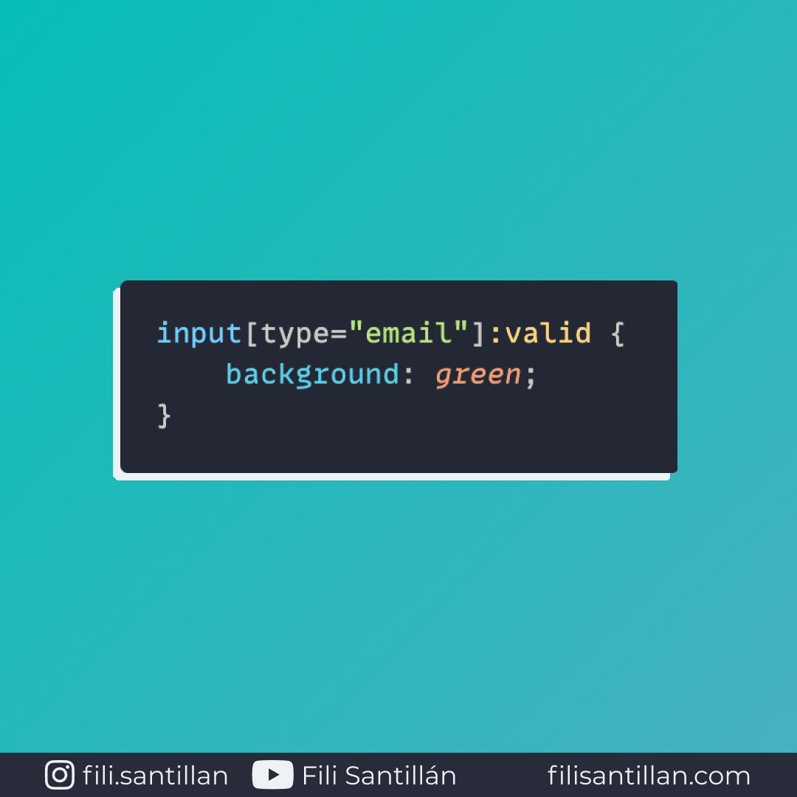

# `:valid`

`:valid` es una pseudo-clase que representa cuando un elemento `<input>` es válido, basado en la información de sus atributos. Es decir que aplica estilos para validar cuando la información es correcta.

Bit completo en: [filisantillan.com](https://filisantillan.com/bits/valid/)

> Código utilizado en el ejemplo: [valid.css](./valid.css)

## 🤓 Aprende algo nuevo hoy

> Comparto los **bits** al menos una vez por semana.

Instagram: [@fili.santillan](https://www.instagram.com/fili.santillan/)  
Twitter: [@FiliSantillan](https://twitter.com/FiliSantillan)  
Facebook: [Fili Santillán](https://www.facebook.com/FiliSantillan96/)  
Sitio web: http://filisantillan.com

## 📚 Recursos

- [:valid MDN](https://developer.mozilla.org/en-US/docs/Web/CSS/:valid)
- [:valid CSS-Tricks](https://css-tricks.com/almanac/selectors/v/valid/)
