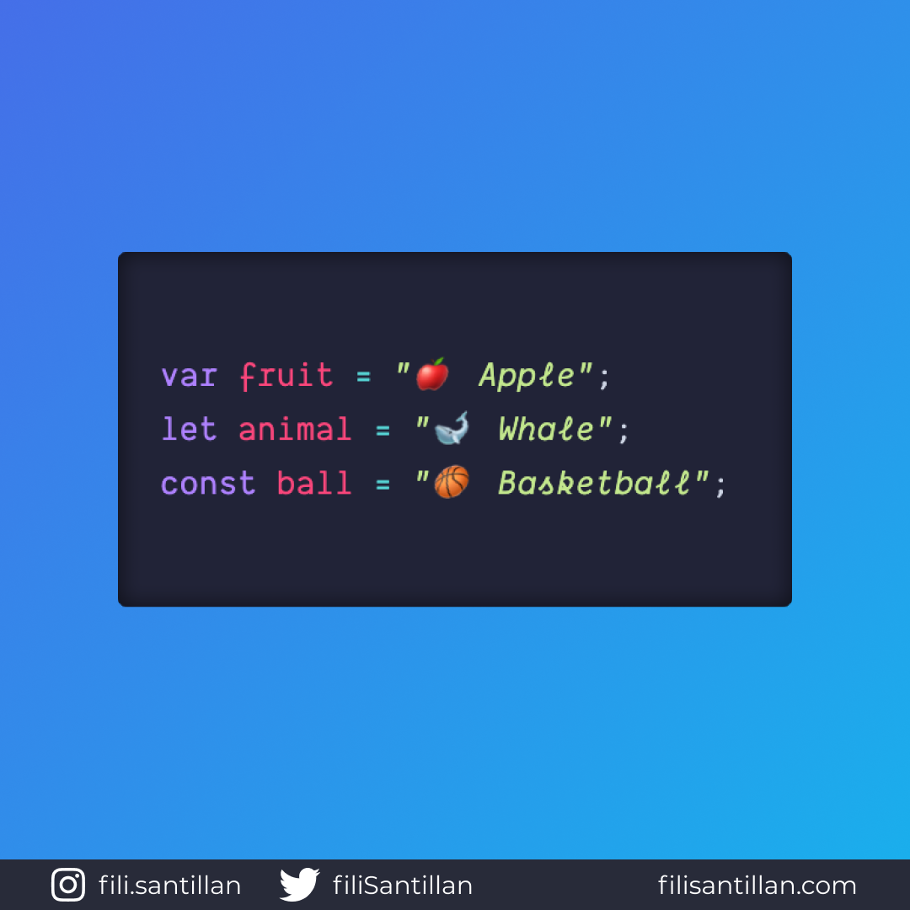

# `var`, `let` y `const`

Con la llegada de ES6 (2015), ahora en JavaScript se tiene tres formas de
declarar una variable: `var`, `let` y `const`.

> Código utilizado en los ejemplos: [var-let-const.js](./var-let-const.js)

En este bit te presentaré las diferencias entre cada una de ellas.

Bit completo en:
[filisantillan.com](https://filisantillan.com/bits/var-let-const/)

## 🤓 Aprende algo nuevo hoy

> Comparto los **bits** al menos una vez por semana.

Instagram: [@fili.santillan](https://www.instagram.com/fili.santillan/)  
Twitter: [@FiliSantillan](https://twitter.com/FiliSantillan)  
Facebook: [Fili Santillán](https://www.facebook.com/FiliSantillan96/)  
Sitio web: http://filisantillan.com

## 📚 Recursos

- [MDN var](https://developer.mozilla.org/en-US/docs/Web/JavaScript/Reference/Statements/var)
- [MDN let](https://developer.mozilla.org/en-US/docs/Web/JavaScript/Reference/Statements/let)
- [MDN const](https://developer.mozilla.org/en-US/docs/Web/JavaScript/Reference/Statements/const)
- [VAR vs LET vs CONST: Todas las diferencias](https://www.youtube.com/watch?v=ojrvxYcKeYg)
