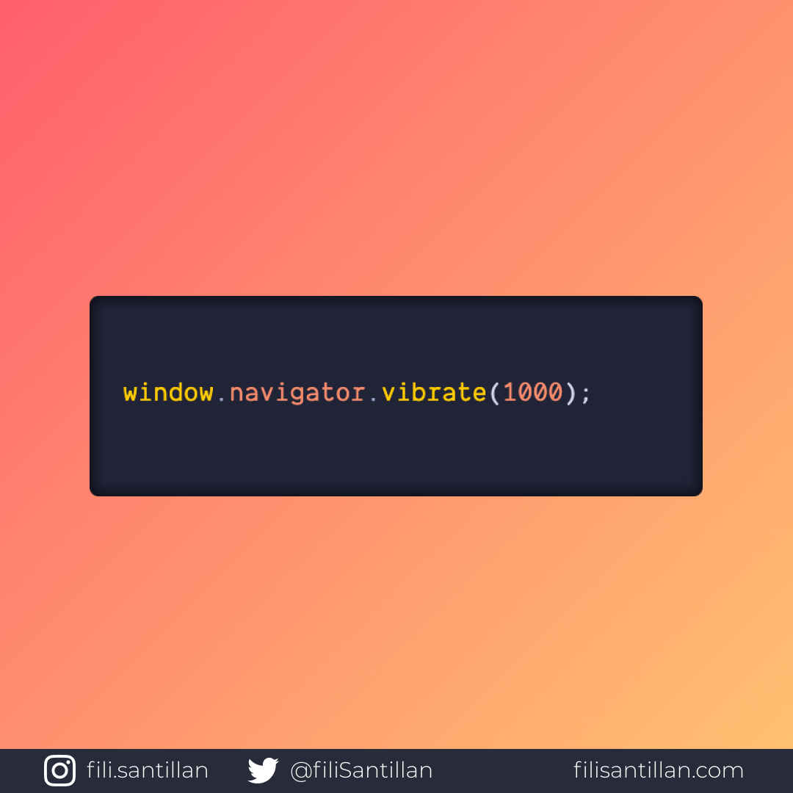

# Vibration API

Para utilizar la API es necesario el método `vibrate()` y pasar como argumento la duración de la vibración en milisegundos.

> Código utilizado en los ejemplos: [vibration-api.js](/BitCode/vibration-api/vibration-api.js)

Bit completo en: [filisantillan.com](https://filisantillan.com/bits/vibration-api/)

## 🤓 Aprende algo nuevo hoy

> Comparto **bits** al menos una vez por semana.

Instagram: [@fili.santillan](https://www.instagram.com/fili.santillan/)  
Twitter: [@FiliSantillan](https://twitter.com/FiliSantillan)  
Facebook: [Fili Santillán](https://www.facebook.com/FiliSantillan96/)  
Sitio web: http://filisantillan.com  

## 📚 Recursos

-   [MDN Vibration API](https://developer.mozilla.org/en-US/docs/Web/API/Vibration_API)
