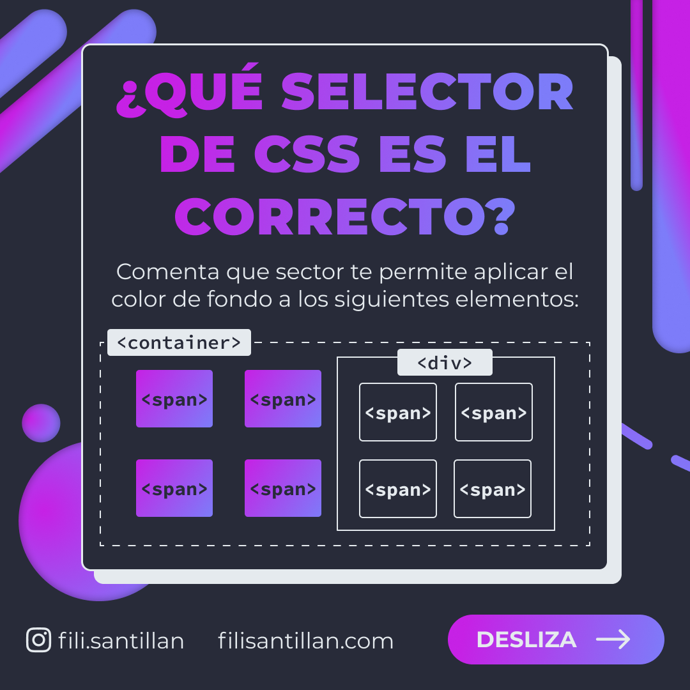
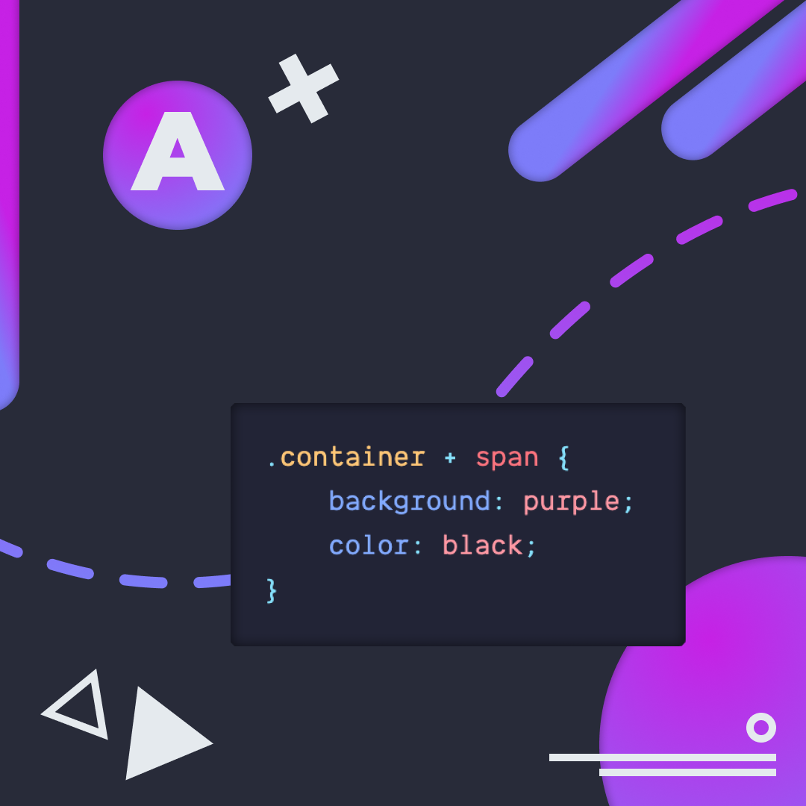
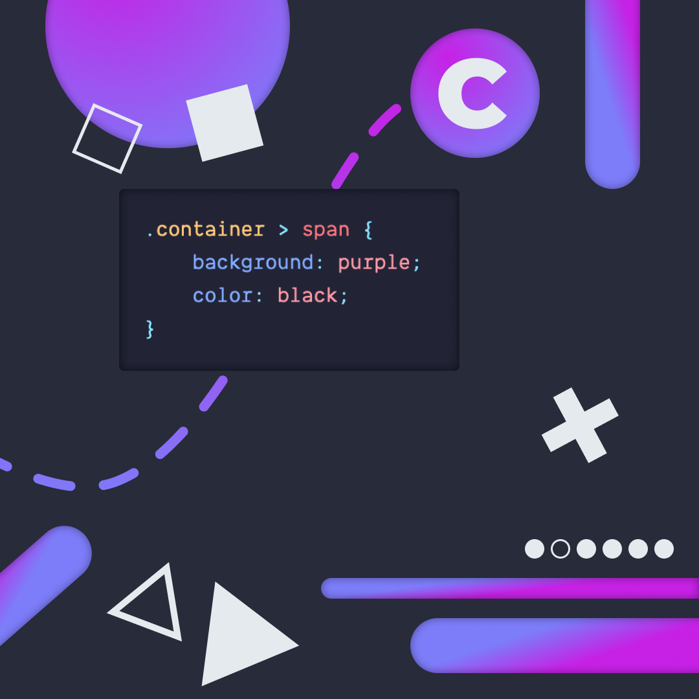
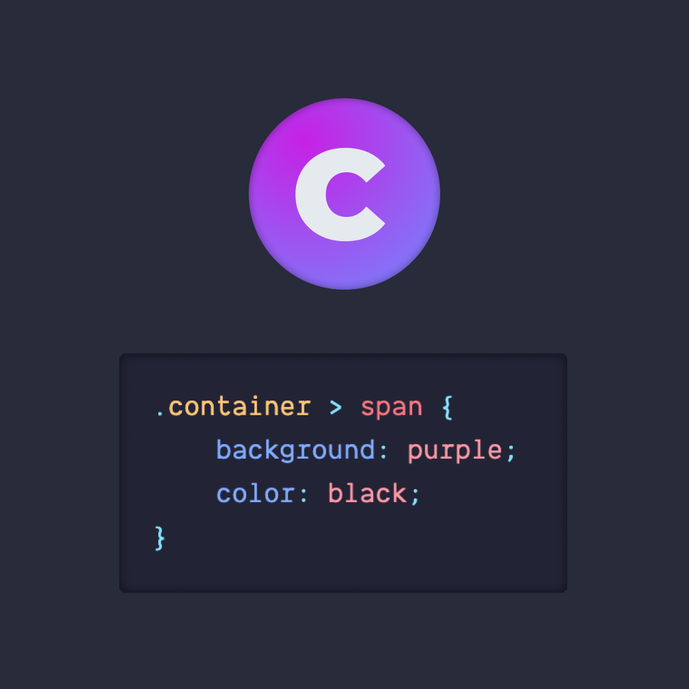
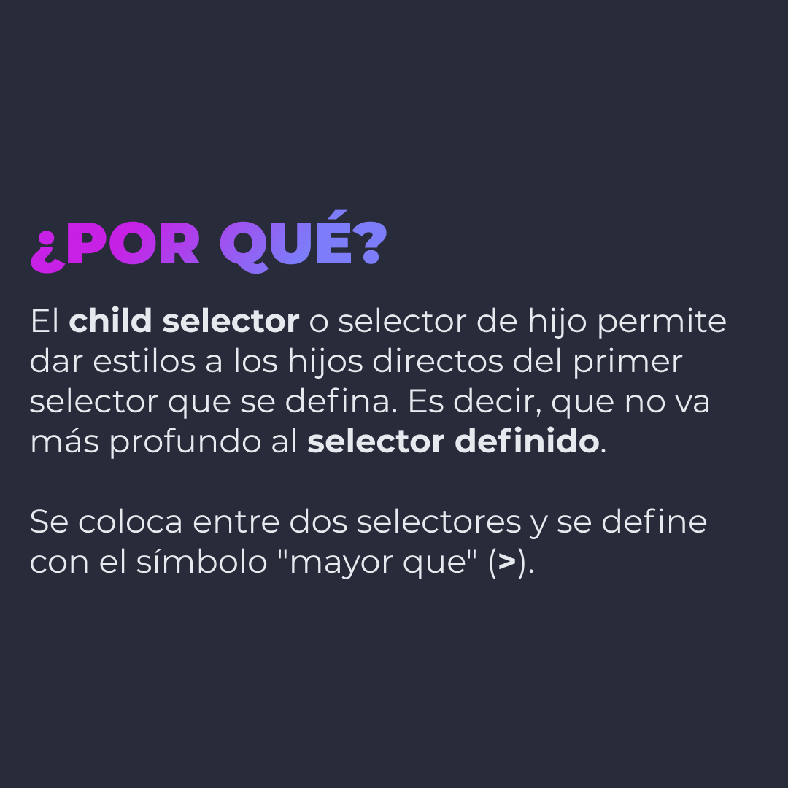

# ¿QUÉ SELECTOR DE CSS ES EL CORRECTO?

¿Qué sector que te permite aplicar el color de fondo a los siguientes elementos?

> Código utilizado en los ejemplos: [problem.css](./problem.css)

  
Click para ver la respuesta correcta. 

   

## 🤓 Aprende algo nuevo hoy

> Comparto diferentes **bits** cada semana:

Instagram: [@fili.santillan](https://www.instagram.com/fili.santillan/)  
Twitter: [@FiliSantillan](https://twitter.com/FiliSantillan)  
Facebook: [Fili Santillán](https://www.facebook.com/FiliSantillan96/)  
Sitio web: https://filisantillan.com
