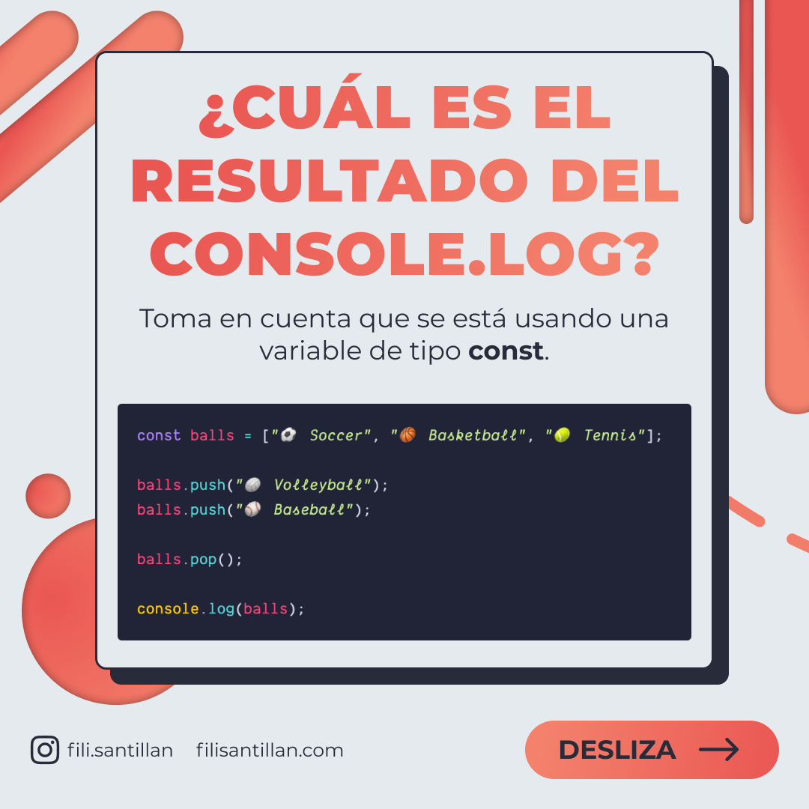
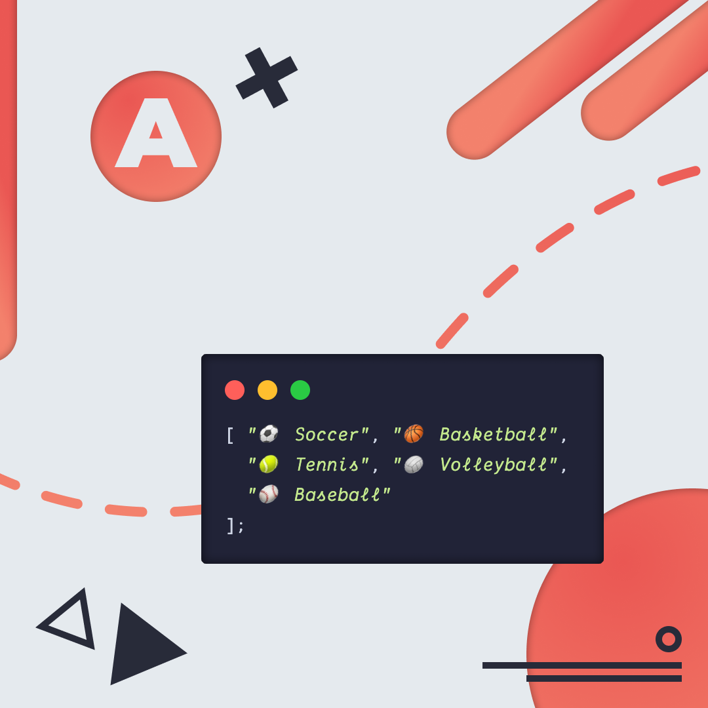
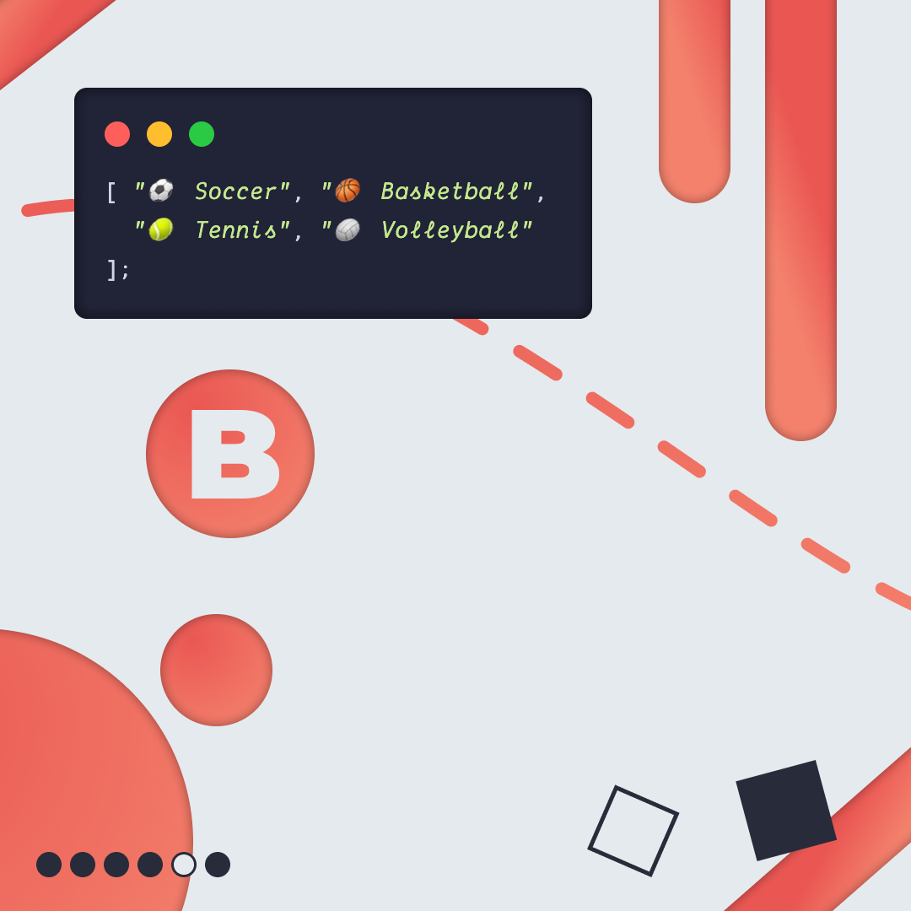
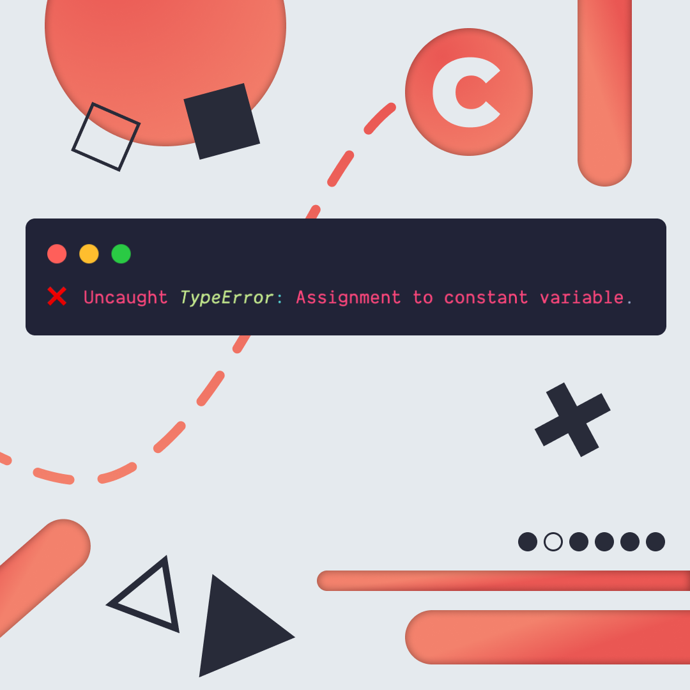
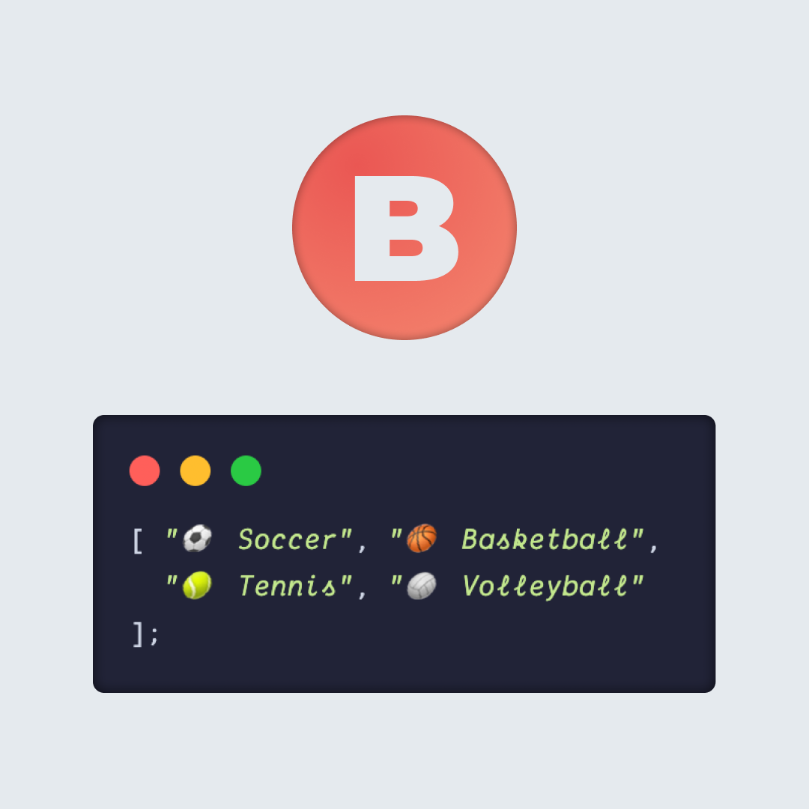
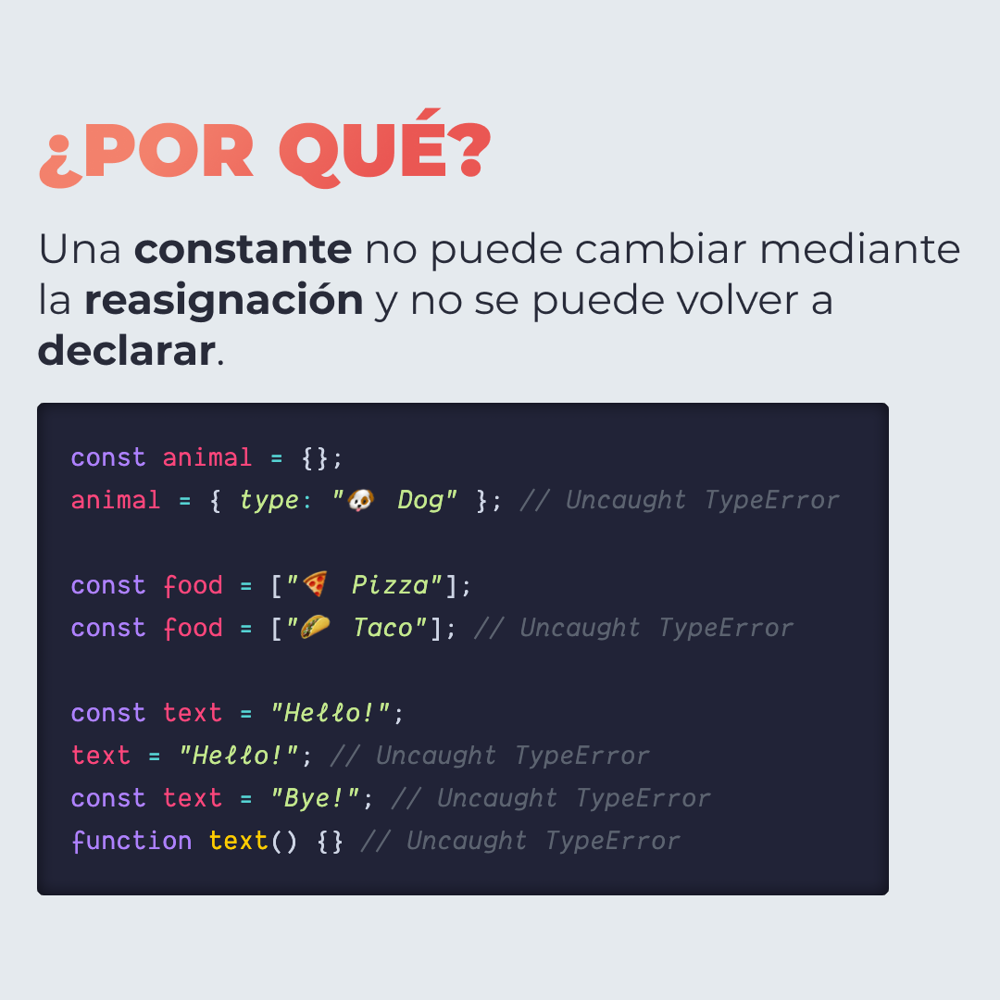
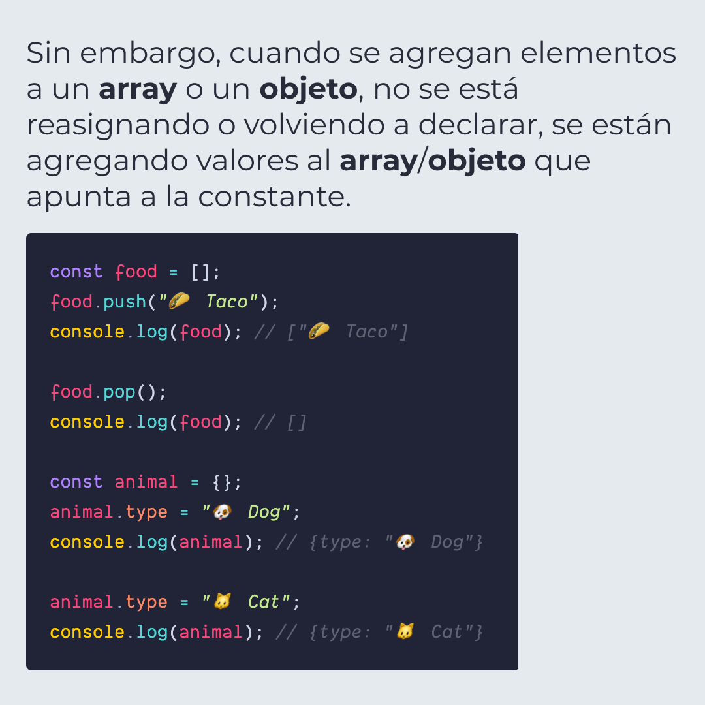

# ¿CUÁL ES EL RESULTADO DEL `CONSOLE.LOG`?

Toma en cuenta qué se está usando una variable de tipo `const`.

> Código utilizado en los ejemplos: [problem.js](./problem.js)

  
Click para ver la respuesta correcta. 

   

  

  

  

## 🤓 Aprende algo nuevo hoy

> Comparto diferentes **bits** cada semana:

Instagram: [@fili.santillan](https://www.instagram.com/fili.santillan/)  
Twitter: [@FiliSantillan](https://twitter.com/FiliSantillan)  
Facebook: [Fili Santillán](https://www.facebook.com/FiliSantillan96/)  
Sitio web: https://filisantillan.com
