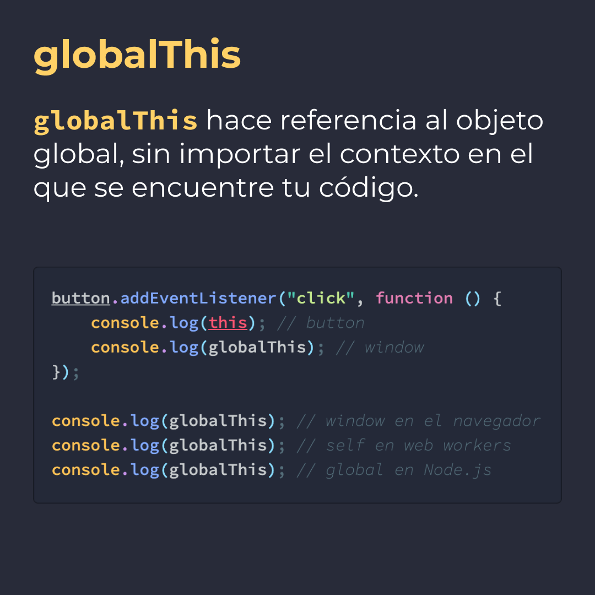
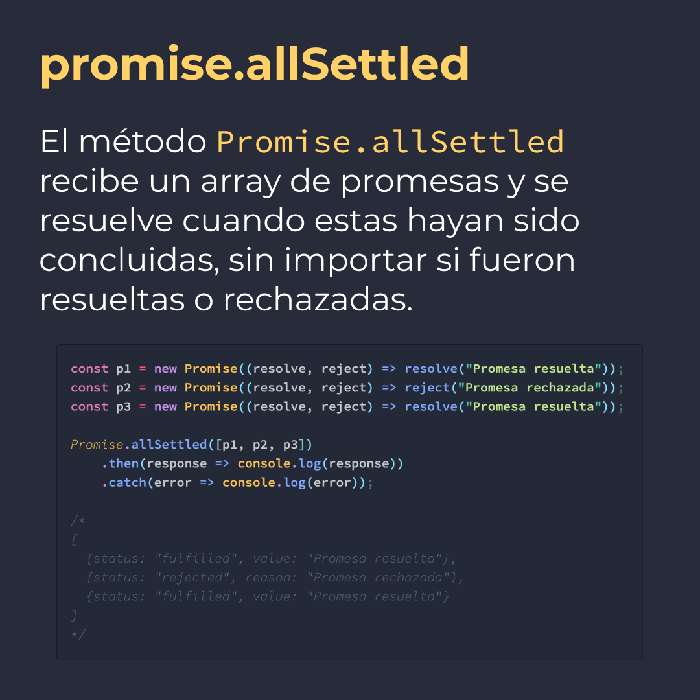
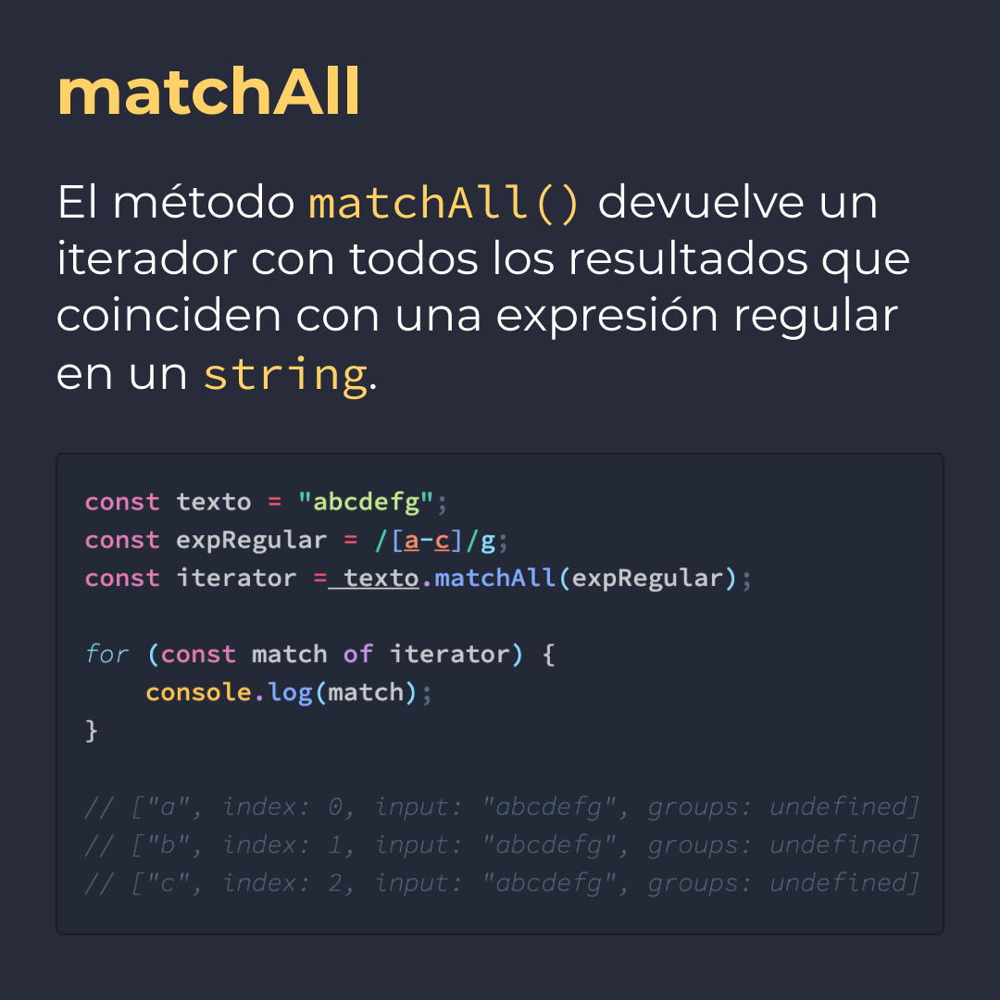
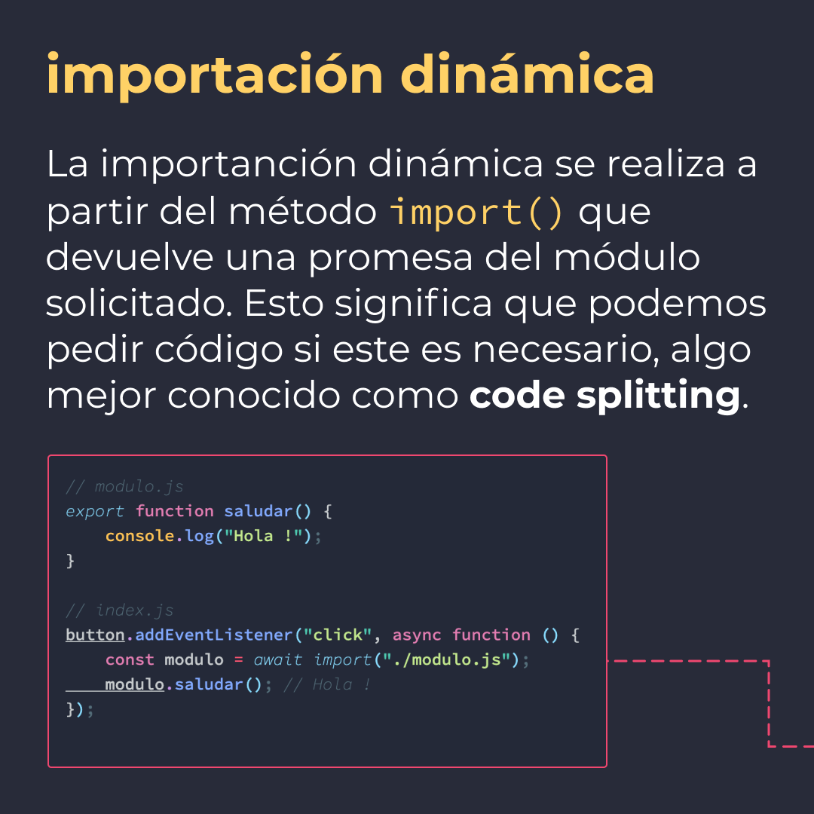
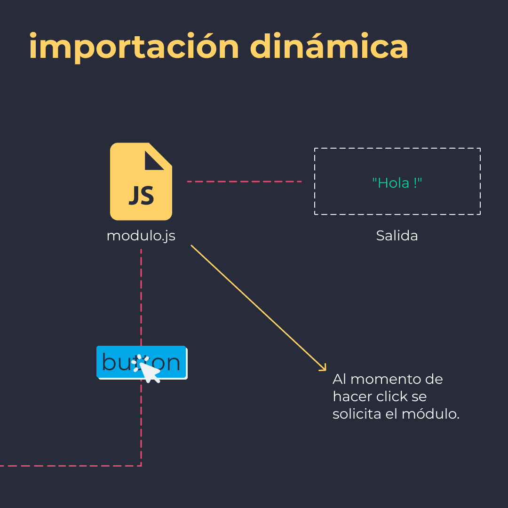

# ES2020

5 características de ES2020 que debes conocer.

> Código utilizado en los ejemplos: [ES2020.js](./ES2020.js)

## 🤓 Aprende algo nuevo hoy

> Comparto los **bits** al menos una vez por semana.

Instagram: [@fili.santillan](https://www.instagram.com/fili.santillan/)  
Twitter: [@FiliSantillan](https://twitter.com/FiliSantillan)  
Facebook: [Fili Santillán](https://www.facebook.com/FiliSantillan96/)  
Sitio web: http://filisantillan.com

## 📚 Recursos

-   [freeCodeCamp ES2020](https://www.freecodecamp.org/news/javascript-new-features-es2020/)
-   [tc39 proposals](https://github.com/tc39/proposals)
