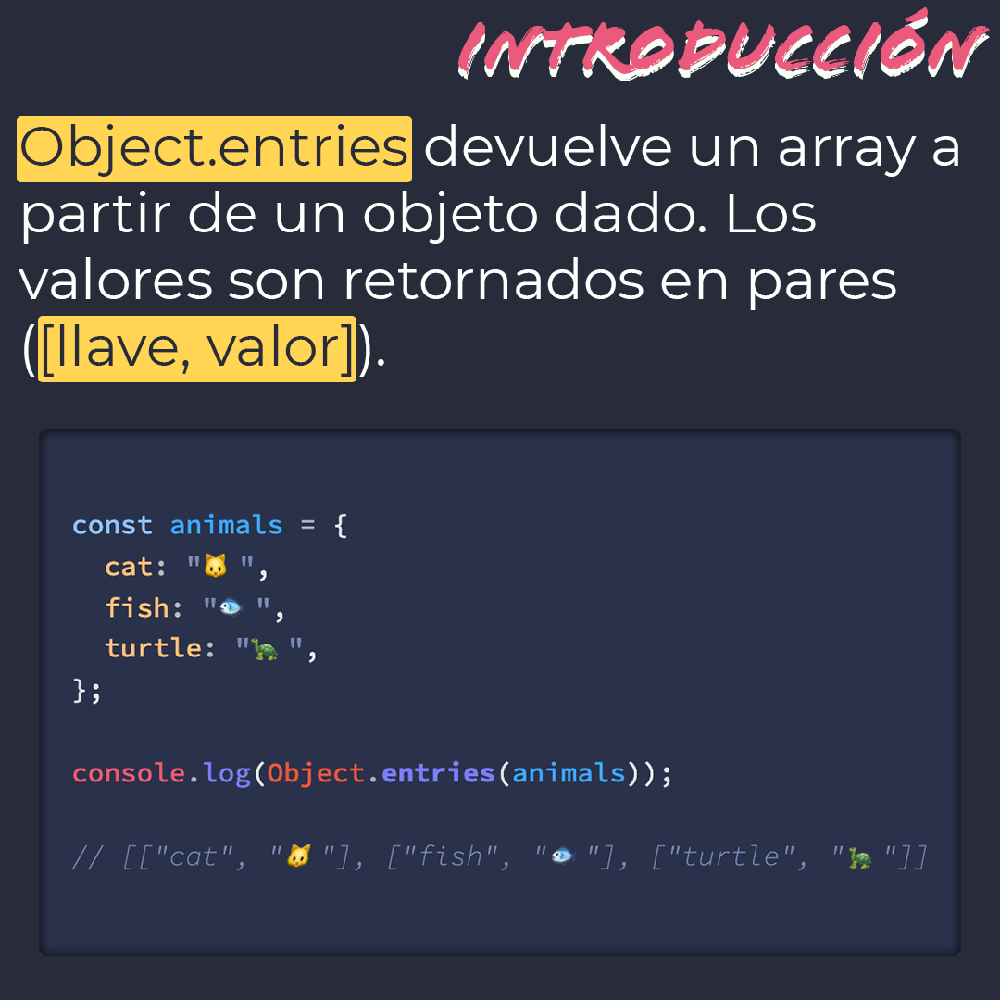
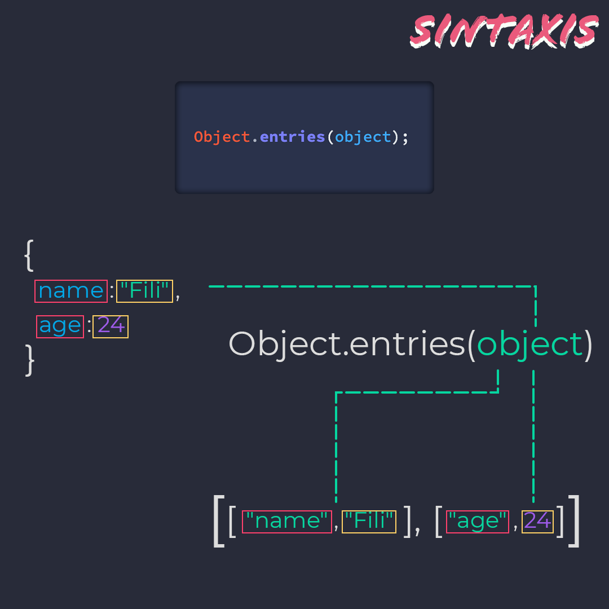
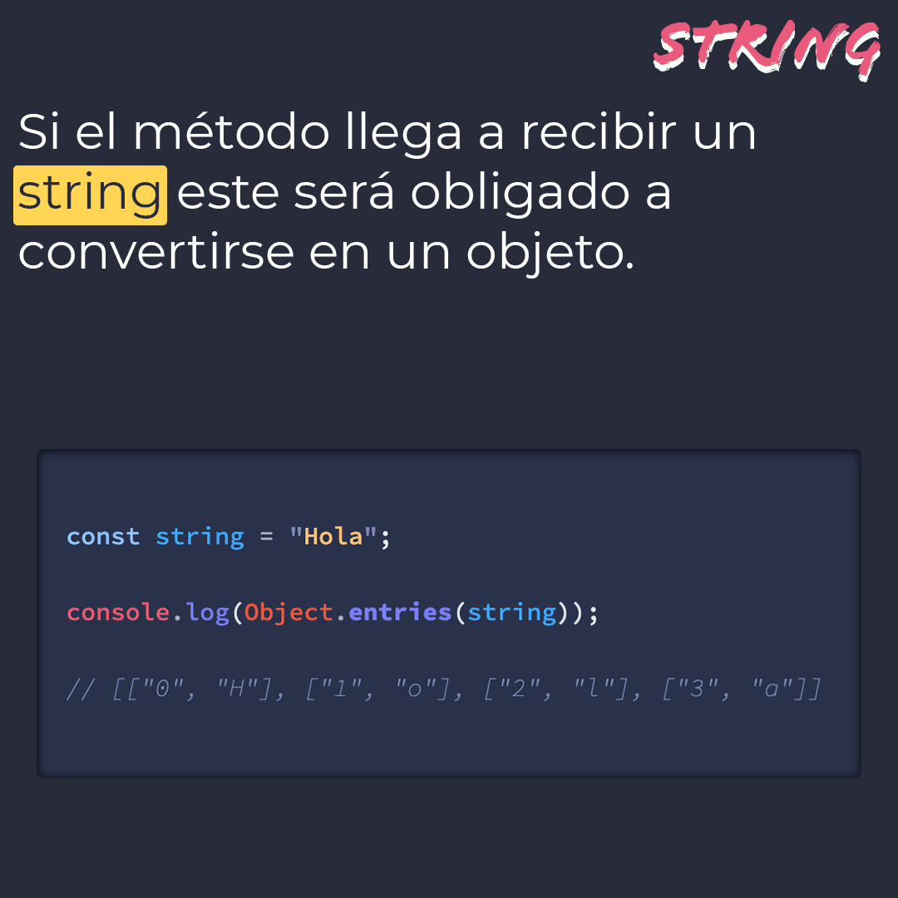
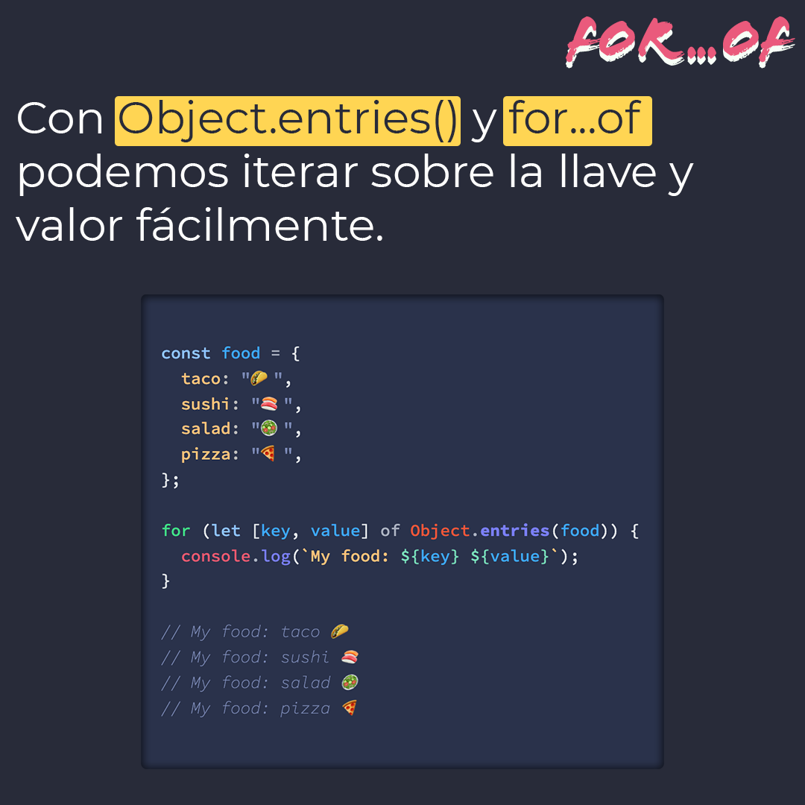

# `Object.entries()`

El método `Object.entries()` devuelve un array a partir de un objeto dado. Los valores son retornados en pares (`[llave, valor]`).

> Código utilizado en los ejemplos: [Object.entries.js](/BitSnack/Object.entries/Object.entries.js)

## 🤓 Aprende algo nuevo hoy

> Comparto **bits** al menos una vez por semana.

Instagram: [@fili.santillan](https://www.instagram.com/fili.santillan/)  
Twitter: [@FiliSantillan](https://twitter.com/FiliSantillan)  
Facebook: [Fili Santillán](https://www.facebook.com/FiliSantillan96/)  
Sitio web: http://filisantillan.com  

## 📚 Recursos

- [MDN Object.entries()](https://developer.mozilla.org/en-US/docs/Web/JavaScript/Reference/Global_Objects/Object/entries)