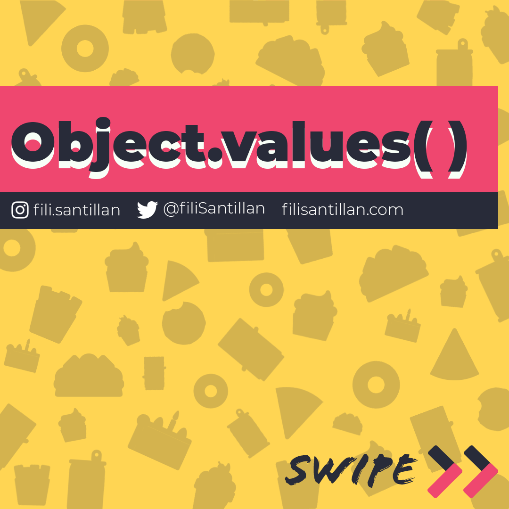
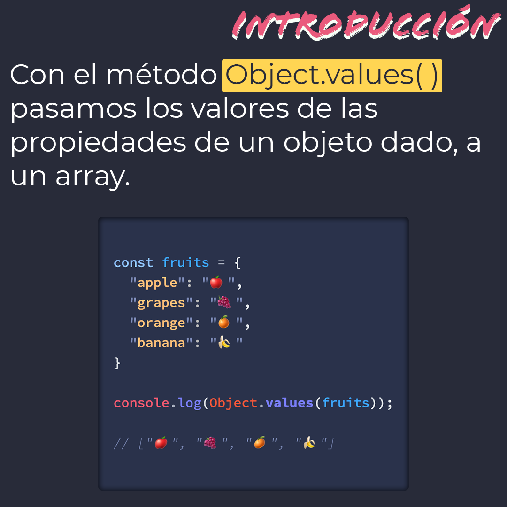
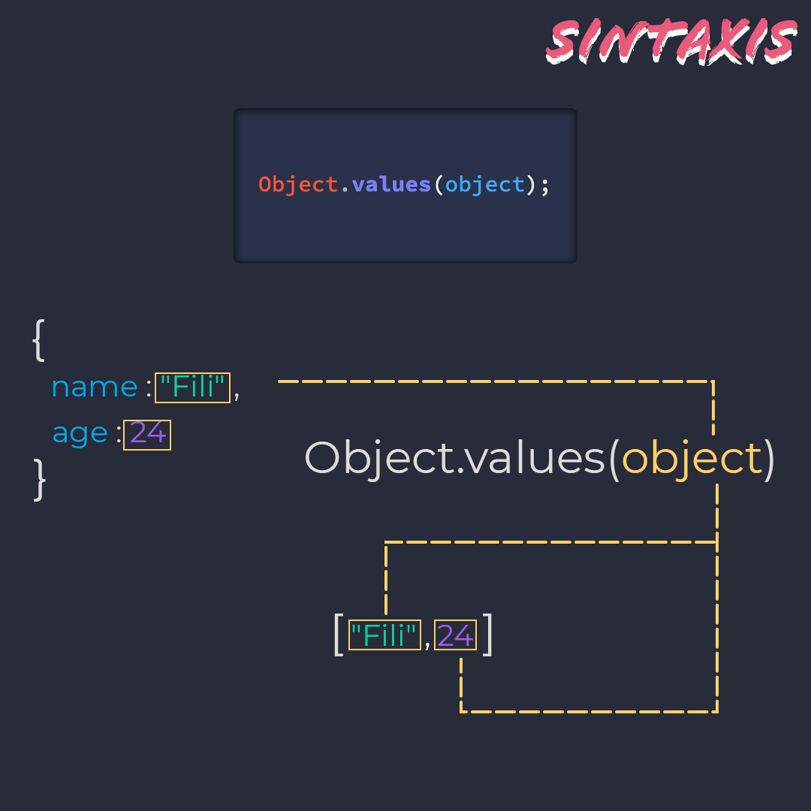
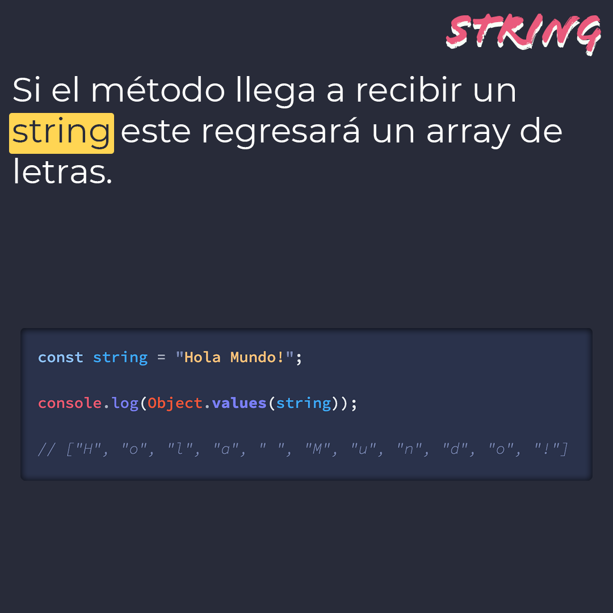
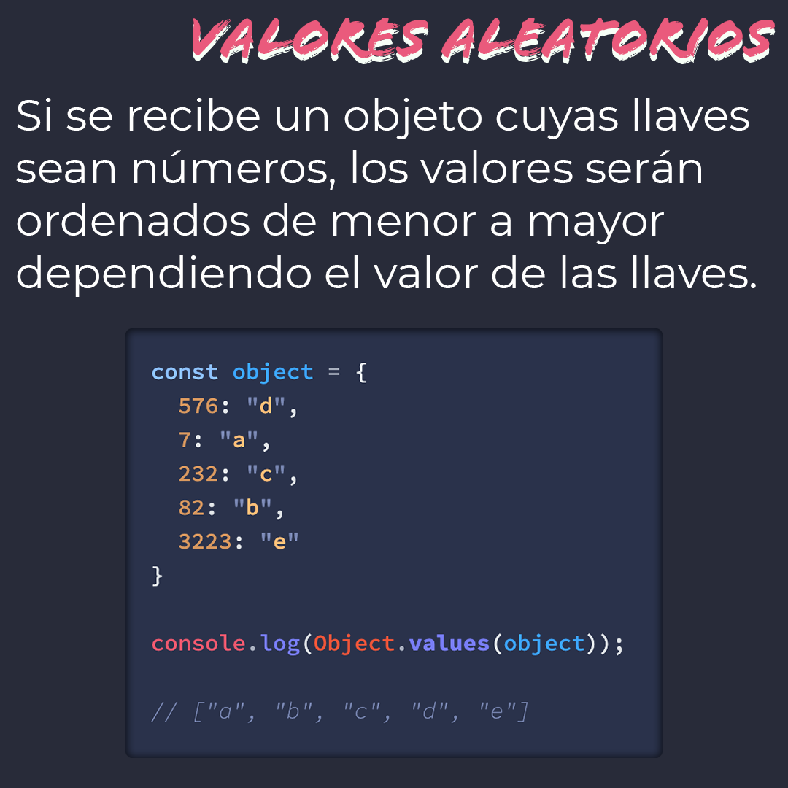

# `Object.values()`

Con el método `Object.values()` pasamos los valores de las propiedades de un objeto dado, a un array.

> Código utilizado en los ejemplos: [Object.values.js](/BitSnack/Object.values/Object.values.js)

## 🤓 Aprende algo nuevo hoy

> Comparto **bits** al menos una vez por semana.

Instagram: [@fili.santillan](https://www.instagram.com/fili.santillan/)  
Twitter: [@FiliSantillan](https://twitter.com/FiliSantillan)  
Facebook: [Fili Santillán](https://www.facebook.com/FiliSantillan96/)  
Sitio web: https://filisantillan.com

## 📚 Recursos

-   [MDN Object.values()](https://developer.mozilla.org/es/docs/Web/JavaScript/Referencia/Objetos_globales/Object/values)
