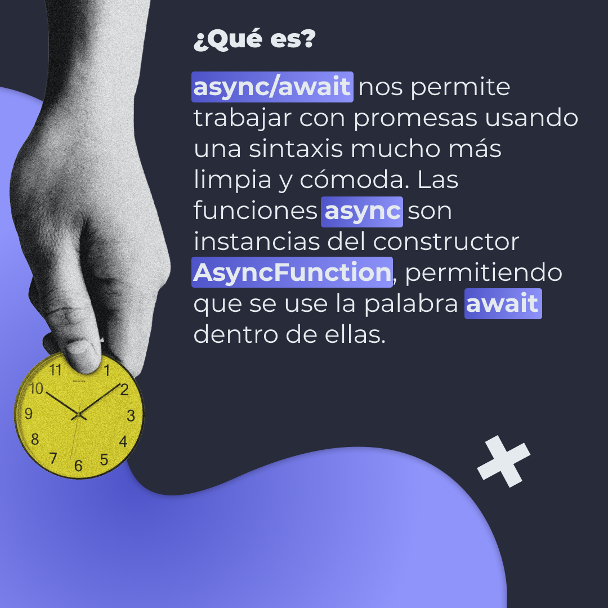
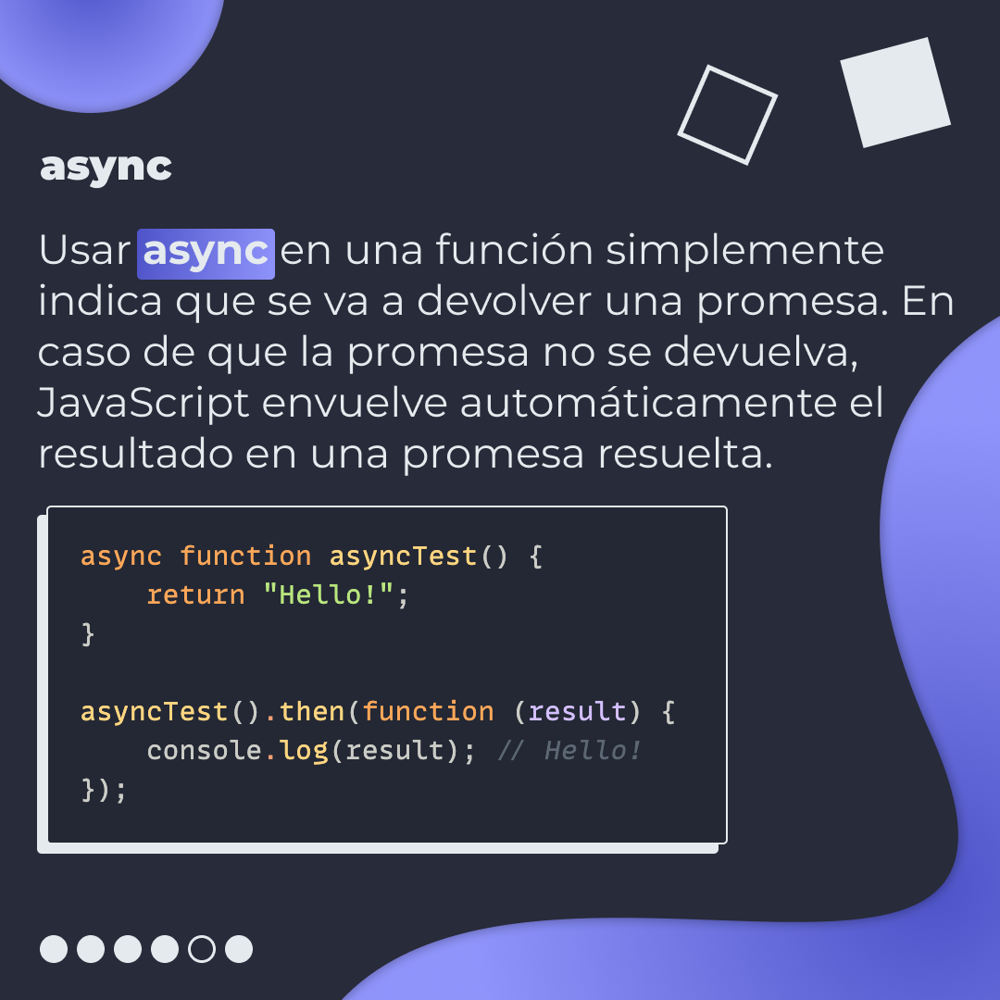
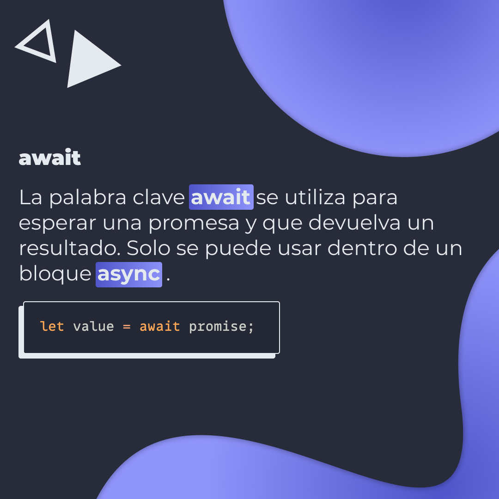
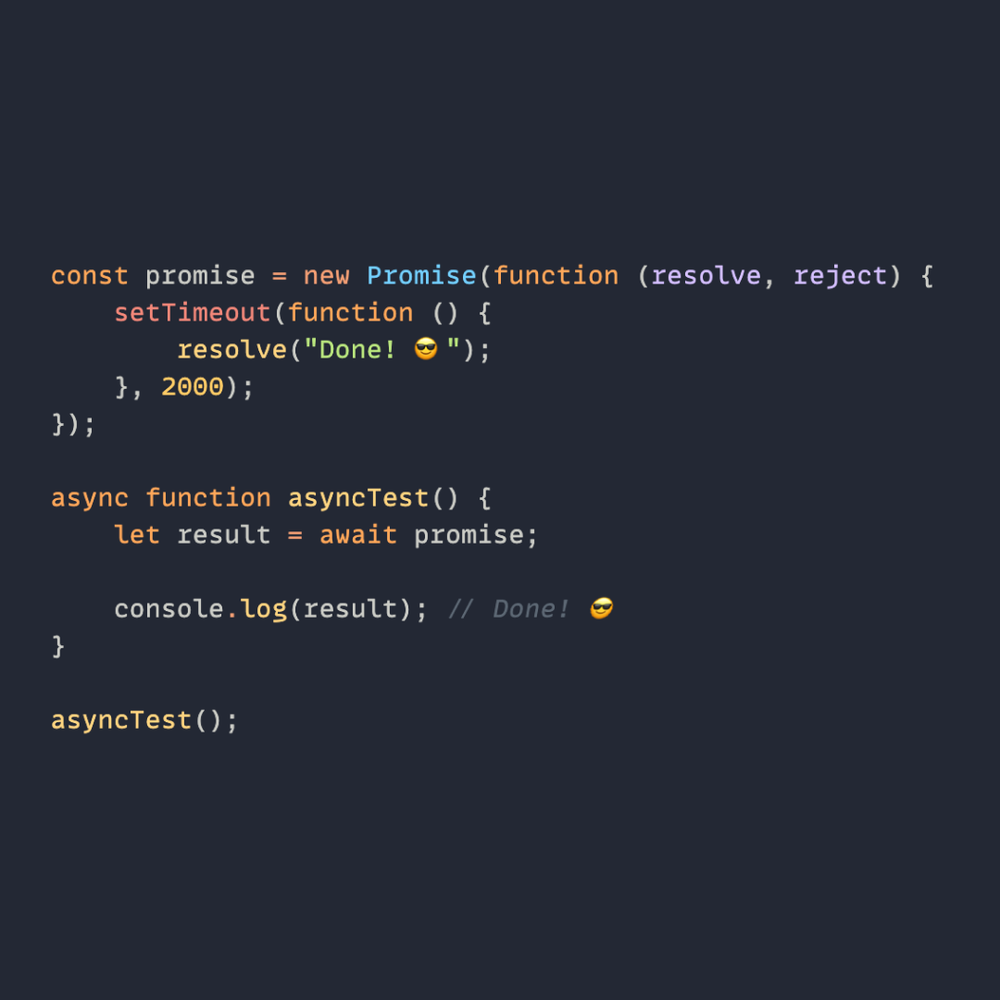
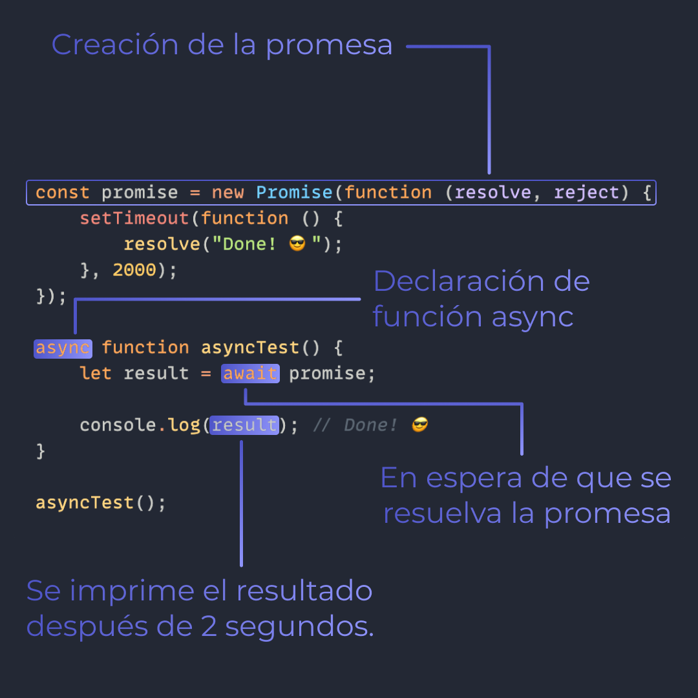
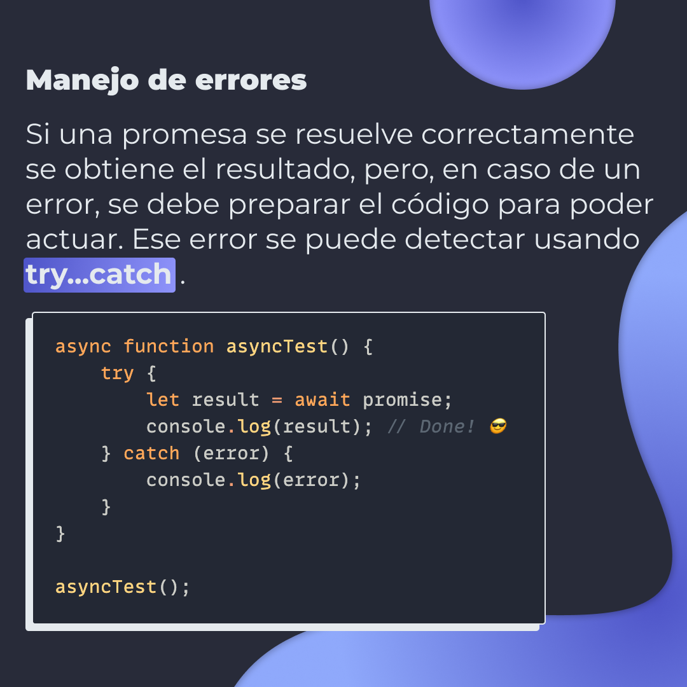
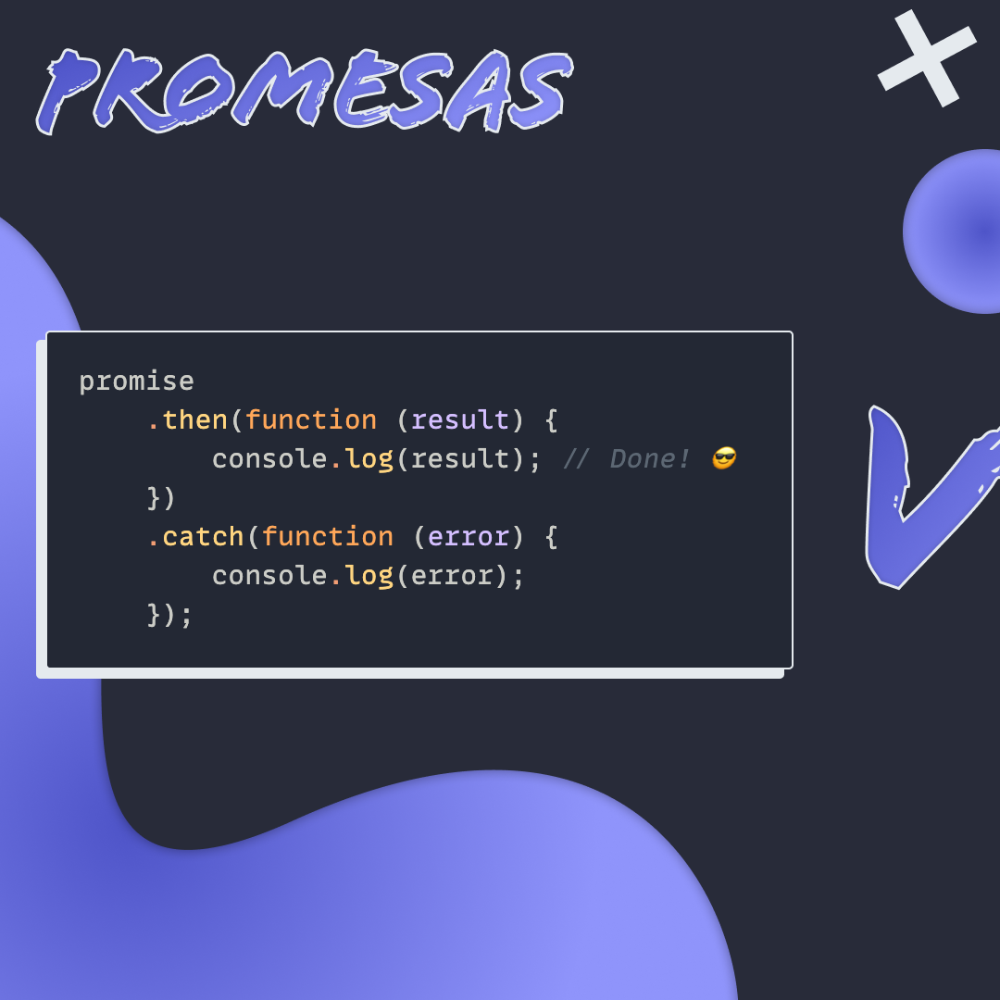
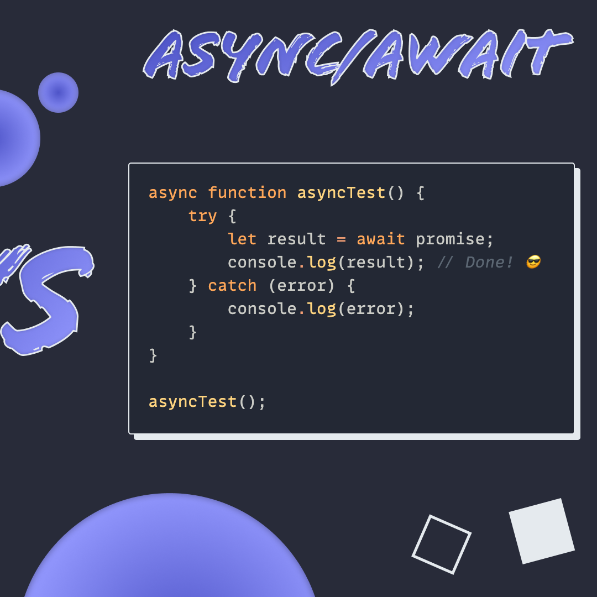

# `async/await`

`async/await` nos permite trabajar con promesas usando una sintaxis mucho más limpia y cómoda.

> Código utilizado en los ejemplos: [async-await.js](/BitSnack/async-await/async-await.js)

## 🤓 Aprende algo nuevo hoy

> Comparto los **bits** al menos una vez por semana.

Instagram: [@fili.santillan](https://www.instagram.com/fili.santillan/)  
Twitter: [@FiliSantillan](https://twitter.com/FiliSantillan)  
Facebook: [Fili Santillán](https://www.facebook.com/FiliSantillan96/)  
Sitio web: http://filisantillan.com

## 📚 Recursos

- [Imagen del reloj por Morgan Housel](https://unsplash.com/photos/X_fbh4Utwk4)
-   [async function MDN](https://developer.mozilla.org/en-US/docs/Web/JavaScript/Reference/Statements/async_function)
-   [Async/await](https://javascript.info/async-await)
