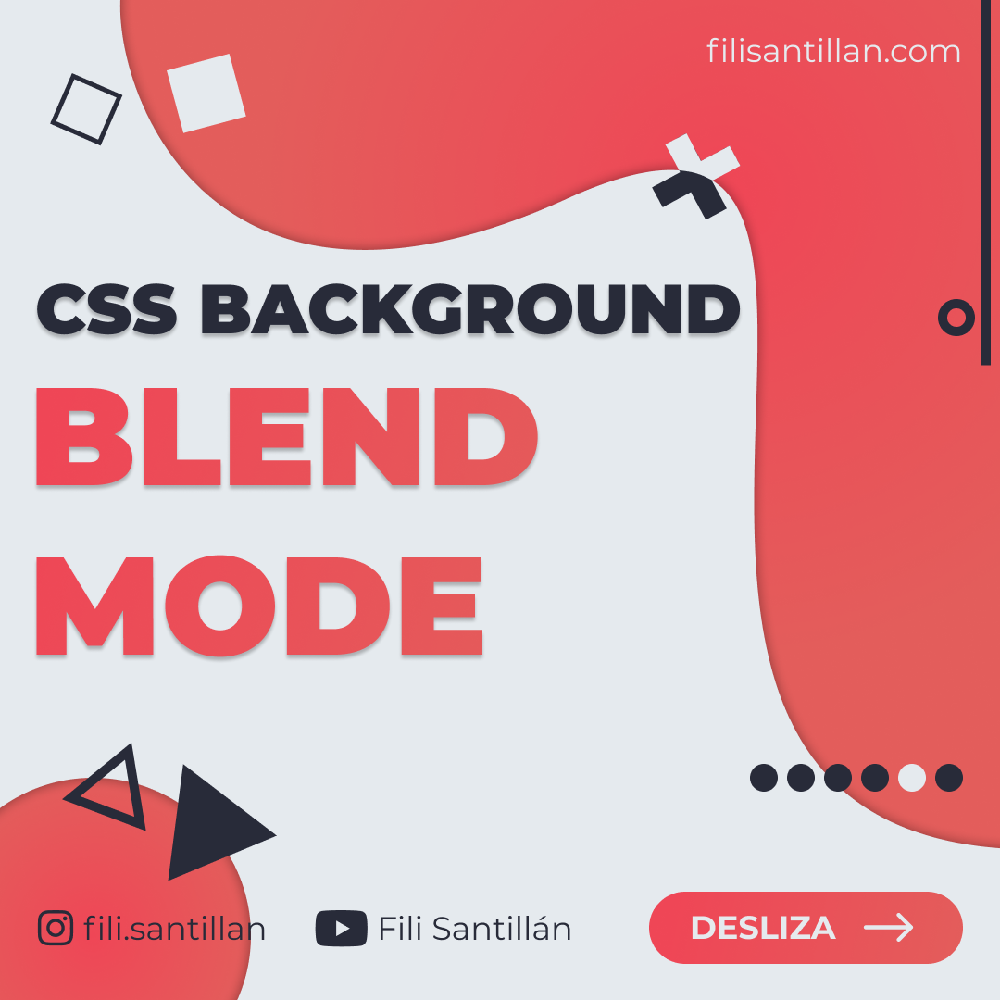
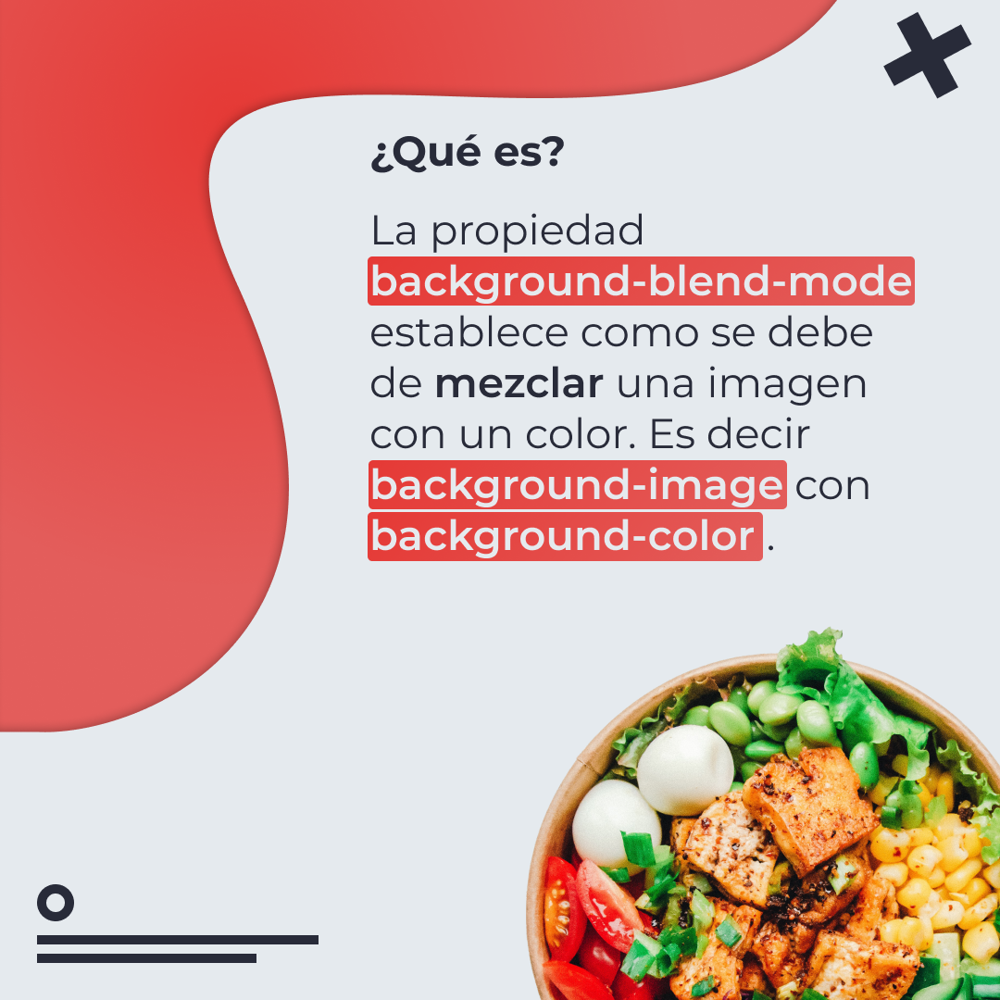
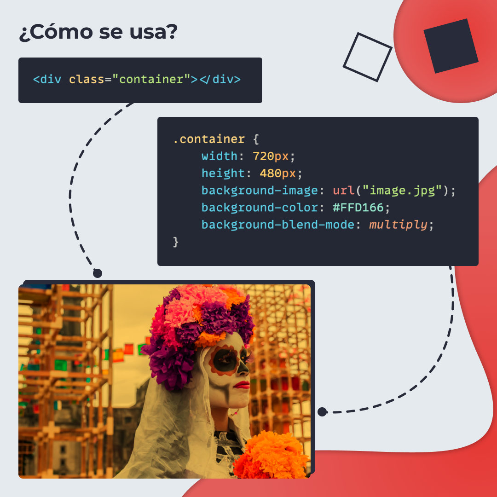
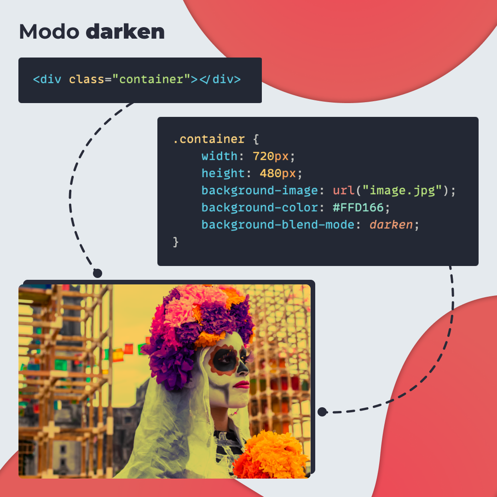
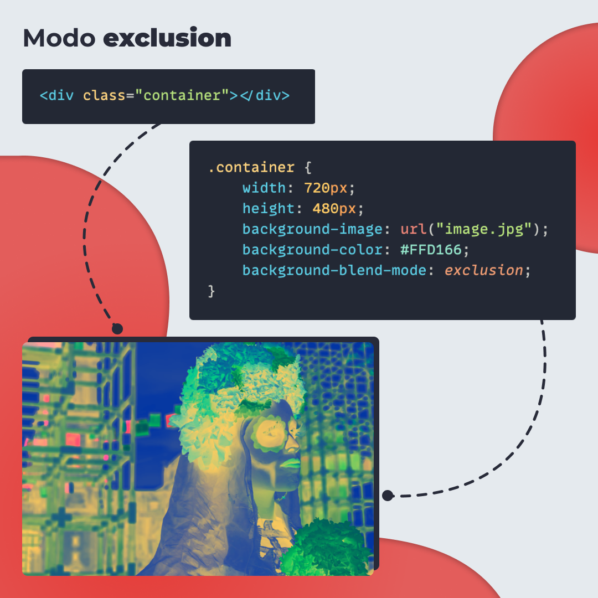
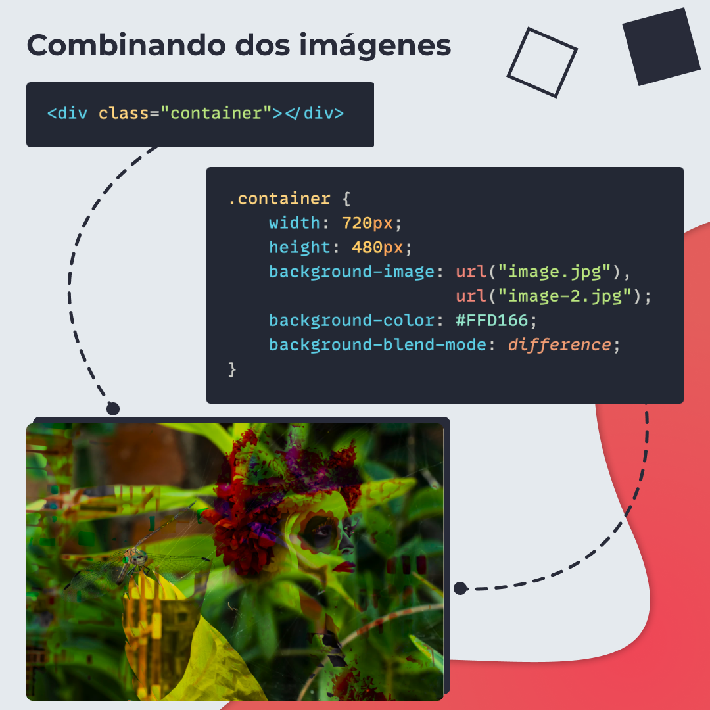
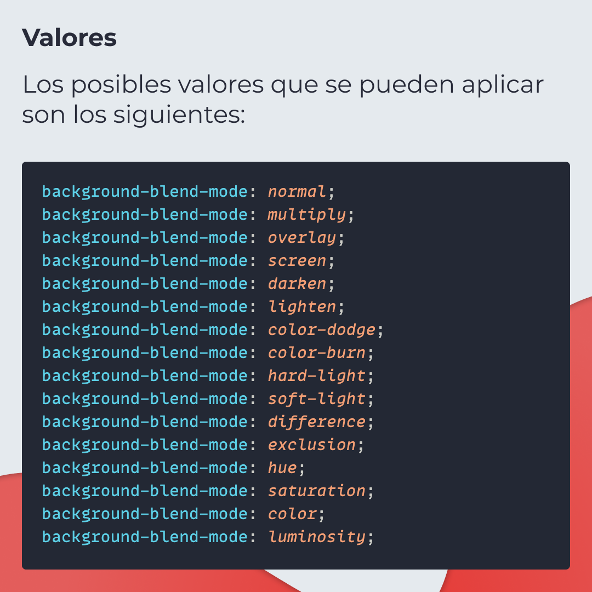

# CSS Background Blend Mode

La propiedad `background-blend-mode` establece como se debe de mezclar una imagen con un color. Es decir `background-image` con `background-color`.

> Código utilizado en los ejemplos: [background-blend-mode.html](/BitSnack/background-blend-mode.html)

## 🤓 Aprende algo nuevo hoy

> Comparto los **bits** al menos una vez por semana.

Instagram: [@fili.santillan](https://www.instagram.com/fili.santillan/)  
Twitter: [@FiliSantillan](https://twitter.com/FiliSantillan)  
Facebook: [Fili Santillán](https://www.facebook.com/FiliSantillan96/)  
Sitio web: http://filisantillan.com

## 📚 Recursos

- [Imagen de la ensalada por Anh Nguyen](https://unsplash.com/photos/kcA-c3f_3FE)
-   [Crea mezclas increíbles con CSS](https://filisantillan.com/blog/background-blend-mode/)
-   [background-blend-mode MDN](https://developer.mozilla.org/en-US/docs/Web/CSS/background-blend-mode)
-   [background-blend-mode CSS-Tricks](https://css-tricks.com/almanac/properties/b/background-blend-mode/)
