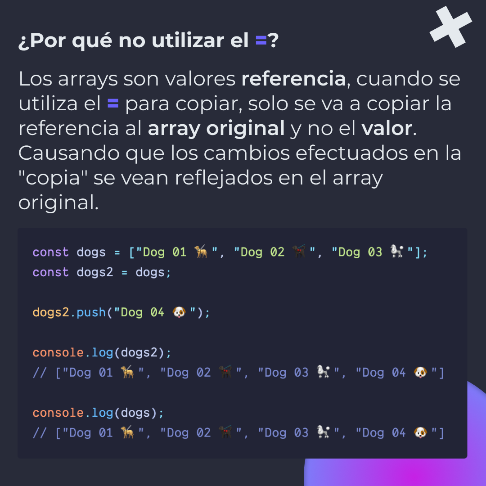
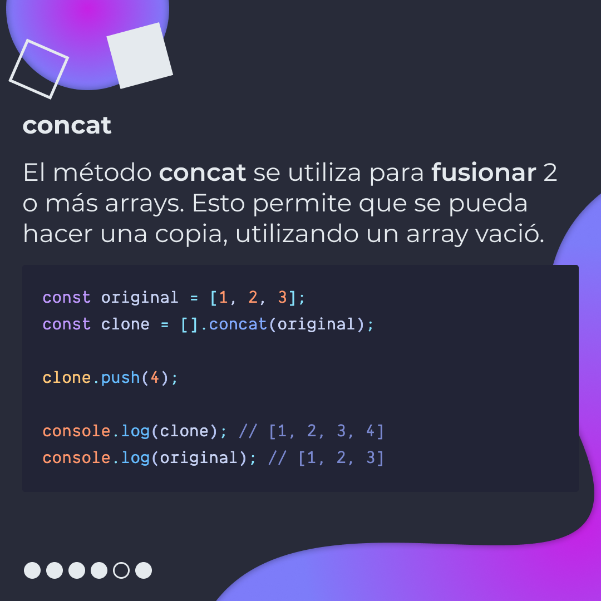
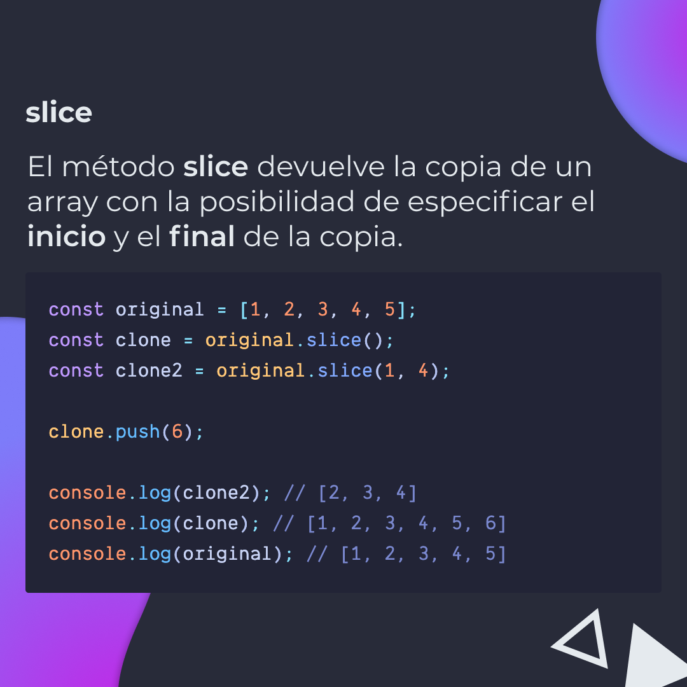
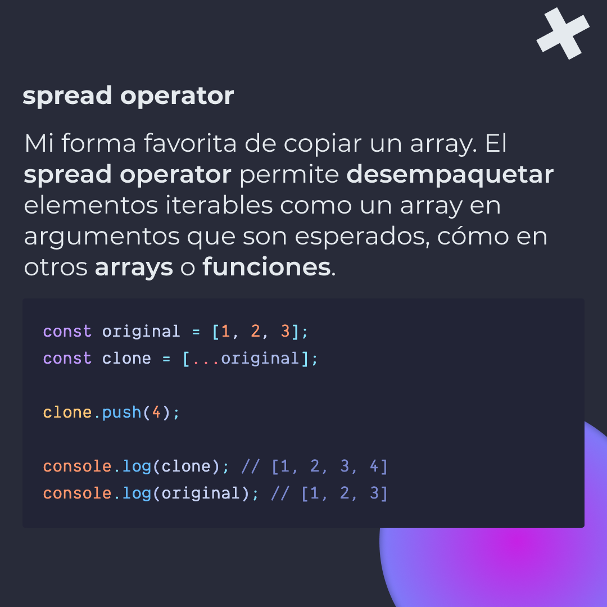
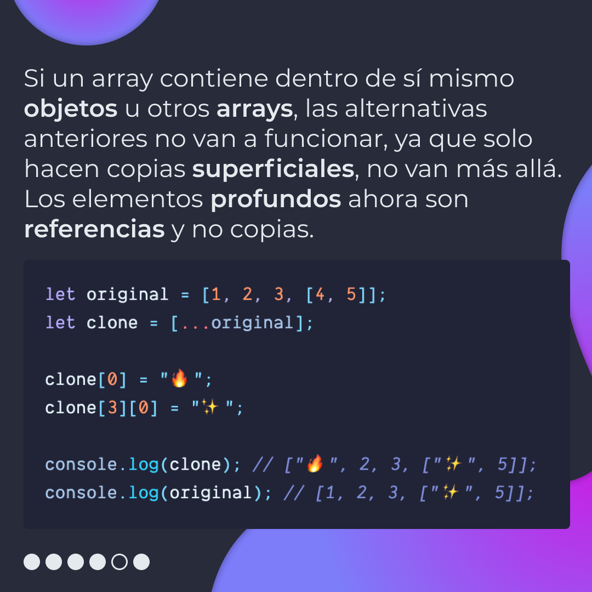
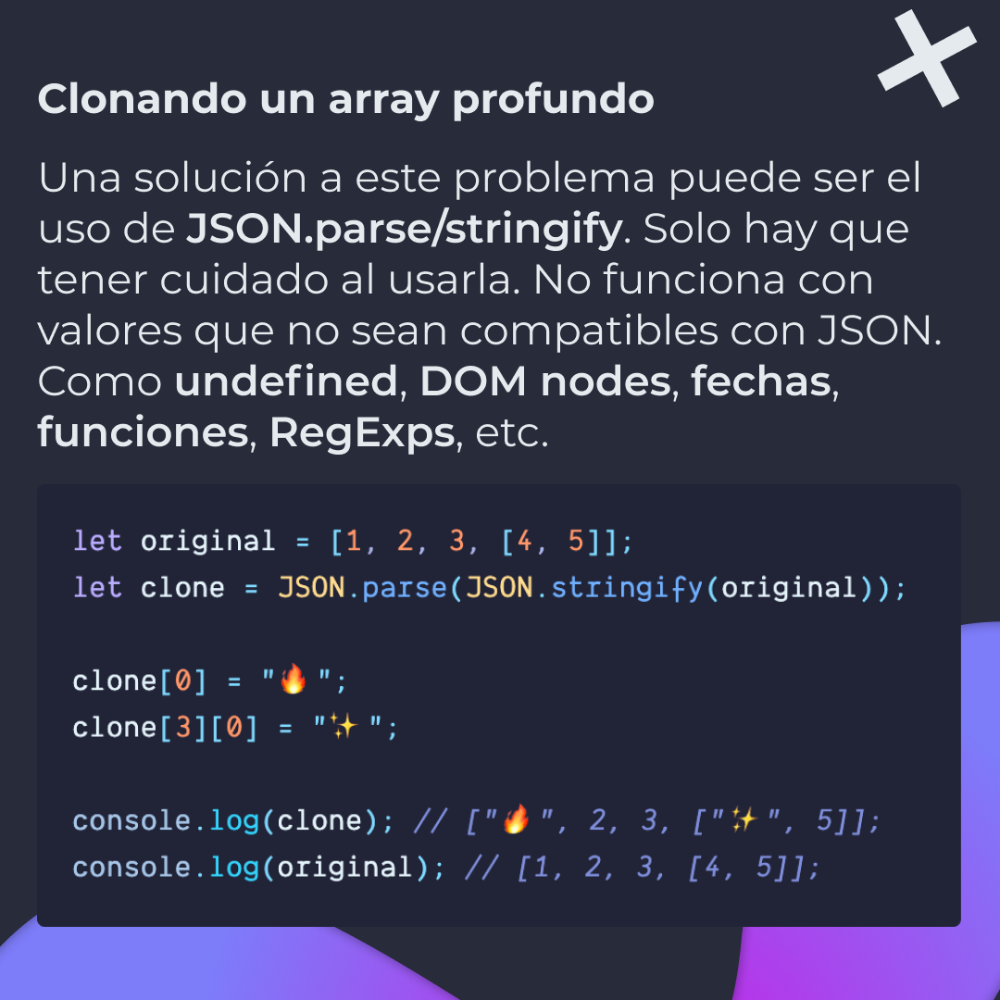
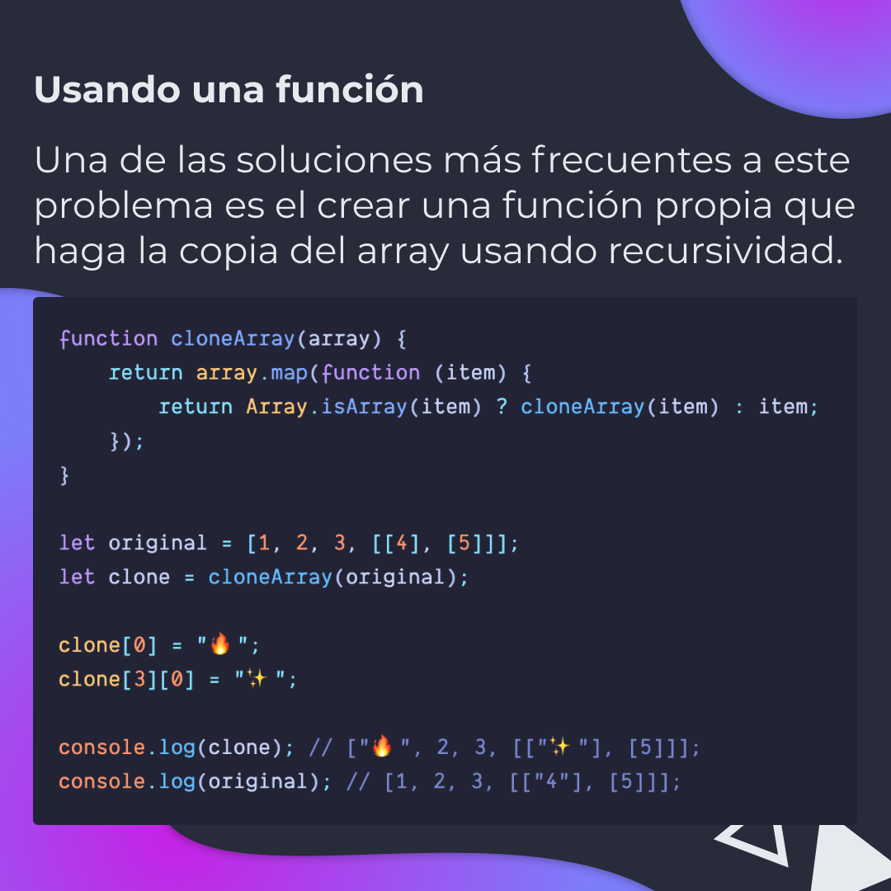

# Formas de clonar un array en JavaScript

Diferentes métodos para clonar arrays superficiales y profundos.

> Código utilizado en los ejemplos:
> [react-hooks.js](/BitSnack/react-hooks/react-hooks.js)

## 🤓 Aprende algo nuevo hoy

> Comparto los **bits** al menos una vez por semana.

Instagram: [@fili.santillan](https://www.instagram.com/fili.santillan/)  
Twitter: [@FiliSantillan](https://twitter.com/FiliSantillan)  
Facebook: [Fili Santillán](https://www.facebook.com/FiliSantillan96/)  
Sitio web: http://filisantillan.com

## 📚 Recursos

-   [ES6 Way to Clone an Array 🐑 ](https://www.samanthaming.com/tidbits/35-es6-way-to-clone-an-array/)
-   [How to Deep Clone an Array](https://www.samanthaming.com/tidbits/50-how-to-deep-clone-an-array/#shallow-vs-deep-clone)
-   [How to Deep Copy Objects and Arrays in JavaScript](https://medium.com/javascript-in-plain-english/how-to-deep-copy-objects-and-arrays-in-javascript-7c911359b089)
-   [Fastest way to duplicate an array in JavaScript - slice vs. 'for' loop](https://stackoverflow.com/questions/3978492/fastest-way-to-duplicate-an-array-in-javascript-slice-vs-for-loop)
