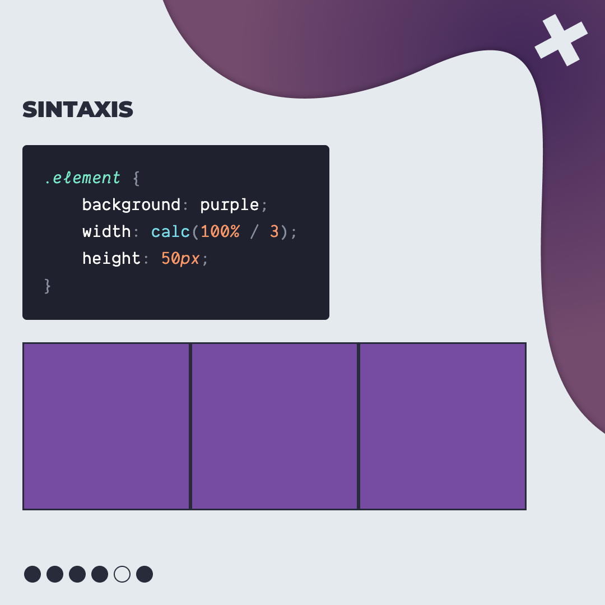
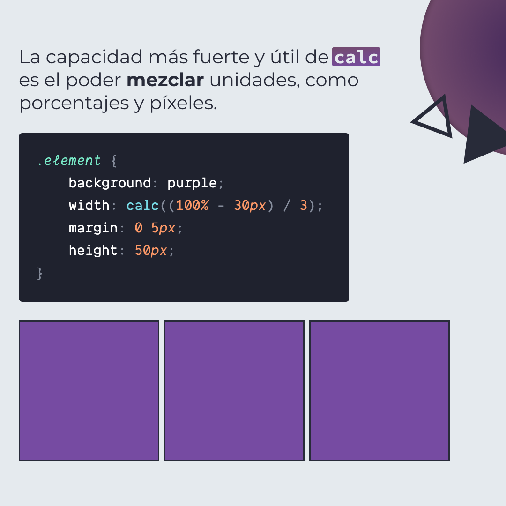
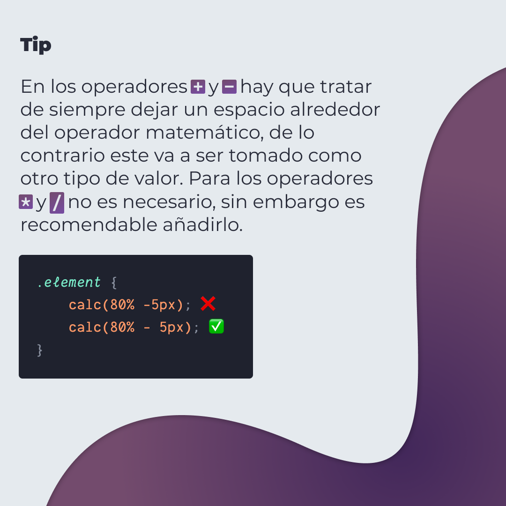

# CSS Calc

Es una función nativa de CSS para hacer cálculos matemáticos simples, reemplazando el uso directo de algún valor.

> Código utilizado en los ejemplos: [css-calc.css](./css-calc.css)

## 🤓 Aprende algo nuevo hoy

> Comparto los **bits** al menos una vez por semana.

Instagram: [@fili.santillan](https://www.instagram.com/fili.santillan/)  
Twitter: [@FiliSantillan](https://twitter.com/FiliSantillan)  
Facebook: [Fili Santillán](https://www.facebook.com/FiliSantillan96/)  
Sitio web: http://filisantillan.com

## Recursos

- [Realiza cálculos con calc() de CSS](https://filisantillan.com/blog/realiza-calculos-con-calc-de-css/)
- [A Couple of Use Cases for Calc()](https://css-tricks.com/a-couple-of-use-cases-for-calc/)
- [A Complete Guide to calc() in CSS](https://css-tricks.com/a-complete-guide-to-calc-in-css/)
- [MDN calc](https://developer.mozilla.org/es/docs/Web/CSS/calc())
- [Foto del iphone](https://unsplash.com/photos/SBxdMoOY9zM)
