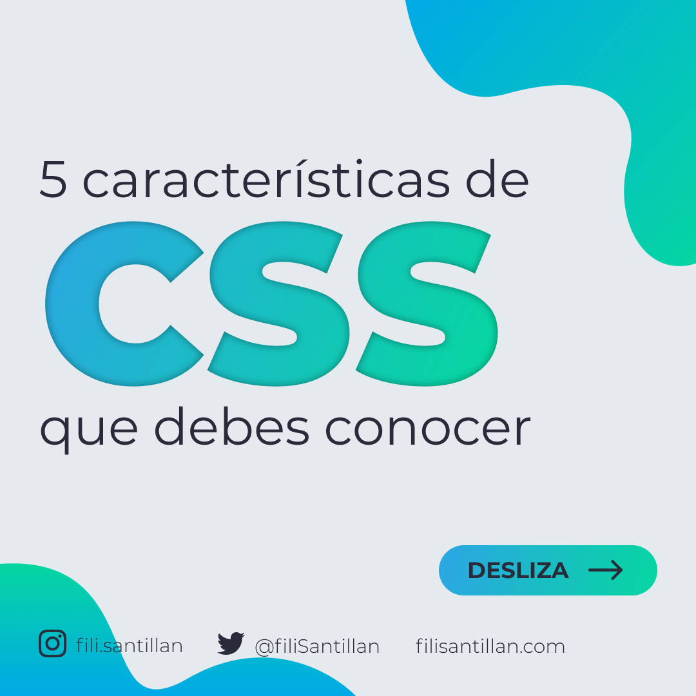
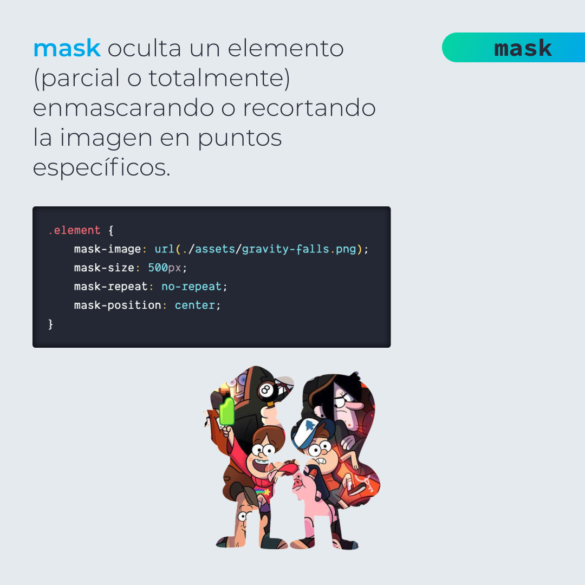
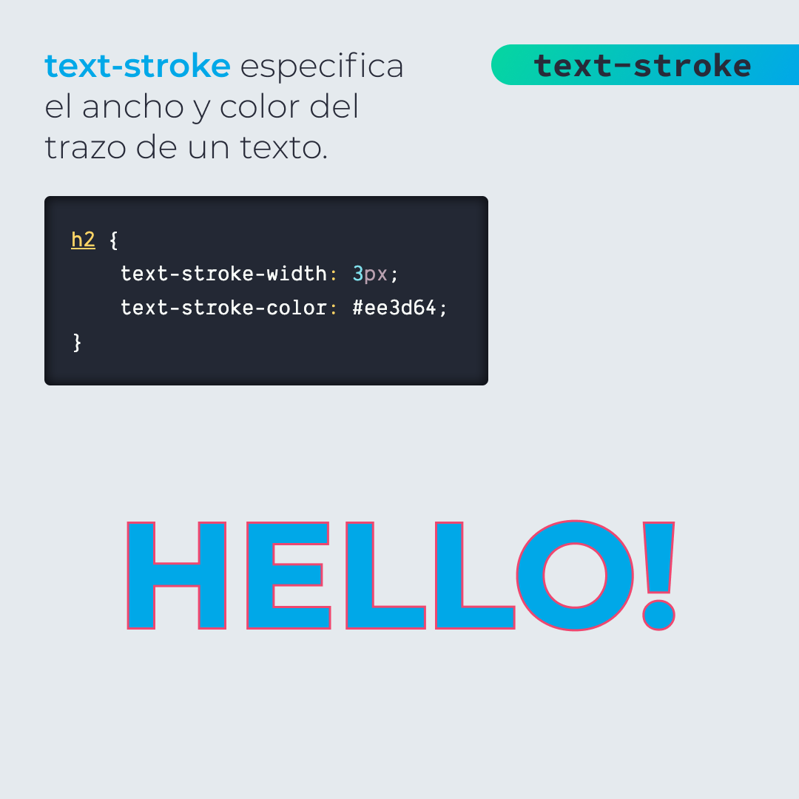
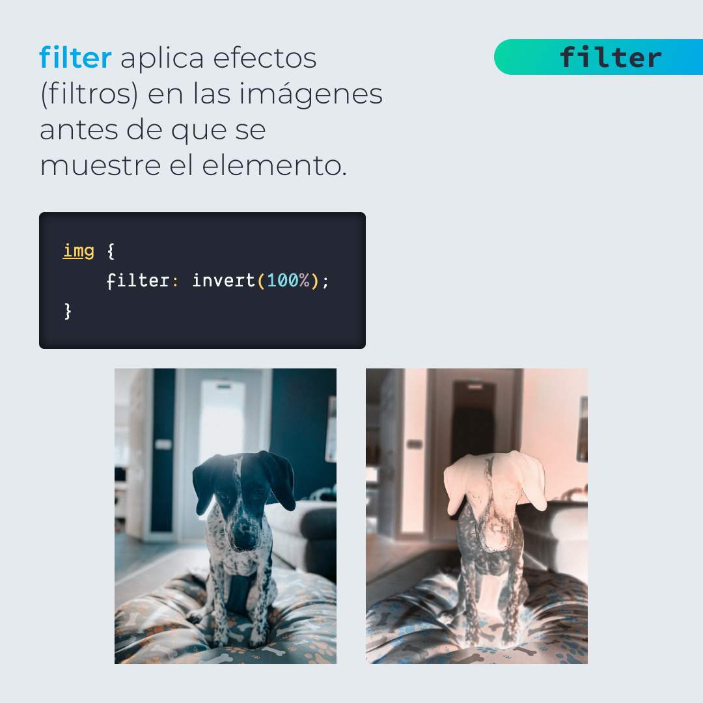
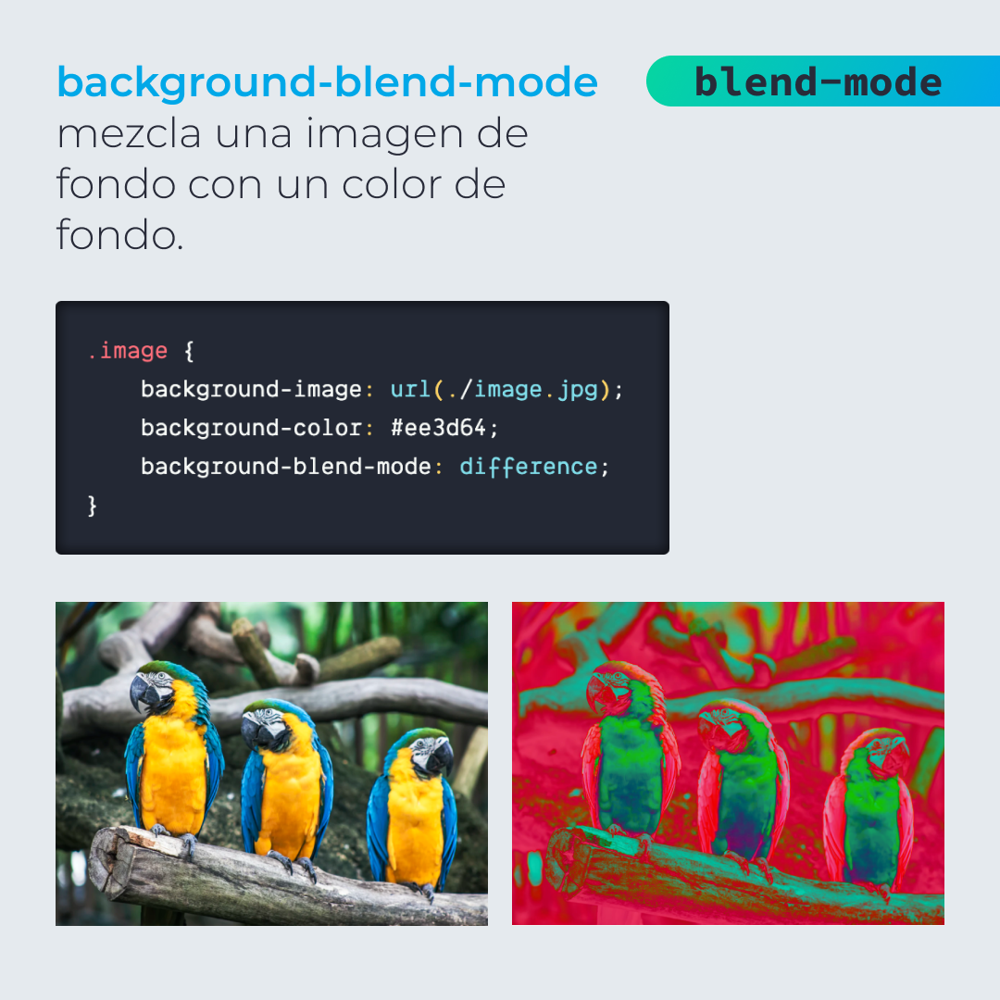

# 5 Características de CSS que debes conocer

5 características de CSS muy curiosas y que probablemente no conocías.

> Código utilizado en los ejemplos: [css-features.css](/BitSnack/css-features/css-features.css)

## 🤓 Aprende algo nuevo hoy

> Comparto los **bits** al menos una vez por semana.

Instagram: [@fili.santillan](https://www.instagram.com/fili.santillan/)  
Twitter: [@FiliSantillan](https://twitter.com/FiliSantillan)  
Facebook: [Fili Santillán](https://www.facebook.com/FiliSantillan96/)  
Sitio web: http://filisantillan.com

## 📚 Recursos

-   [MDN mask](https://developer.mozilla.org/en-US/docs/Web/CSS/mask)
-   [mask-image](https://css-tricks.com/almanac/properties/m/mask-image/)
-   [Aplica trazo a un texto con CSS](https://filisantillan.com/blog/text-stroke/)
-   [MDN conic-gradient()](https://developer.mozilla.org/en-US/docs/Web/CSS/conic-gradient)
-   [MDN filter](https://developer.mozilla.org/es/docs/Web/CSS/filter)
-   [Crea mezclas increíbles con CSS](https://filisantillan.com/blog/background-blend-mode/)
