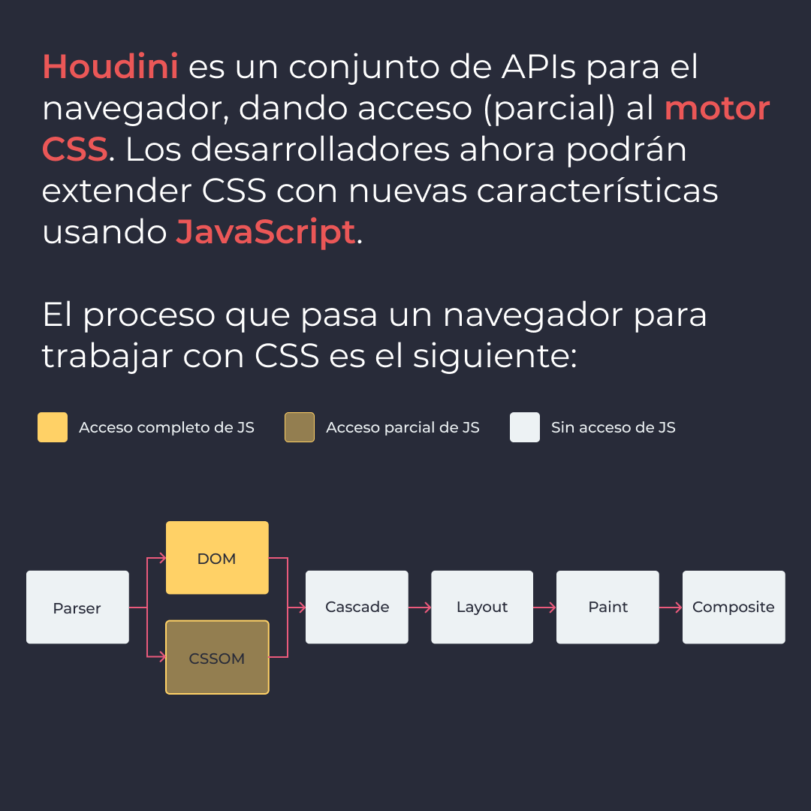
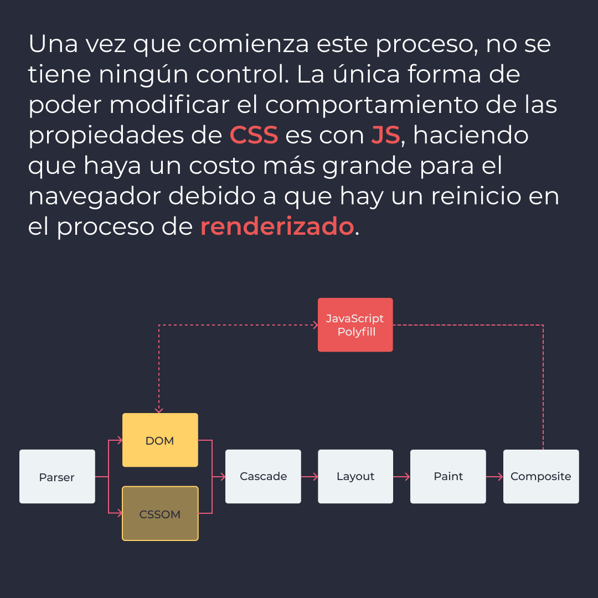
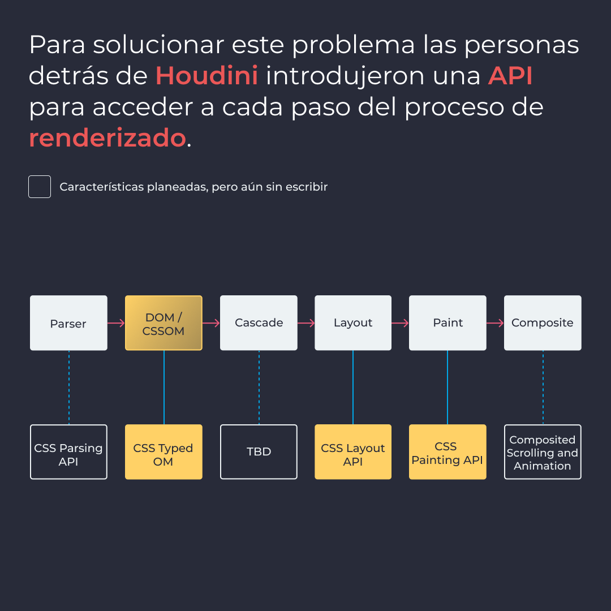
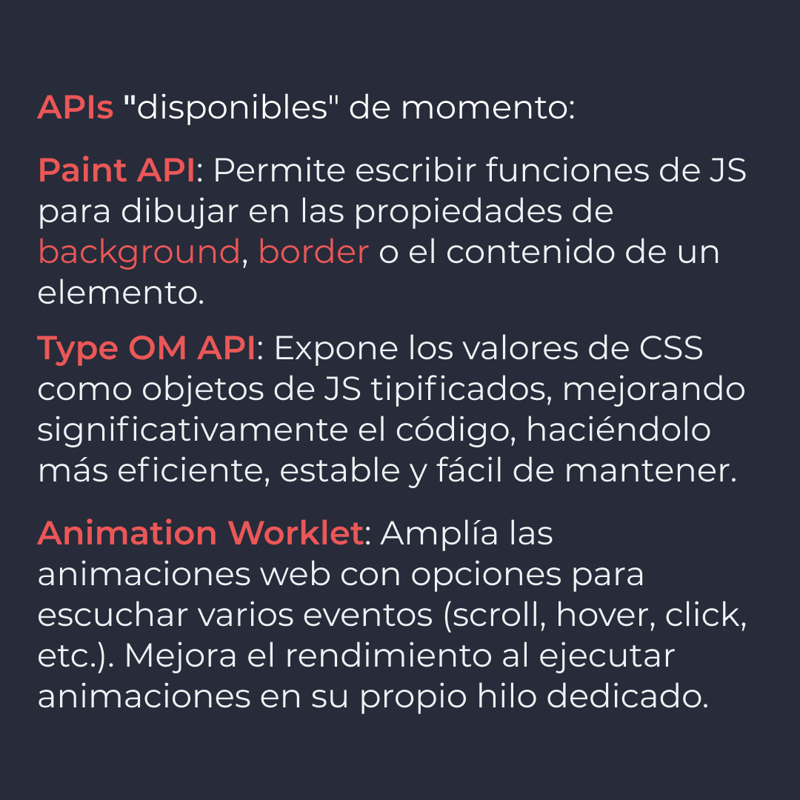
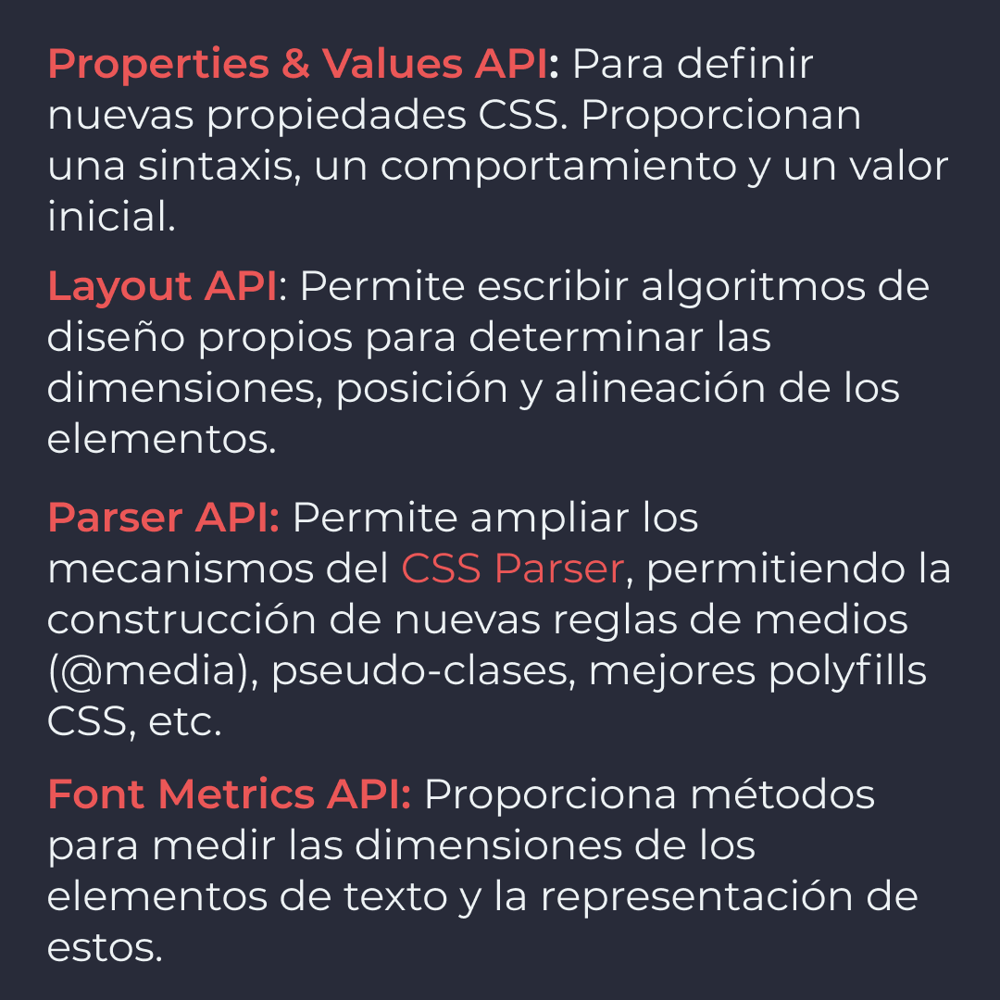
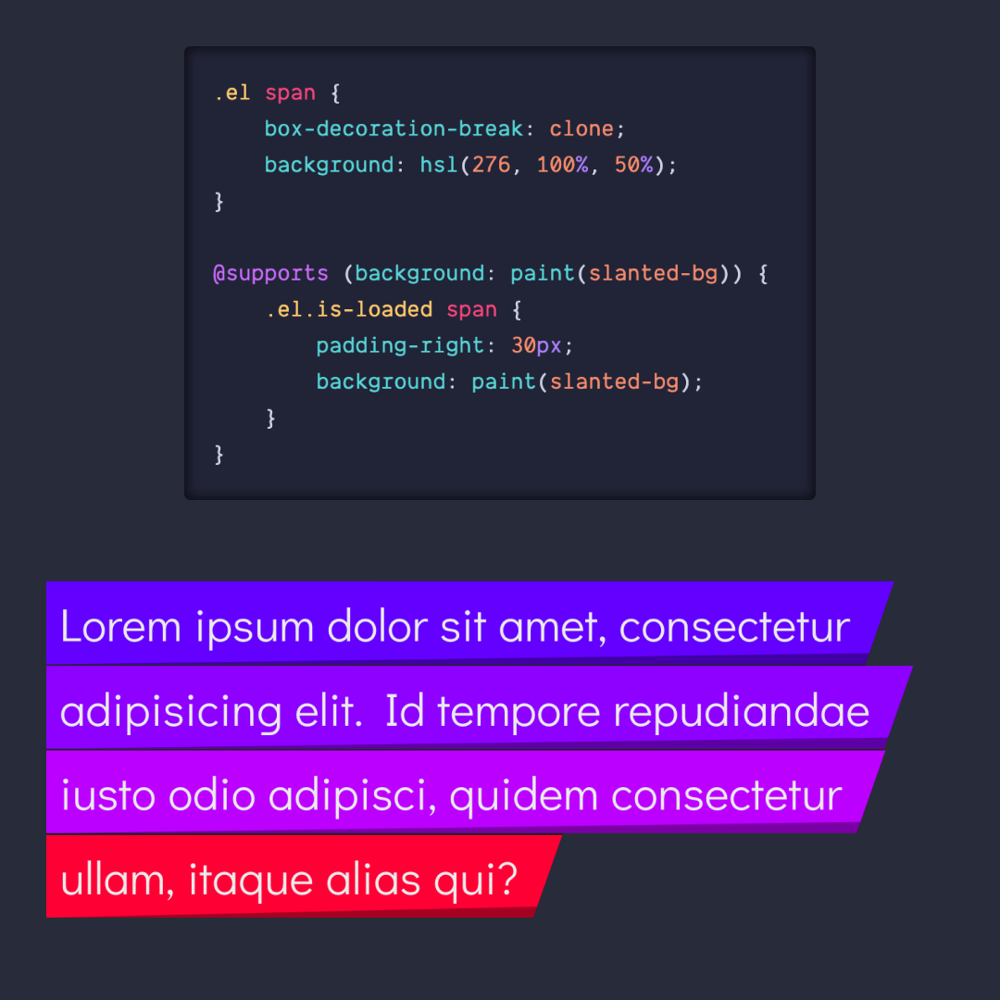
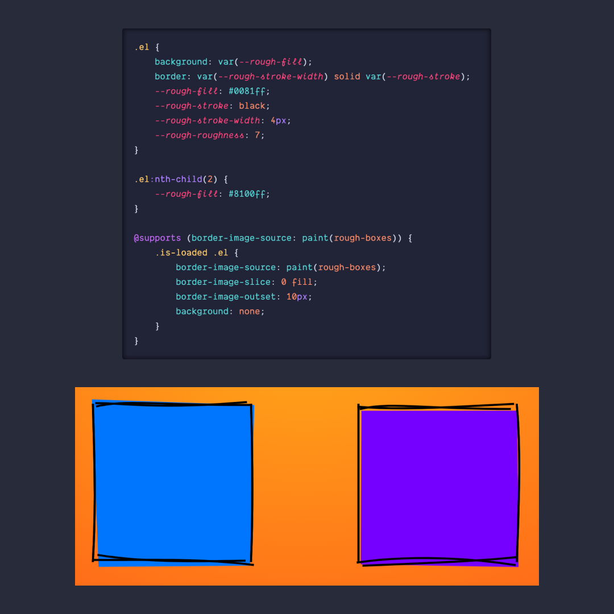
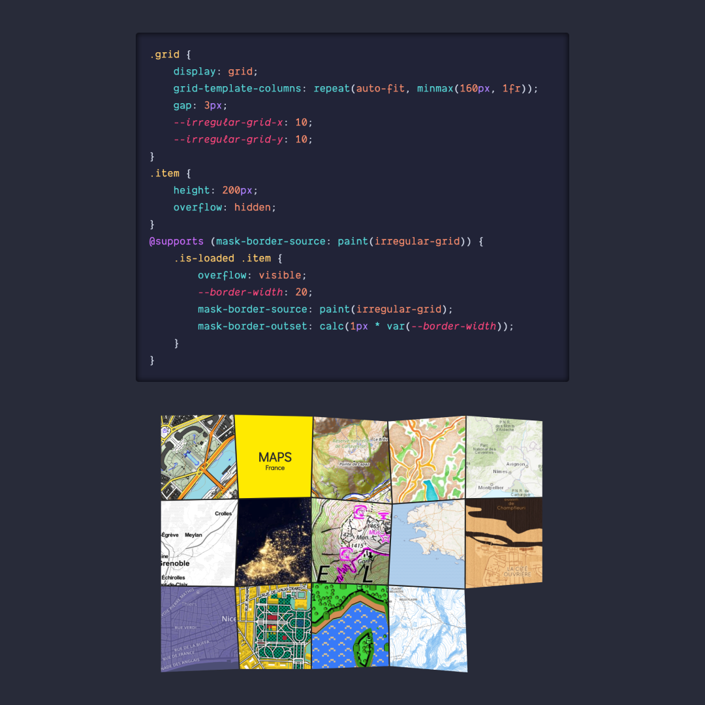

# CSS Houdini

**Houdini** es un conjunto de **APIs** para el navegador, dando acceso (parcial) al motor CSS. Los desarrolladores ahora podrán extender **CSS** con nuevas características usando **JavaScript**.

> Código utilizado en los ejemplos: [css-houdini.css](/BitSnack/css-houdini/css-houdini.css)

## 🤓 Aprende algo nuevo hoy

> Comparto los **bits** al menos una vez por semana.

Instagram: [@fili.santillan](https://www.instagram.com/fili.santillan/)  
Twitter: [@FiliSantillan](https://twitter.com/FiliSantillan)  
Facebook: [Fili Santillán](https://www.facebook.com/FiliSantillan96/)  
Sitio web: http://filisantillan.com

## 📚 Recursos

-   [CSS Houdini, algo más que magia](https://octuweb.com/css-houdini-algo-mas-que-magia/)
-   [Houdini: Maybe The Most Exciting Development In CSS You’ve Never Heard Of](https://www.smashingmagazine.com/2016/03/houdini-maybe-the-most-exciting-development-in-css-youve-never-heard-of/)
-   [Revolution incoming: CSS Houdini and the future of frontend development](https://tsh.io/blog/css-houdini-future-frontend-development/)
-   [A Practical Overview Of CSS Houdini](https://www.smashingmagazine.com/2020/03/practical-overview-css-houdini/)
-   [MDN CSS Houdini](https://developer.mozilla.org/en-US/docs/Web/Houdini)
-   [CSS Houdini Experiments](https://css-houdini.rocks/)
