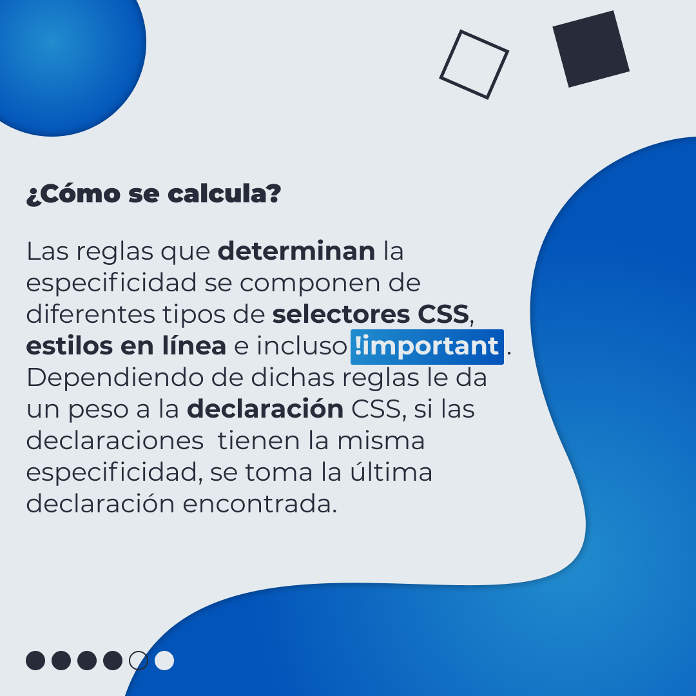
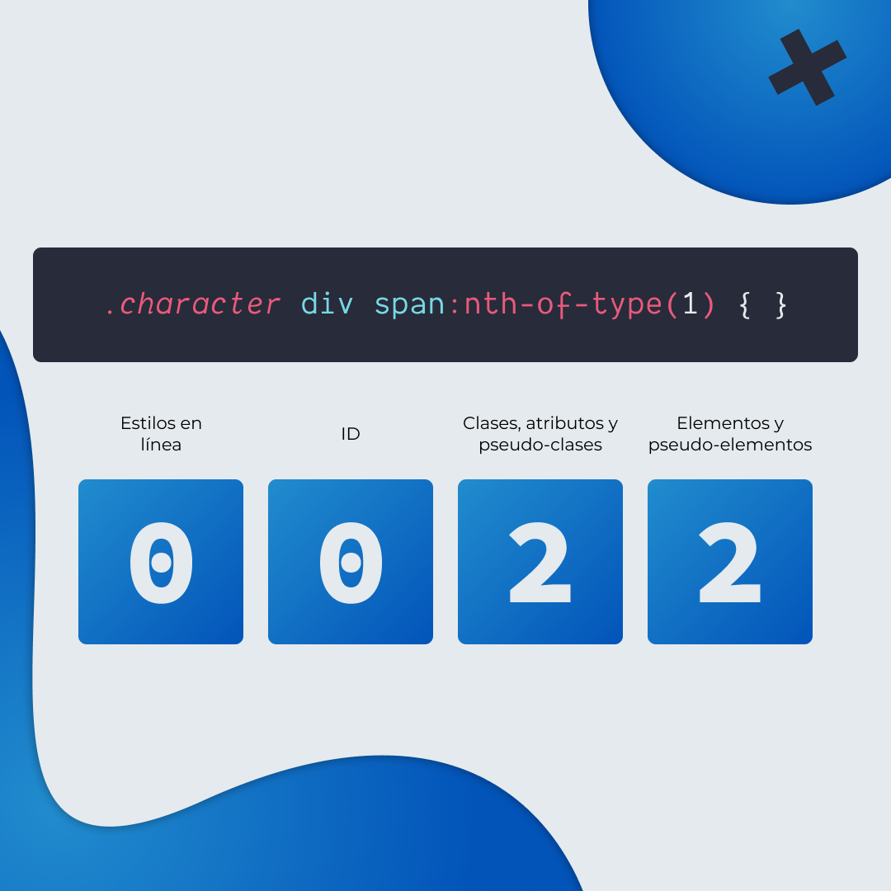
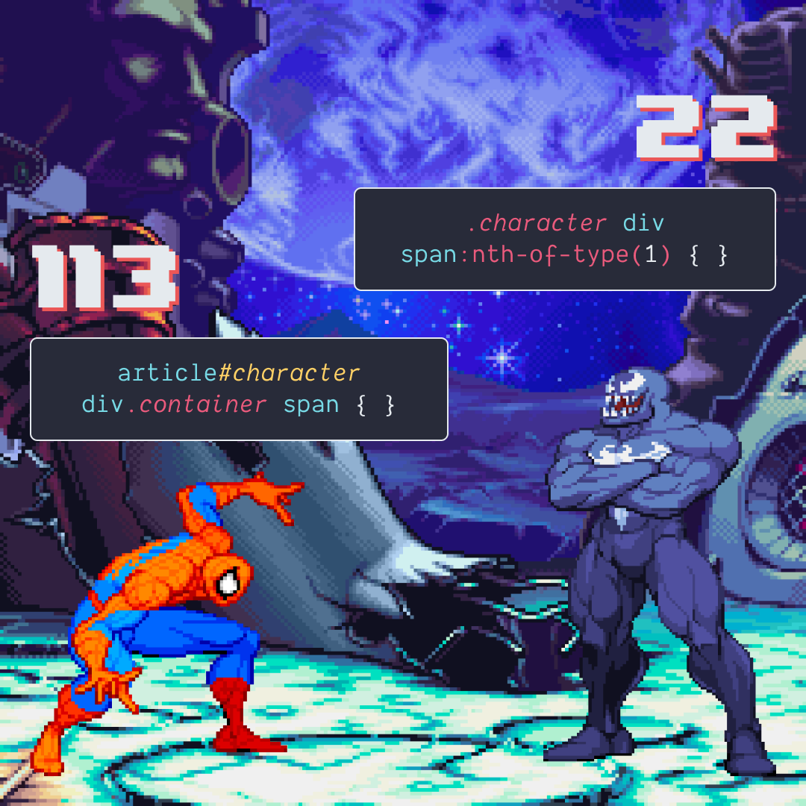
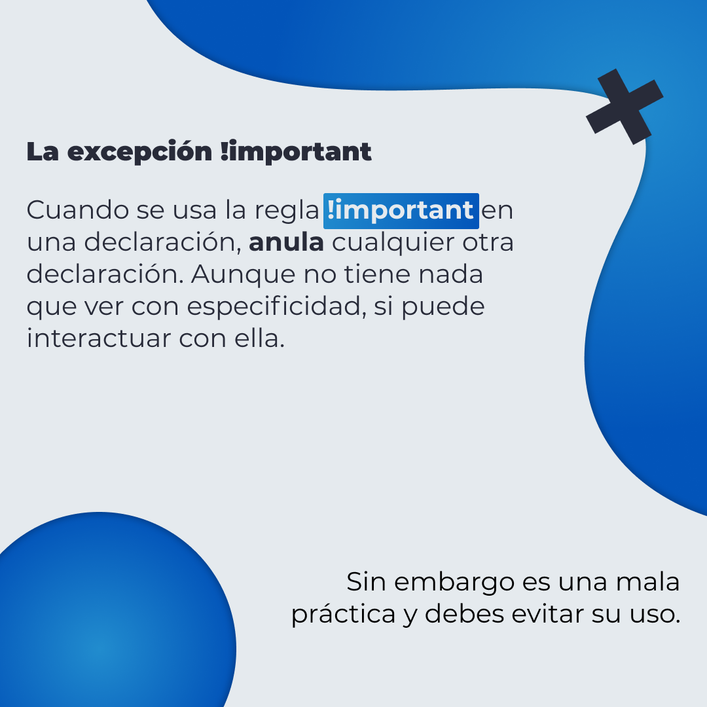

# Especificidad en CSS

Es la forma en la que los navegadores deciden que valores de una propiedad CSS son los más importantes para un elemento. Es decir los estilos que va a aplicar al elemento.

## 🤓 Aprende algo nuevo hoy

> Comparto los **bits** al menos una vez por semana.

Instagram: [@fili.santillan](https://www.instagram.com/fili.santillan/)
Twitter: [@FiliSantillan](https://twitter.com/FiliSantillan)
Facebook: [Fili Santillán](https://www.facebook.com/FiliSantillan96/)
Sitio web: http://filisantillan.com

## Recursos

- [Especificidad by Estefany Aguilar](https://twitter.com/teffcode/status/1159162961090490369)
- [MDN Specificity](https://developer.mozilla.org/en-US/docs/Web/CSS/Specificity)
- [Specifics on CSS Specificity](https://css-tricks.com/specifics-on-css-specificity/)
