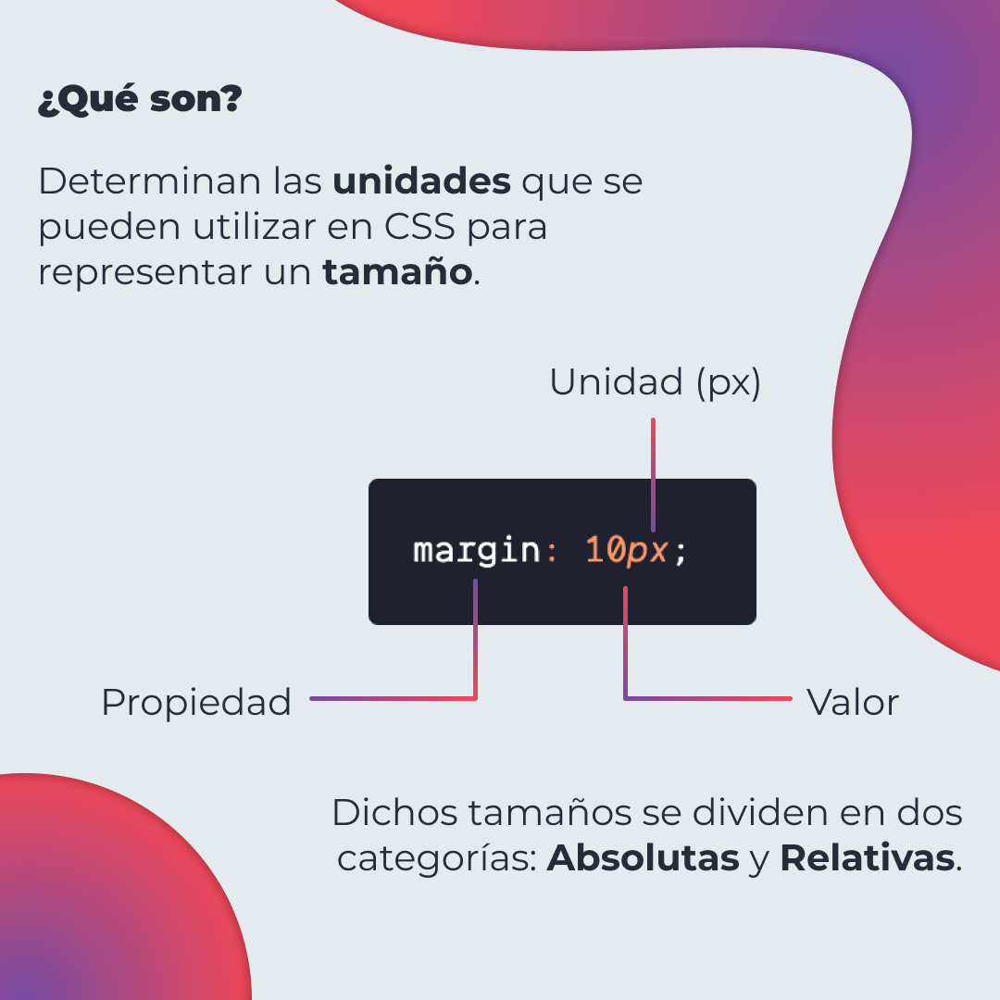
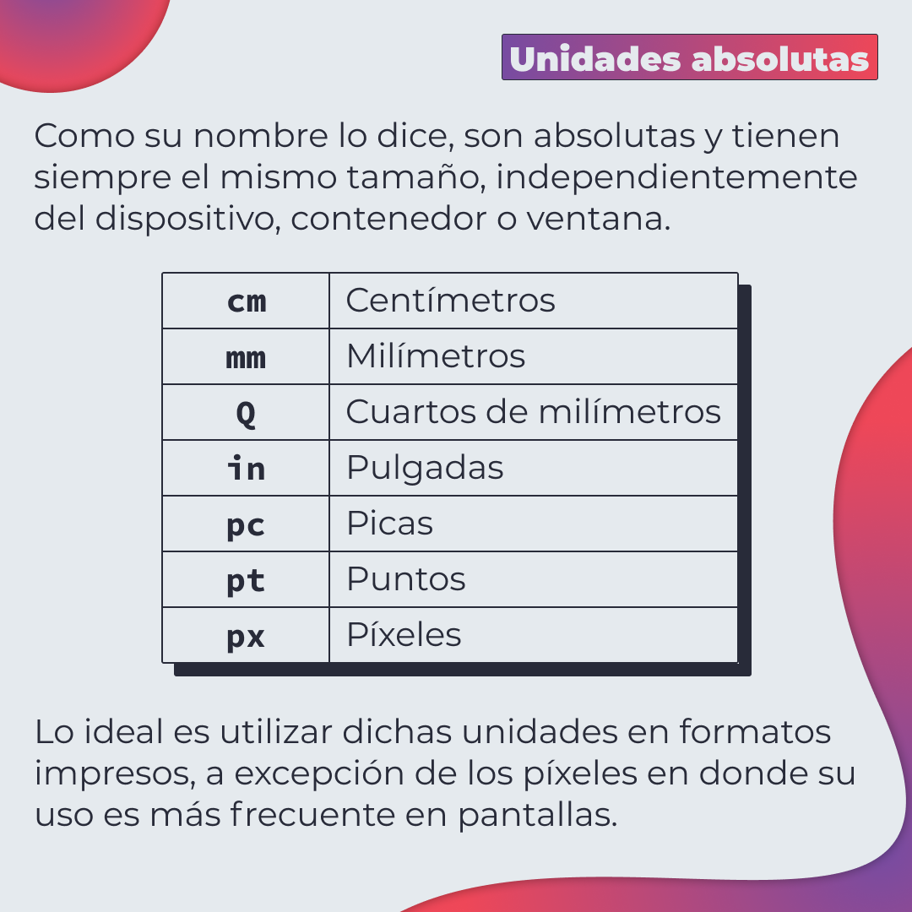
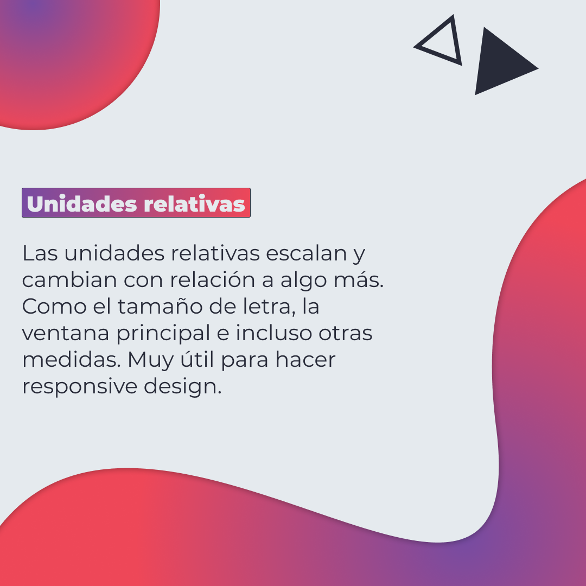
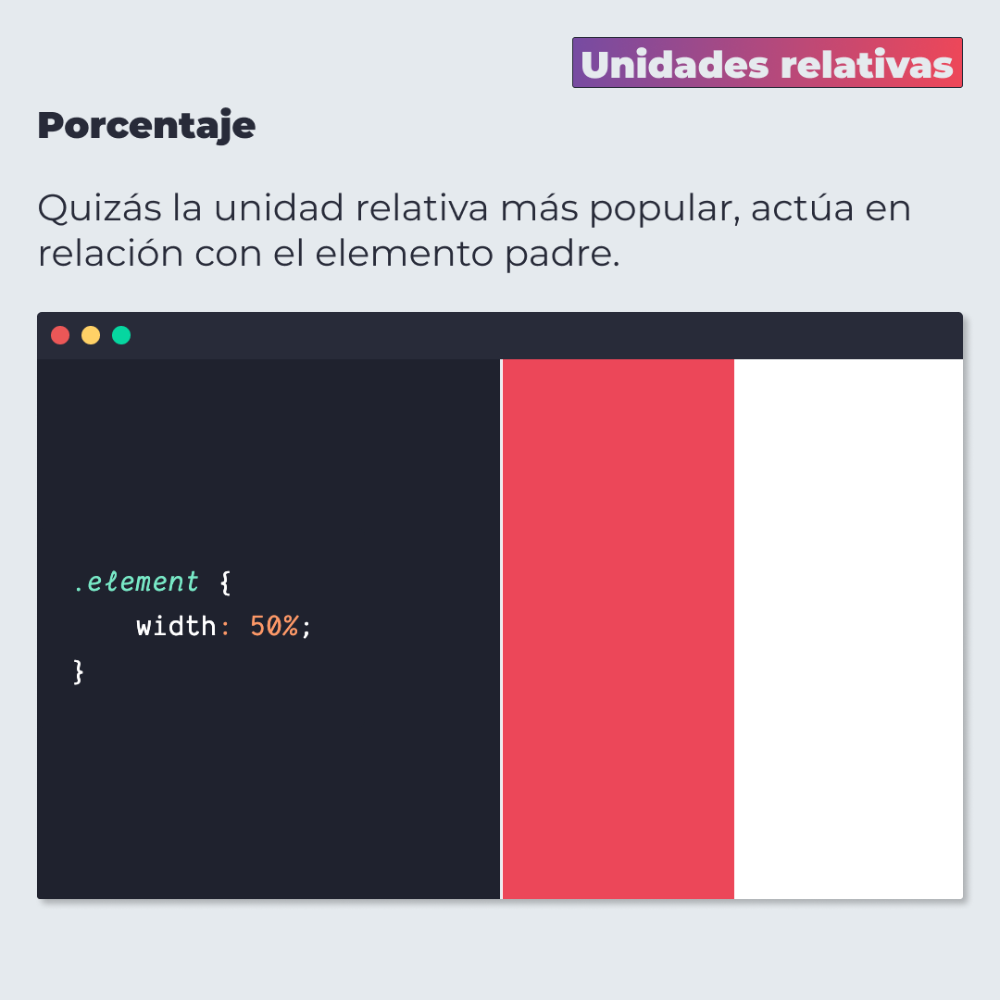
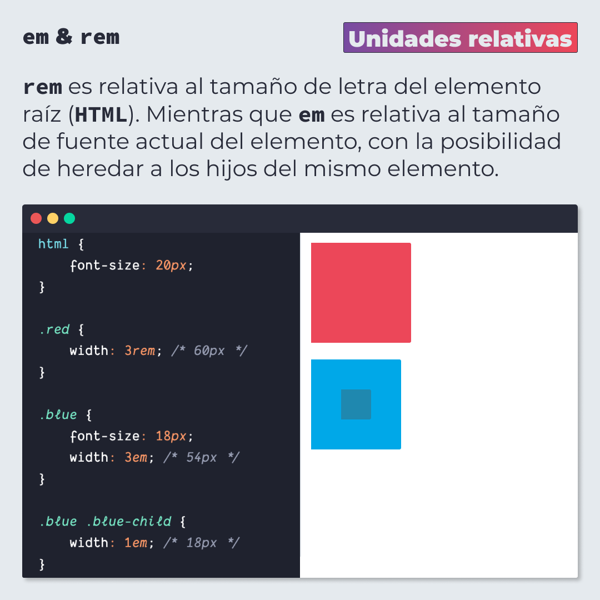
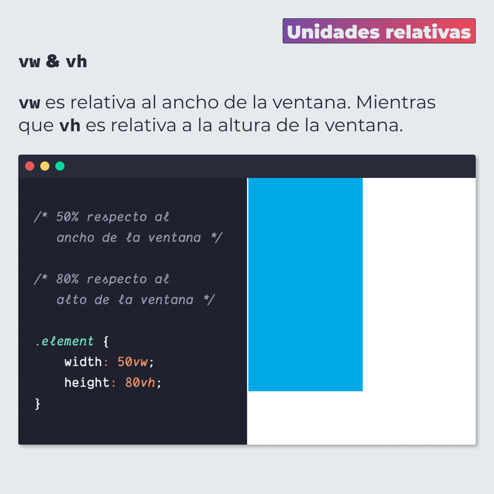
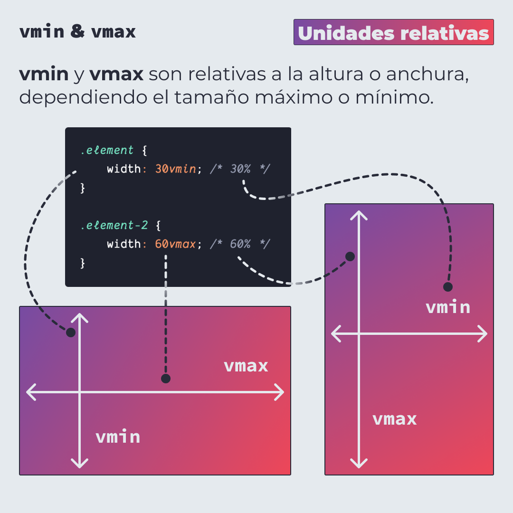
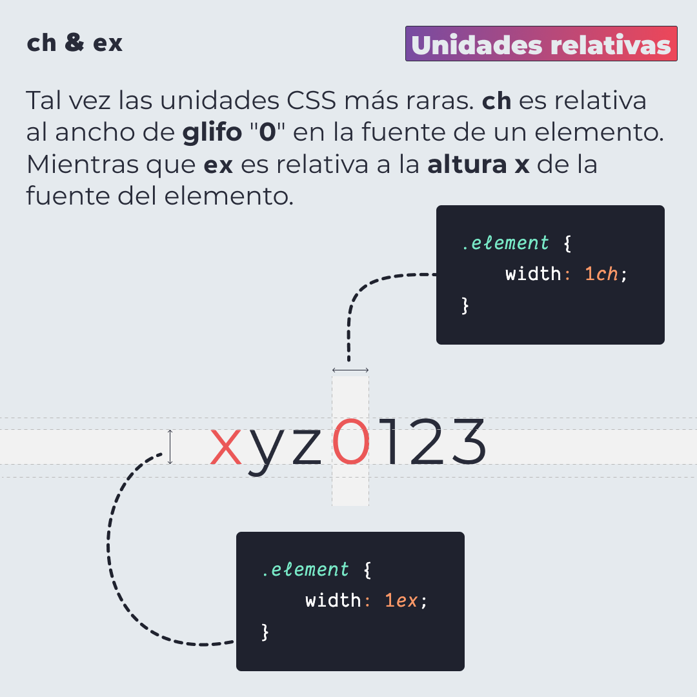

# Unidades en CSS

Se utilizan para representar un tamaño en CSS. Dichos tamaños se dividen en dos categorías: Absolutas y Relativas.

> Código utilizado en los ejemplos: [css-units.css](./css-units.css)

## 🤓 Aprende algo nuevo hoy

> Comparto los **bits** al menos una vez por semana.

Instagram: [@fili.santillan](https://www.instagram.com/fili.santillan/)  
Twitter: [@FiliSantillan](https://twitter.com/FiliSantillan)  
Facebook: [Fili Santillán](https://www.facebook.com/FiliSantillan96/)  
Sitio web: http://filisantillan.com

## Recursos

- [CSS units](https://gist.github.com/basham/2175a16ab7c60ce8e001)
- [CSS Units Explained](https://www.digitalocean.com/community/tutorials/css-css-units-explained)
- [MDN CSS values and units](https://developer.mozilla.org/en-US/docs/Learn/CSS/Building_blocks/Values_and_units)
