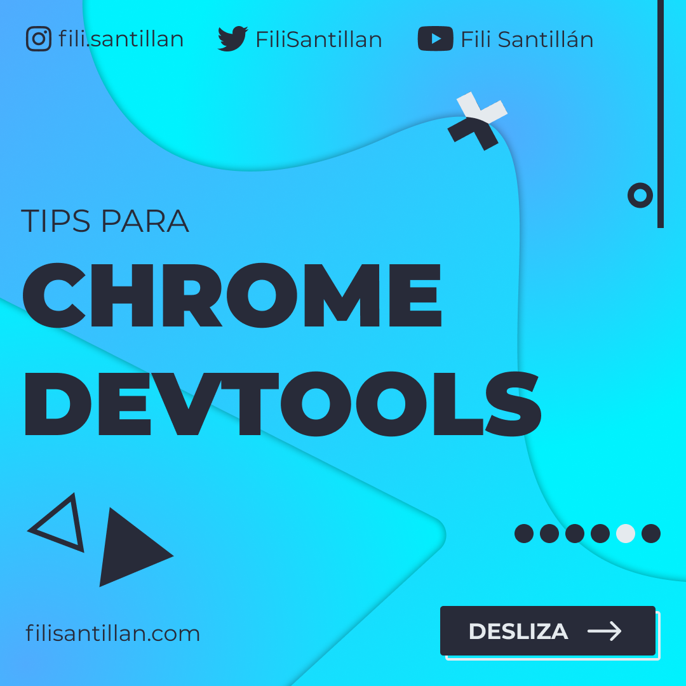

# Tips para Chrome DevTools

Chrome DevTools es una herramienta que forma parte de mi día a día como Frontend Developer y te sorprendería de lo que es capaz.

El resto del **BitSnack**, se encuentra en mis redes sociales debido a que son videos.   
Los puedes ver [aquí](https://www.instagram.com/p/CMX_kk5g20G/).

## 🤓 Aprende algo nuevo hoy

> Comparto los **bits** al menos una vez por semana.

Instagram: [@fili.santillan](https://www.instagram.com/fili.santillan/)  
Twitter: [@FiliSantillan](https://twitter.com/FiliSantillan)  
Facebook: [Fili Santillán](https://www.facebook.com/FiliSantillan96/)  
Sitio web: http://filisantillan.com

## Recursos

- [Chrome DevTools - 20+ Tips and Tricks](https://www.keycdn.com/blog/chrome-devtools)
- [A list of cool Chrome DevTools Tips and Tricks](https://flaviocopes.com/chrome-devtools-tips/)
